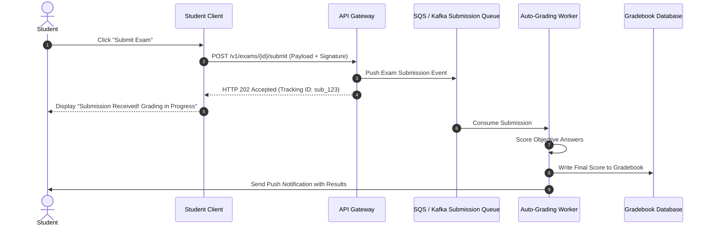

# Sequence Flows & Failure Recovery: EdTech Platform

## 1. High-Concurrency Exam Submission Flow

```mermaid
sequenceDiagram
    autonumber
    actor Student
    participant Browser as Student Client
    participant Gateway as API Gateway
    participant Queue as SQS / Kafka Submission Queue
    participant Grader as Auto-Grading Worker
    participant DB as Gradebook Database

    Student->>Browser: Click "Submit Exam"
    Browser->>Gateway: POST /v1/exams/{id}/submit (Payload + Signature)
    Gateway->>Queue: Push Exam Submission Event
    Gateway-->>Browser: HTTP 202 Accepted (Tracking ID: sub_123)
    Browser-->>Student: Display "Submission Received! Grading in Progress"
    Queue->>Grader: Consume Submission
    Grader->>Grader: Score Objective Answers
    Grader->>DB: Write Final Score to Gradebook
    Grader->>Student: Send Push Notification with Results
```
