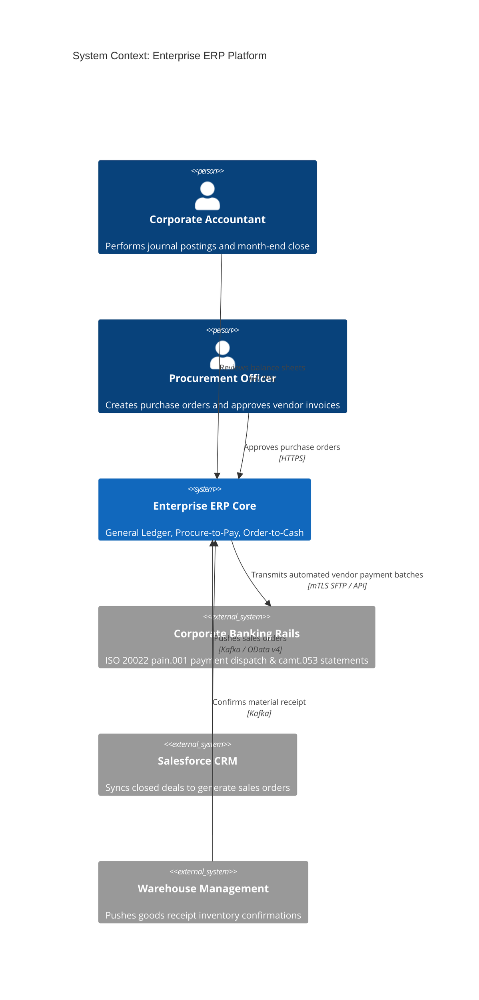

# C4 Architecture Model & Cloud Mapping: Enterprise ERP

## 1. C4 Level 1: System Context Diagram

---

## 2. Technology-Neutral to Cloud Provider Mapping

| Component | Technology-Neutral | AWS Implementation | Azure Implementation | GCP Implementation |
| :--- | :--- | :--- | :--- | :--- |
| **In-Memory Ledger DB**| SAP HANA / Aurora In-Memory| Amazon EC2 Memory-Optimized | Azure M-Series Memory VMs | Google Cloud M2 Memory VMs |
| **ERP Sidecar Platform**| Cloud Foundry / K8s | AWS App Runner / EKS | Azure App Service / AKS | Cloud Run / GKE |
| **Financial Document Store**| WORM Object Storage | Amazon S3 Glacier Vault Lock | Azure Immutable Blob Storage | Google Cloud Storage Bucket Lock |
| **Integration Broker** | Apache Kafka | Amazon MSK | Azure Event Hubs | Google Cloud Pub/Sub |
