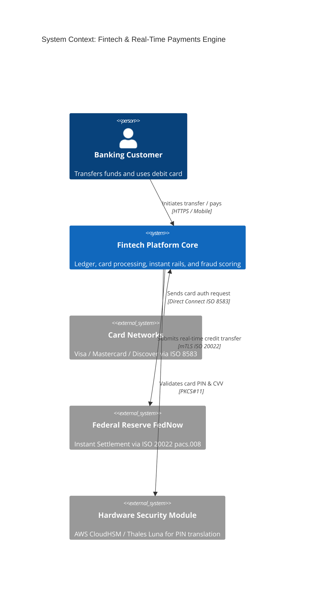

# C4 Architecture Model & Cloud Mapping: Fintech Platform

## 1. C4 Level 1: System Context Diagram

---

## 2. Technology-Neutral to Cloud Provider Mapping

| Component | Technology-Neutral | AWS Implementation | Azure Implementation | GCP Implementation |
| :--- | :--- | :--- | :--- | :--- |
| **Ledger Database** | CockroachDB / Spanner | Amazon Aurora Multi-Master | Azure Cosmos DB (Strong)| Google Cloud Spanner |
| **Key & PIN Management**| Hardware Security Module| AWS CloudHSM | Azure Dedicated HSM | Google Cloud HSM |
| **Event Streaming** | Apache Kafka | Amazon MSK | Azure Event Hubs | Google Cloud Pub/Sub |
| **In-Memory Auth Cache**| Redis Enterprise | Amazon ElastiCache | Azure Cache for Redis | Cloud Memorystore |
