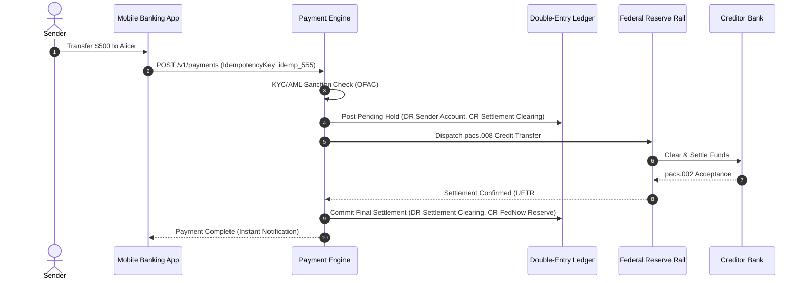

# Sequence Flows & Failure Recovery: Fintech Platform

## 1. Instant Real-Time Payment Settlement Flow (FedNow)

```mermaid
sequenceDiagram
    autonumber
    actor Customer as Sender
    participant App as Mobile Banking App
    participant Engine as Payment Engine
    participant Ledger as Double-Entry Ledger
    participant FedNow as Federal Reserve Rail
    participant ReceiverBank as Creditor Bank

    Customer->>App: Transfer $500 to Alice
    App->>Engine: POST /v1/payments (IdempotencyKey: idemp_555)
    Engine->>Engine: KYC/AML Sanction Check (OFAC)
    Engine->>Ledger: Post Pending Hold (DR Sender Account, CR Settlement Clearing)
    Engine->>FedNow: Dispatch pacs.008 Credit Transfer
    FedNow->>ReceiverBank: Clear & Settle Funds
    ReceiverBank-->>FedNow: pacs.002 Acceptance
    FedNow-->>Engine: Settlement Confirmed (UETR #fed_987)
    Engine->>Ledger: Commit Final Settlement (DR Settlement Clearing, CR FedNow Reserve)
    Engine-->>App: Payment Complete (Instant Notification)
```
