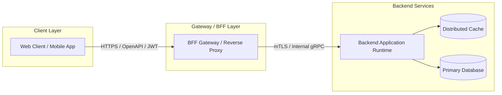

# Full-Stack Reference Architecture: Mobile React Native + Node.js BFF Stack

## 1. Architectural Vision & End-to-End Context
Mobile client connected to a tailored Node.js Backend-for-Frontend (BFF) aggregating downstream microservices and tailoring mobile payload sizes.

---

## 2. End-to-End System Diagram

---

## 3. Production Invariants & Integration Rules
- Contracts between UI and Backend must be strongly typed and generated from OpenAPI or Protobuf definitions.
- Security tokens (OAuth2/OIDC) must be validated with zero-trust verification at the API boundary.
- Distributed trace contexts (`traceparent` header) must propagate seamlessly from frontend user actions to database queries.
