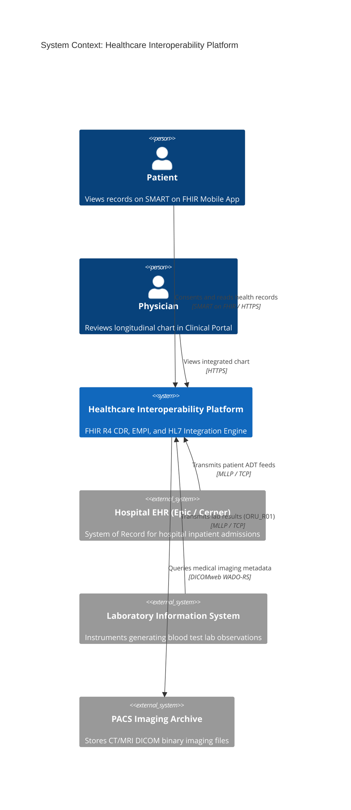

# C4 Architecture Model & Cloud Mapping: Healthcare Platform

## 1. C4 Level 1: System Context Diagram

---

## 2. Technology-Neutral to Cloud Provider Mapping

| Component | Technology-Neutral | AWS Implementation | Azure Implementation | GCP Implementation |
| :--- | :--- | :--- | :--- | :--- |
| **FHIR Server (CDR)** | HAPI FHIR / Microsoft FHIR| AWS HealthLake | Azure Health Data Services | Google Cloud Healthcare API |
| **HL7 v2 Integration Engine**| Mirth Connect / NextGen | Amazon EKS Container Pods | Azure Kubernetes Service | GKE Container Pods |
| **Patient Identity Store**| Relational / Graph | Amazon Aurora PostgreSQL | Azure Database for PostgreSQL | Cloud SQL for PostgreSQL |
| **Object & DICOM Storage**| S3 / Medical Imaging | AWS HealthImaging / S3 | Azure Blob Storage | Cloud Healthcare DICOM API |
