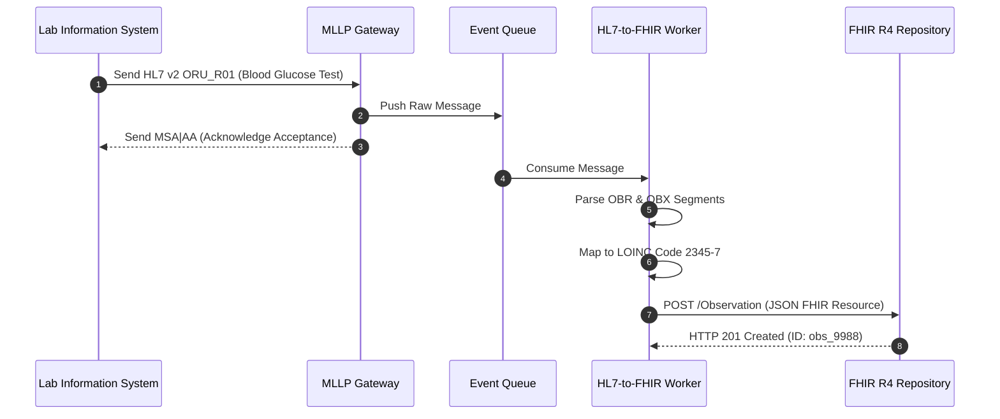

# Sequence Flows & Failure Recovery: Healthcare Platform

## 1. Lab Result (HL7 v2 ORU_R01) Ingestion Flow

```mermaid
sequenceDiagram
    autonumber
    participant LIS as Lab Information System
    participant MLLP as MLLP Gateway
    participant Kafka as Event Queue
    participant Transformer as HL7-to-FHIR Worker
    participant CDR as FHIR R4 Repository

    LIS->>MLLP: Send HL7 v2 ORU_R01 (Blood Glucose Test)
    MLLP->>Kafka: Push Raw Message
    MLLP-->>LIS: Send MSA|AA (Acknowledge Acceptance)
    Kafka->>Transformer: Consume Message
    Transformer->>Transformer: Parse OBR & OBX Segments
    Transformer->>Transformer: Map to LOINC Code 2345-7
    Transformer->>CDR: POST /Observation (JSON FHIR Resource)
    CDR-->>Transformer: HTTP 201 Created (ID: obs_9988)
```
