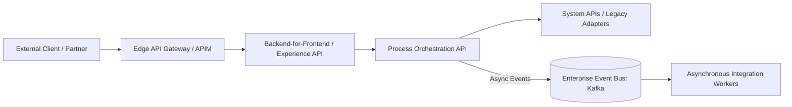

# Reference Architecture: API-Led Enterprise Integration Reference Architecture

## 1. Architectural Vision & Context
Three-tier API topology (System, Process, Experience APIs): strictly separating core backend adapters from business orchestration and presentation channels.

---

## 2. Architecture Topology Blueprint

---

## 3. Core Architectural Invariants & Governance
- External traffic must terminate at governed edge gateways with rate limiting and authentication.
- Distributed trace contexts must propagate across both synchronous RPC calls and asynchronous event headers.
- Service integrations must be protected by explicit circuit breakers and timeouts.
