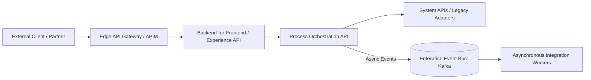

# Reference Architecture: Hybrid Synchronous API & Asynchronous Event Architecture

## 1. Architectural Vision & Context
Harmonizing synchronous REST/gRPC queries for user-facing reads with asynchronous event pub/sub for transactional side-effects and inter-service mutations.

---

## 2. Architecture Topology Blueprint

---

## 3. Core Architectural Invariants & Governance
- External traffic must terminate at governed edge gateways with rate limiting and authentication.
- Distributed trace contexts must propagate across both synchronous RPC calls and asynchronous event headers.
- Service integrations must be protected by explicit circuit breakers and timeouts.
