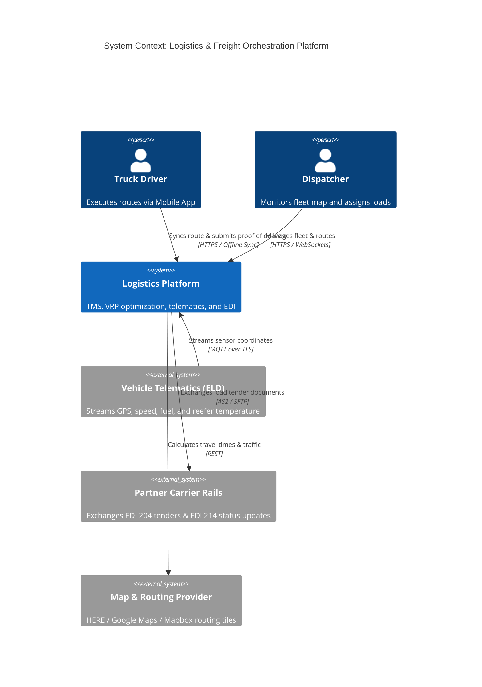

# C4 Architecture Model & Cloud Mapping: Logistics Platform

## 1. C4 Level 1: System Context Diagram

---

## 2. Technology-Neutral to Cloud Provider Mapping

| Component | Technology-Neutral | AWS Implementation | Azure Implementation | GCP Implementation |
| :--- | :--- | :--- | :--- | :--- |
| **IoT Telematics Ingress**| EMQX / VerneMQ (MQTT) | AWS IoT Core | Azure IoT Hub | Google Cloud IoT Core |
| **Spatial Indexing DB** | PostGIS / Uber H3 | Amazon Aurora PostgreSQL | Azure Database for PostgreSQL | Cloud SQL for PostgreSQL |
| **Route Optimization Engine**| OptaPlanner / VRP Worker| Amazon EKS Batch Pods | Azure Batch / AKS | Google Cloud Batch / GKE |
| **Time-Series Telematics**| ClickHouse / TimescaleDB| Amazon Managed Grafana/Timestream| Azure Data Explorer | BigQuery Time Series |
