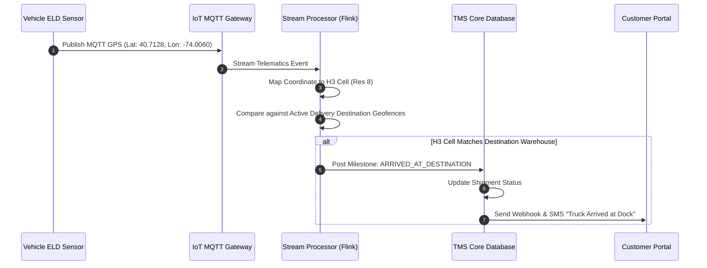

# Sequence Flows & Failure Recovery: Logistics Platform

## 1. Automated Geofence Arrival and Milestone Update Flow

```mermaid
sequenceDiagram
    autonumber
    participant Truck as Vehicle ELD Sensor
    participant IoT as IoT MQTT Gateway
    participant Flink as Stream Processor (Flink)
    participant TMS as TMS Core Database
    participant Shipper as Customer Portal

    Truck->>IoT: Publish MQTT GPS (Lat: 40.7128, Lon: -74.0060)
    IoT->>Flink: Stream Telematics Event
    Flink->>Flink: Map Coordinate to H3 Cell (Res 8)
    Flink->>Flink: Compare against Active Delivery Destination Geofences
    alt H3 Cell Matches Destination Warehouse
        Flink->>TMS: Post Milestone: ARRIVED_AT_DESTINATION
        TMS->>TMS: Update Shipment Status
        TMS->>Shipper: Send Webhook & SMS "Truck Arrived at Dock"
    end
```
