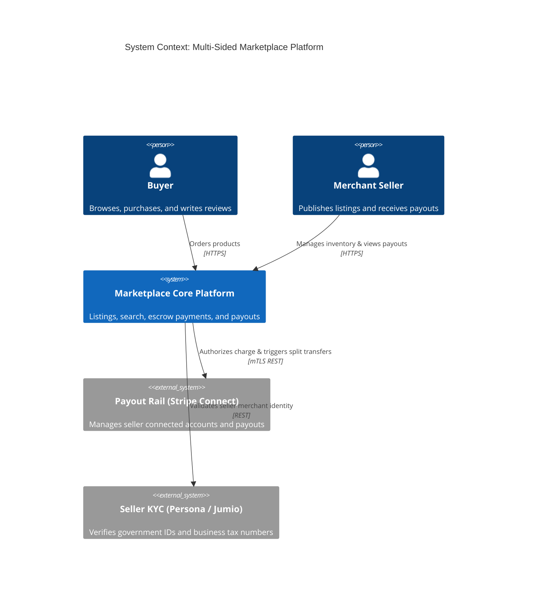

# C4 Architecture Model & Cloud Mapping: Marketplace Platform

## 1. C4 Level 1: System Context Diagram

---

## 2. Technology-Neutral to Cloud Provider Mapping

| Component | Technology-Neutral | AWS Implementation | Azure Implementation | GCP Implementation |
| :--- | :--- | :--- | :--- | :--- |
| **Catalog Search** | OpenSearch / Elasticsearch | Amazon OpenSearch Service | Azure AI Search | Google Cloud OpenSearch |
| **Transactional DB** | PostgreSQL Aurora Multi-AZ | Amazon Aurora PostgreSQL | Azure Database for PostgreSQL | Cloud SQL for PostgreSQL |
| **Payout Orchestrator**| Stripe Connect / Adyen | Stripe API Integration | Stripe / Adyen API | Stripe / Adyen API |
| **Event Streaming** | Apache Kafka | Amazon MSK | Azure Event Hubs | Google Cloud Pub/Sub |
