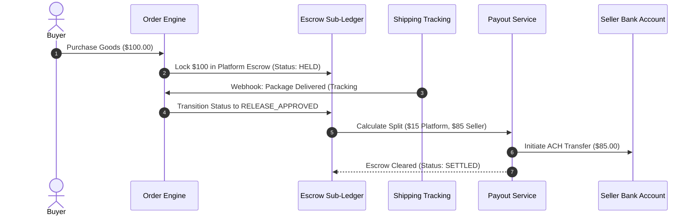

# Sequence Flows & Failure Recovery: Marketplace Platform

## 1. Escrow Split Payment and Payout Release Flow

```mermaid
sequenceDiagram
    autonumber
    actor Buyer
    participant Order as Order Engine
    participant Escrow as Escrow Sub-Ledger
    participant Carrier as Shipping Tracking
    participant Payout as Payout Service
    participant SellerBank as Seller Bank Account

    Buyer->>Order: Purchase Goods ($100.00)
    Order->>Escrow: Lock $100 in Platform Escrow (Status: HELD)
    Carrier->>Order: Webhook: Package Delivered (Tracking #1Z999)
    Order->>Escrow: Transition Status to RELEASE_APPROVED
    Escrow->>Payout: Calculate Split ($15 Platform, $85 Seller)
    Payout->>SellerBank: Initiate ACH Transfer ($85.00)
    Payout-->>Escrow: Escrow Cleared (Status: SETTLED)
```
