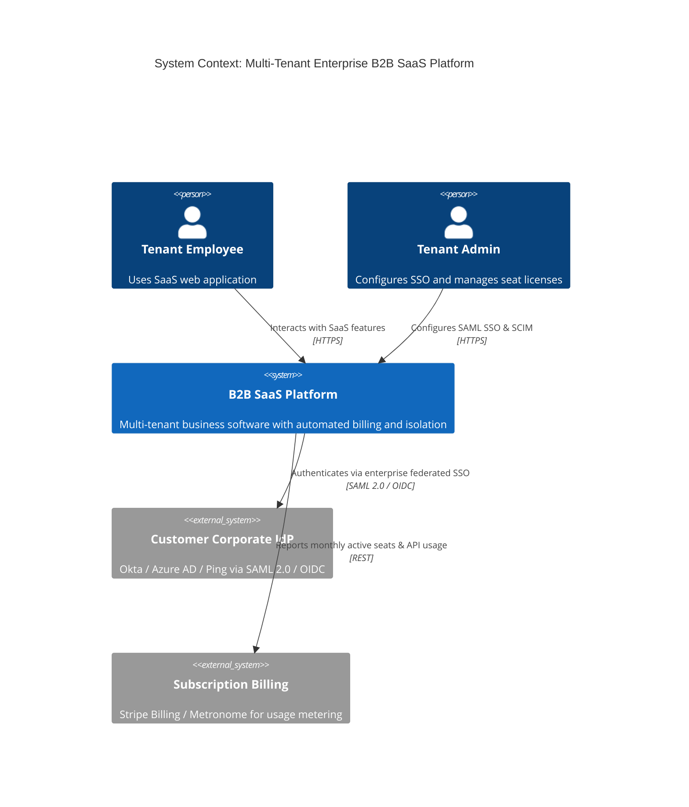

# C4 Architecture Model & Cloud Mapping: B2B SaaS Platform

## 1. C4 Level 1: System Context Diagram

---

## 2. Technology-Neutral to Cloud Provider Mapping

| Component | Technology-Neutral | AWS Implementation | Azure Implementation | GCP Implementation |
| :--- | :--- | :--- | :--- | :--- |
| **Tenant Context Gateway**| Envoy Proxy with WASM | AWS API Gateway / Envoy | Azure API Management | Apigee Edge |
| **Pooled Relational DB** | PostgreSQL with RLS | Amazon Aurora PostgreSQL | Azure Database for PostgreSQL | Cloud SQL for PostgreSQL |
| **Silo Enterprise DB** | Isolated RDS Instances | AWS RDS PostgreSQL Silos | Azure SQL Dedicated Instances| Cloud SQL Dedicated Instances |
| **Tenant Secret Store** | HashiCorp Vault | AWS Secrets Manager / KMS | Azure Key Vault | Google Cloud Secret Manager |
