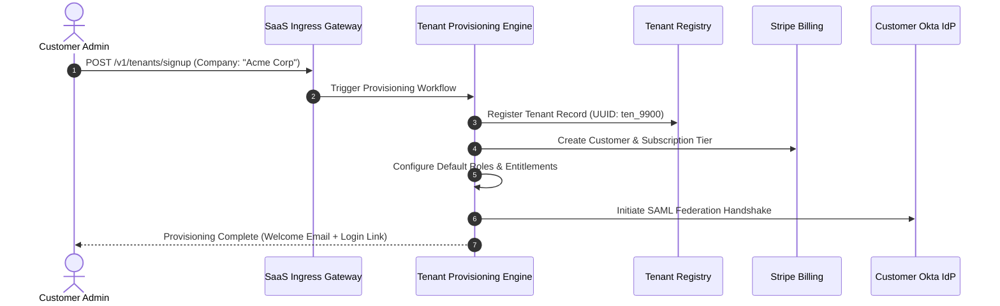

# Sequence Flows & Failure Recovery: B2B SaaS Platform

## 1. Automated Tenant Onboarding & Provisioning Flow

```mermaid
sequenceDiagram
    autonumber
    actor Admin as Customer Admin
    participant Gateway as SaaS Ingress Gateway
    participant Onboarding as Tenant Provisioning Engine
    participant DB as Tenant Registry
    participant Billing as Stripe Billing
    participant IdP as Customer Okta IdP

    Admin->>Gateway: POST /v1/tenants/signup (Company: "Acme Corp")
    Gateway->>Onboarding: Trigger Provisioning Workflow
    Onboarding->>DB: Register Tenant Record (UUID: ten_9900)
    Onboarding->>Billing: Create Customer & Subscription Tier
    Onboarding->>Onboarding: Configure Default Roles & Entitlements
    Onboarding->>IdP: Initiate SAML Federation Handshake
    Onboarding-->>Admin: Provisioning Complete (Welcome Email + Login Link)
```
