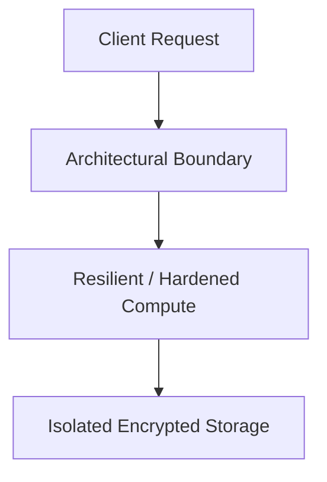

# Reference Architecture: Highly Reliable Enterprise Platform Blueprint (SRE Architecture)

## Executive Summary
This reference blueprint provides the end-to-end architectural specification for implementing a production-grade highly reliable enterprise platform blueprint (sre architecture).

---

## 1. Architectural Topology

Global Route53 Anycast -> Multi-AZ Load Balancers -> Resilient Compute with Circuit Breakers -> Aurora Global DB -> Prometheus Alerting.

---

## 2. Core Architectural Invariants
- Multi-window multi-burn-rate alerting paging on Error Budget depletion.
- Automated canary rollouts via Argo Rollouts with automated metric rollback.
- Bounded queues with proactive load shedding when CPU exceeds 85%.

---

## 3. Threat Model & Failure Mitigation
- **Threats Mitigated**: Distributed DDoS, credential stuffing, lateral movement, data exfiltration, cascading dependency failure.
- **Fail-Secure & Fail-Safe Behavior**: Components fail closed on authentication/policy failures; application compute degrades gracefully with cached fallback data.

---

## 4. Operational & Observability Verification
- Emits structured OCSF audit events.
- Golden Signals instrumentation (Latency, Traffic, Errors, Saturation) with Prometheus and OpenTelemetry.
