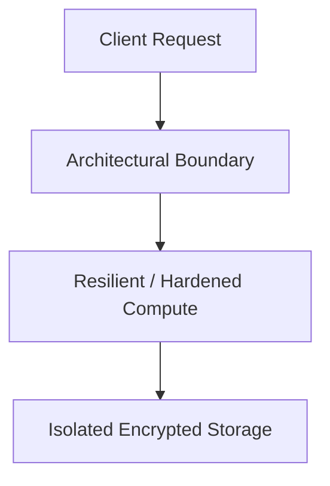

# Reference Architecture: Secure CI/CD & Software Supply Chain Platform Blueprint

## Executive Summary
This reference blueprint provides the end-to-end architectural specification for implementing a production-grade secure ci/cd & software supply chain platform blueprint.

---

## 1. Architectural Topology

Developer Commit (Gitleaks) -> GitHub Actions (Isolated Runner) -> Semgrep SAST -> Syft SBOM -> Cosign Keyless Sign -> Private Registry.

---

## 2. Core Architectural Invariants
- Hermetic build runners with outbound network restricted to approved package mirrors.
- Cryptographic provenance attestation adhering to SLSA Level 3.
- Automated PR blocking on Critical/High CVEs.

---

## 3. Threat Model & Failure Mitigation
- **Threats Mitigated**: Distributed DDoS, credential stuffing, lateral movement, data exfiltration, cascading dependency failure.
- **Fail-Secure & Fail-Safe Behavior**: Components fail closed on authentication/policy failures; application compute degrades gracefully with cached fallback data.

---

## 4. Operational & Observability Verification
- Emits structured OCSF audit events.
- Golden Signals instrumentation (Latency, Traffic, Errors, Saturation) with Prometheus and OpenTelemetry.
