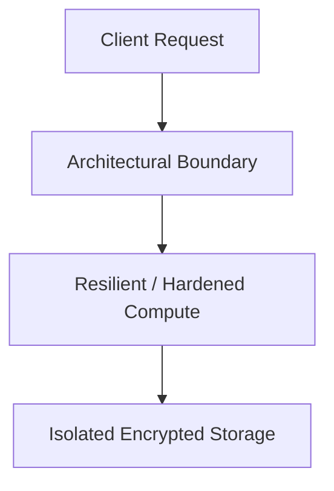

# Reference Architecture: Secure Enterprise Web Application Reference Architecture

## Executive Summary
This reference blueprint provides the end-to-end architectural specification for implementing a production-grade secure enterprise web application reference architecture.

---

## 1. Architectural Topology

Edge WAF (Cloudflare) -> ALB -> Envoy Gateway (OIDC BFF) -> Container Cluster (Spring/Node) -> Aurora PostgreSQL Multi-AZ with envelope encryption.

---

## 2. Core Architectural Invariants
- WAF terminates TLS 1.3 with approved ciphers.
- Invariant tenant context injected from validated JWT.
- Database connections authenticated via IAM authentication (no static passwords).

---

## 3. Threat Model & Failure Mitigation
- **Threats Mitigated**: Distributed DDoS, credential stuffing, lateral movement, data exfiltration, cascading dependency failure.
- **Fail-Secure & Fail-Safe Behavior**: Components fail closed on authentication/policy failures; application compute degrades gracefully with cached fallback data.

---

## 4. Operational & Observability Verification
- Emits structured OCSF audit events.
- Golden Signals instrumentation (Latency, Traffic, Errors, Saturation) with Prometheus and OpenTelemetry.
