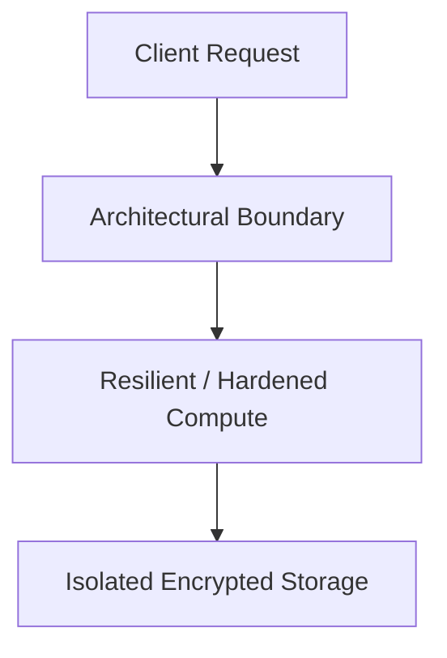

# Reference Architecture: Hardened Enterprise Kubernetes Platform Blueprint

## Executive Summary
This reference blueprint provides the end-to-end architectural specification for implementing a production-grade hardened enterprise kubernetes platform blueprint.

---

## 1. Architectural Topology

Ingress Gateway -> Cilium eBPF NetworkPolicy -> Restricted Pod Security Standards -> External Secrets Operator -> KMS.

---

## 2. Core Architectural Invariants
- `automountServiceAccountToken: false` by default.
- Kyverno admission webhook blocks images lacking Cosign signatures.
- All containers run as unprivileged UID 10001 with read-only root filesystem.

---

## 3. Threat Model & Failure Mitigation
- **Threats Mitigated**: Distributed DDoS, credential stuffing, lateral movement, data exfiltration, cascading dependency failure.
- **Fail-Secure & Fail-Safe Behavior**: Components fail closed on authentication/policy failures; application compute degrades gracefully with cached fallback data.

---

## 4. Operational & Observability Verification
- Emits structured OCSF audit events.
- Golden Signals instrumentation (Latency, Traffic, Errors, Saturation) with Prometheus and OpenTelemetry.
