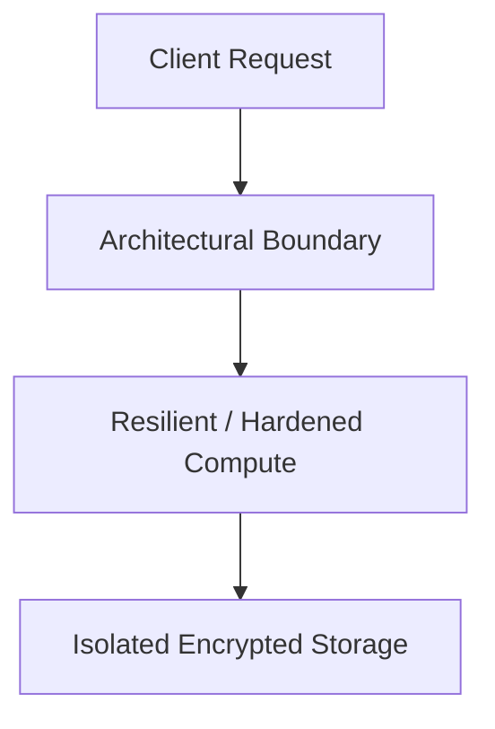

# Reference Architecture: Enterprise Security Operations & Detection Platform Blueprint

## Executive Summary
This reference blueprint provides the end-to-end architectural specification for implementing a production-grade enterprise security operations & detection platform blueprint.

---

## 1. Architectural Topology

CloudTrail / IdP Logs / K8s Audit -> Kinesis Data Streams -> Fluentbit Normalizer (OCSF) -> Microsoft Sentinel / Splunk -> SOAR Automation.

---

## 2. Core Architectural Invariants
- Tamper-proof log streaming to S3 Object Lock in Compliance Mode (WORM).
- Automated SOAR playbooks for automated credential revocation and IP containment.
- High-fidelity Sigma detection rules mapping to MITRE ATT&CK.

---

## 3. Threat Model & Failure Mitigation
- **Threats Mitigated**: Distributed DDoS, credential stuffing, lateral movement, data exfiltration, cascading dependency failure.
- **Fail-Secure & Fail-Safe Behavior**: Components fail closed on authentication/policy failures; application compute degrades gracefully with cached fallback data.

---

## 4. Operational & Observability Verification
- Emits structured OCSF audit events.
- Golden Signals instrumentation (Latency, Traffic, Errors, Saturation) with Prometheus and OpenTelemetry.
