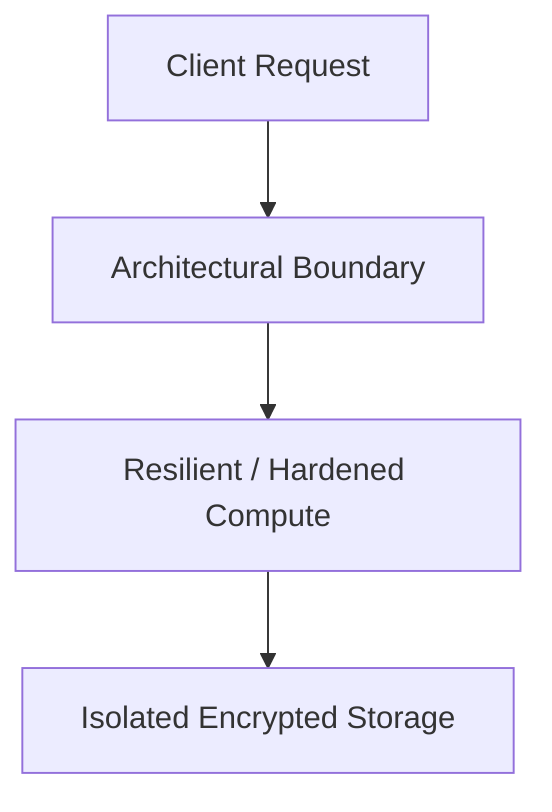

# Reference Architecture: Zero Trust Enterprise Reference Architecture (NIST SP 800-207)

## Executive Summary
This reference blueprint provides the end-to-end architectural specification for implementing a production-grade zero trust enterprise reference architecture (nist sp 800-207).

---

## 1. Architectural Topology

Subject -> Policy Enforcement Point (Envoy) -> Policy Decision Point (OPA) -> Microservices Mesh (Istio mTLS) -> Data Tier.

---

## 2. Core Architectural Invariants
- Device posture verified via EDR telemetry before token issuance.
- Zero implicit trust of internal IP networks.
- Ephemeral Just-in-Time (JIT) access for administrative roles.

---

## 3. Threat Model & Failure Mitigation
- **Threats Mitigated**: Distributed DDoS, credential stuffing, lateral movement, data exfiltration, cascading dependency failure.
- **Fail-Secure & Fail-Safe Behavior**: Components fail closed on authentication/policy failures; application compute degrades gracefully with cached fallback data.

---

## 4. Operational & Observability Verification
- Emits structured OCSF audit events.
- Golden Signals instrumentation (Latency, Traffic, Errors, Saturation) with Prometheus and OpenTelemetry.
