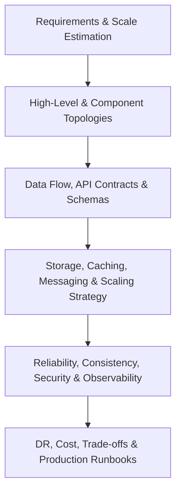

# Reference Architectures: System Design Playbook

## 1. Executive Summary & Purpose
This directory contains production-grade, authoritative reference architectures for 30 foundational distributed systems. Designed for Solution Architects and Enterprise Architects operating at Fortune 500 / global MNC scale, each system design follows a mandatory, rigorous **26-section architectural standard**.

---

## 2. Master Catalog of 30 Reference Systems

### Foundations & Utilities
1. [URL Shortener (TinyURL / Bit.ly)](url-shortener.md)
2. [Pastebin (Gist / Pastebin)](pastebin.md)
3. [Distributed Rate Limiter](rate-limiter.md)
4. [Distributed Key-Value Store (Dynamo / Cassandra)](key-value-store.md)
5. [Enterprise Notification Service](notification-service.md)

### Communication & Social
6. [Real-Time Chat Application (WhatsApp / Slack)](chat-application.md)
7. [Social Media Feed (Twitter / Instagram)](social-media-feed.md)
8. [Video Streaming Platform (YouTube / Netflix)](video-streaming-platform.md)

### Commerce & Logistics
9. [High-Scale E-Commerce Platform (Amazon)](e-commerce-platform.md)
10. [Ride-Sharing Dispatch Service (Uber / Lyft)](ride-sharing-service.md)
11. [Food Delivery Platform (DoorDash / Deliveroo)](food-delivery-service.md)
12. [Global Payment Gateway (Stripe)](payment-gateway.md)

### Data & Infrastructure Platforms
13. [Distributed In-Memory Cache (Redis Cluster)](distributed-cache.md)
14. [Distributed Message Queue (Kafka / Pulsar)](distributed-message-queue.md)
15. [Search Autocomplete & Typeahead](search-autocomplete.md)
16. [Distributed Full-Text Search Engine (Elasticsearch)](distributed-search-engine.md)
17. [Distributed Web Crawler (Googlebot)](web-crawler.md)
18. [Metrics Monitoring & TSDB (Prometheus / M3)](metrics-monitoring-system.md)
19. [Distributed Logging System (ELK / Loki)](distributed-logging-system.md)
20. [Cloud File & Object Storage (Dropbox / S3)](cloud-file-storage.md)

### Financial, Booking & Analytics Systems
21. [Digital Wallet & Ledger (PayPal / Venmo)](digital-wallet.md)
22. [Hotel Reservation System (Airbnb / Booking.com)](hotel-reservation-system.md)
23. [High-Concurrency Ticket Booking (Ticketmaster)](ticket-booking-system.md)
24. [Personalized Recommendation Engine (Netflix / TikTok)](recommendation-system.md)
25. [Ad-Click Event Aggregation Pipeline](ad-click-aggregation.md)
26. [Distributed Task Scheduler (Temporal / Airflow)](distributed-task-scheduler.md)
27. [Real-Time Gaming Leaderboard](gaming-leaderboard.md)
28. [Industrial IoT Data Ingestion Platform](iot-data-platform.md)
29. [Content Delivery Network (CDN Edge)](content-delivery-network.md)
30. [Enterprise API Gateway Service (Envoy / Kong)](api-gateway-service.md)
