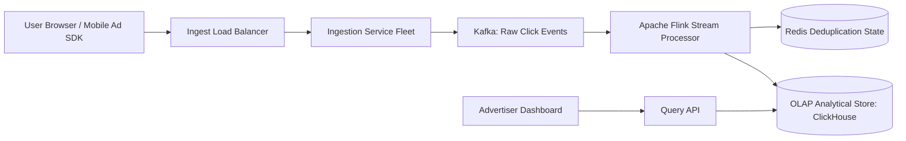

# Reference Architecture: Ad-Click Event Aggregation Pipeline

## 1. System Overview
A real-time, high-throughput stream processing pipeline ingesting billions of advertising impression and click events, deduplicating fraudulent clicks, aggregating metrics across 1-minute and 1-hour sliding windows, and writing to an analytical OLAP database for real-time advertiser billing.

## 2. Business Context
Advertising networks (Google Ads, Meta) bill advertisers based on Cost-Per-Click (CPC) and Cost-Per-Mille (CPM). Under-counting loses revenue; over-counting or counting bot clicks results in severe advertiser fraud litigation.

## 3. Functional Requirements
* **Event Ingestion**: Ingest ad clicks with sub-second latency.
* **Click Deduplication**: Filter duplicate accidental or fraudulent rapid double-clicks (same user/IP within 10s).
* **Sliding Window Aggregation**: Aggregate metrics by `ad_id`, `campaign_id`, `country`, and `placement` across 1-minute windows.
* **Advertiser Real-Time Querying**: Expose aggregated CPC spend and click counts to advertiser dashboards.

## 4. Non-Functional Requirements
* **Throughput**: Ingest $>50,000\text{ click events/sec}$.
* **Data Integrity**: Exactly-Once Processing guarantees for billing financial accuracy.
* **Latency**: End-to-end processing latency (click to dashboard) $<5\text{ seconds}$.

## 5. Constraints & Assumptions
* Network delays can cause out-of-order event arrivals (up to 5 minutes late).

## 6. Scale Estimation
* 1 Billion ad impressions/day; 50 Million clicks/day.
* Peak Click Ingestion Rate: $\frac{50 \times 10^6}{86,400} \times 3 \approx \mathbf{1,736\text{ clicks/sec}}$ (Impression pipeline handles $\mathbf{35,000\text{ RPS}}$).
* Average Event Size: 500 bytes.

## 7. Capacity Planning
* Daily Click Ingest: $50\text{M} \times 500\text{ bytes} \approx 25\text{ GB/day}$.
* Daily Impression Ingest: $1\text{ Billion} \times 500\text{ bytes} \approx 500\text{ GB/day}$.
* 3-Year Compressed Cold Storage: $\approx 150\text{ TB}$ in Parquet S3.

## 8. High-Level Architecture


## 9. Component Architecture
* **Ingestion Gateway**: Low-latency Go microservice validating signatures and publishing to Kafka.
* **Stream Processor (Apache Flink)**: Stateful stream computing engine evaluating tumbling and sliding windows with event-time watermarking.
* **OLAP Store (ClickHouse)**: Columnar datastore delivering sub-100ms analytical queries across billions of rows.

## 10. Data Flow
1. User clicks ad $\rightarrow$ Browser sends beacon to Ingestion Gateway.
2. Gateway enriches with Geo-IP and publishes raw click event to Kafka.
3. Flink stream processor:
   * Checks Redis for duplicate `(user_id, ad_id)` within 10-second sliding window.
   * Assigns event-time watermarks allowing up to 2 minutes late arrival.
   * Aggregates click counts into 1-minute tumbling windows.
4. Flink writes aggregated 1-minute window batches to ClickHouse via Two-Phase Commit sink.

## 11. API Design
* `POST /v1/events/click`
  * Body: `{"ad_id": "ad_991", "campaign_id": "cmp_12", "user_token": "usr_abc", "timestamp": 1725508800}`
  * Response: `HTTP 204 No Content`

## 12. Data Model
```sql
CREATE TABLE ad_clicks_aggregated (
    window_start   DateTime,
    campaign_id    UInt32,
    ad_id          UInt32,
    country        FixedString(2),
    click_count    UInt64,
    total_spend_usd Float64
) ENGINE = SummingMergeTree()
ORDER BY (campaign_id, ad_id, window_start);
```

## 13. Storage Architecture
ClickHouse columnar database: SummingMergeTree engine automatically rolls up aggregations during background disk merges, reducing disk footprint by $90\%$.

## 14. Caching Architecture
Redis Cluster caches active campaign budget caps; shuts off ad delivery when budget is exhausted.

## 15. Messaging & Async Processing
Kafka topic `ad.clicks` partitioned by `ad_id` to ensure all clicks for a given advertisement land on the same Flink consumer slot for localized windowing.

## 16. Scalability Strategy
Horizontal Flink parallelization: Scale Flink TaskManagers dynamically based on Kafka consumer group lag.

## 17. Performance Optimization
* **Columnar Compression**: ClickHouse compresses repetitive campaign IDs and country codes with DoubleDelta and LZ4, storing millions of clicks per gigabyte.
* **In-Memory Windowing**: Flink maintains window state in RocksDB state backend on local NVMe.

## 18. Reliability & Fault Tolerance
Flink Checkpointing: Periodically takes distributed consistent snapshots to S3 via Chandy-Lamport algorithm, providing Exactly-Once recovery.

## 19. Consistency & Transactions
Exactly-Once Semantics (EOS) end-to-end: Flink Kafka consumer $\rightarrow$ Flink stateful compute $\rightarrow$ ClickHouse transactional sink.

## 20. Security Architecture
Click Fraud Defense: Machine learning models detect bot IP subnets and abnormal click patterns, flagging invalid clicks before billing.

## 21. Observability Strategy
Metrics: `flink_watermark_delay_seconds`, `clickhouse_insert_duration_ms`, `duplicate_clicks_dropped_total`.

## 22. Disaster Recovery
Continuous checkpointing to multi-region S3; replayable Kafka event streams.

## 23. Cost Optimization
Pre-aggregating clicks into 1-minute buckets in Flink reduces database insert write IOPS by $99\%$.

## 24. Trade-off Analysis
* **Processing Time vs. Event Time**: Processing time is simple but gives wrong results when mobile devices upload buffered offline clicks. Event time with watermarks guarantees accurate financial billing.

## 25. Failure Scenarios
* **Flink TaskManager Crash**: Flink job manager detects failure, restores state from last S3 checkpoint, and resumes stream processing in $<15\text{ seconds}$.

## 26. Production Considerations
* Set watermark lag to 2 minutes: balances real-time dashboard freshness against late-arriving event completeness.
