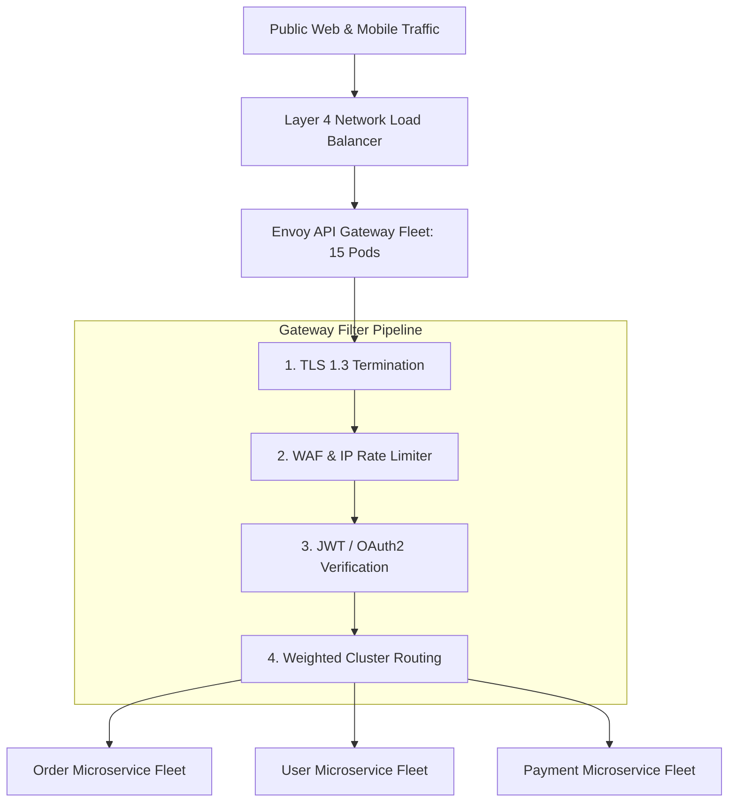

# Reference Architecture: Enterprise API Gateway Service (Envoy / Kong)

## 1. System Overview
A carrier-grade, highly scalable API Gateway and reverse proxy service acting as the centralized front door for all enterprise microservices, executing authentication, traffic routing, rate limiting, request transformation, and telemetry instrumentation.

## 2. Business Context
Protects internal microservices from direct public internet exposure, standardizes security and compliance policies, and enables zero-downtime blue/green deployments.

## 3. Functional Requirements
* **Dynamic Routing**: Route incoming HTTP/gRPC requests based on path, hostname, and headers.
* **Authentication**: Validate JWT signatures, OAuth2 tokens, and API keys at the perimeter.
* **Traffic Management**: Canary weighted traffic splitting, circuit breaking, and retries.
* **Rate Limiting**: Distributed token-bucket rate limiting per IP and client API key.

## 4. Non-Functional Requirements
* **Ultra-Low Overhead**: Gateway transit latency $p99 < 2.0\text{ ms}$, $p50 < 0.5\text{ ms}$.
* **Availability**: $99.999\%$ (Five Nines) uptime.
* **Throughput**: Support $>100,000\text{ RPS}$ per gateway cluster.

## 5. Constraints & Assumptions
* Gateway must never perform heavy CPU computations (e.g., image manipulation or deep JSON transformations).

## 6. Scale Estimation
* Ingress Volume: 100,000 requests/second peak.
* Egress Volume: 100,000 upstream microservice dispatches/second.
* Network Throughput: 10 Gbps continuous network ingress.

## 7. Capacity Planning
* Compute Fleet: An optimized Envoy proxy processes $\approx 10,000\text{ RPS per 4-vCPU host}$.
* Gateway Fleet Sizing: 100,000 RPS / 10,000 = 10 nodes $\times 1.5\text{ (headroom)} = \mathbf{15\text{ compute instances}}$ (4 vCPU / 8 GB RAM each).

## 8. High-Level Architecture


## 9. Component Architecture
* **Control Plane (Istio / Envoy Gateway API)**: Pushes dynamic route tables, clusters, and listener updates to proxies via xDS gRPC APIs.
* **Data Plane (Envoy Proxy)**: C++ high-performance asynchronous event loop executing filter chains.
* **Auth Cache (Redis)**: Caches revoked token blacklists and JWKS public signing keys.

## 10. Data Flow
1. Client connects with HTTPS `POST /v1/orders` carrying Bearer JWT.
2. Envoy terminates TLS in $<1\text{ ms}$.
3. Auth filter verifies cryptographic JWT signature against cached JWKS.
4. Injects internal verified headers: `X-User-Id: 42`, `X-Tenant: Acme`.
5. Rate limit filter queries local/Redis token bucket.
6. Weighted router selects healthy pod in Order Service cluster $\rightarrow$ dispatches over HTTP/2.

## 11. API Design
Envoy Dynamic xDS Configuration (YAML snippet):
```yaml
routes:
  - match: { prefix: "/v1/orders" }
    route:
      cluster: order_service_cluster
      timeout: 2.5s
      retry_policy:
        retry_on: "5xx,connect-failure"
        num_retries: 2
```

## 12. Data Model
Configuration schema defining VirtualHosts, Routes, Clusters, and HealthCheck policies.

## 13. Storage Architecture
Stateless data plane. Dynamic configuration stored in Git repository and served via Kubernetes CRDs to the control plane.

## 14. Caching Architecture
* Local RAM Cache: JWKS public keys and route definitions cached in memory.
* Distributed Rate Limit Cache: Redis Cluster for cross-gateway quota synchronization.

## 15. Messaging & Async Processing
Asynchronous access logs streamed to Kafka for security SIEM analysis via Fluent Bit sidecars.

## 16. Scalability Strategy
Horizontal Pod Autoscaler (HPA): Scales gateway fleet dynamically from 10 to 40 pods based on CPU utilization and open socket count.

## 17. Performance Optimization
* **Connection Multiplexing**: Reuses persistent HTTP/2 connection pools to upstream microservices, eliminating backend TCP handshakes.
* **Zero-Copy Buffer Slices**: Evades memory allocations during request proxying.

## 18. Reliability & Fault Tolerance
* Circuit Breaking: Automatically ejects unhealthy microservice instances (`consecutive_5xx = 3`) for 30 seconds.
* Active Health Checking: Probes `/healthz` endpoints of upstream microservices every 5 seconds.

## 19. Consistency & Transactions
Stateless execution. Rate limits operate with eventual consistency across distributed Redis shards.

## 20. Security Architecture
* Edge TLS 1.3 with automated ACME certificate rotation.
* Header Sanitization: Gateway strips all incoming `X-Forwarded-*` and internal `X-User-*` headers from untrusted clients.

## 21. Observability Strategy
Metrics: `upstream_rq_time_ms`, `upstream_rq_5xx_total`, `server_live_connections`. Distributed trace context injection (`traceparent`).

## 22. Disaster Recovery
Multi-AZ active-active deployment spanning 3 Availability Zones behind a regional Network Load Balancer.

## 23. Cost Optimization
Co-locating API Gateway instances in the same Availability Zones as primary backend microservices eliminates inter-AZ data transfer fees.

## 24. Trade-off Analysis
* **In-Gateway Auth vs. Service Auth**: Centralizing auth at the gateway eliminates duplicated security code across 50 microservices; services can trust pre-validated `X-User-Id` headers within the private VPC.

## 25. Failure Scenarios
* **Upstream Microservice Outage**: Gateway returns structured RFC 7807 `HTTP 503 Service Unavailable` immediately once circuit breaker opens, preventing thread exhaustion.

## 26. Production Considerations
* Strict connection draining on deployments (`graceful_drain_time = 45s`) to prevent dropping active WebSocket or long-running client transfers.
