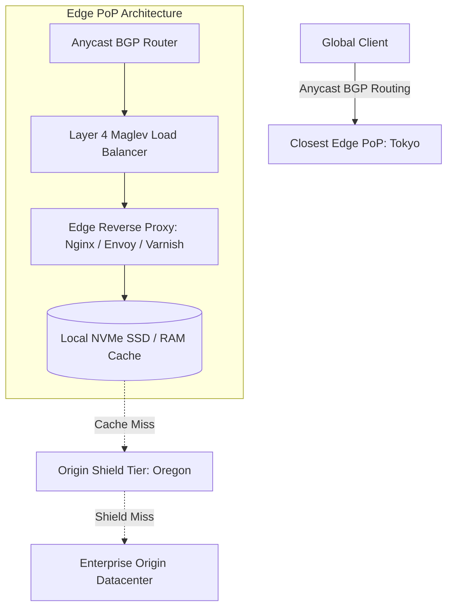

# Reference Architecture: Content Delivery Network (CDN Edge Architecture)

## 1. System Overview
A globally distributed Content Delivery Network (CDN) edge caching and traffic acceleration architecture operating hundreds of Points of Presence (PoPs) globally, terminating client TLS sessions and serving cached web assets within 10 milliseconds of any global user.

## 2. Business Context
The foundation of modern web performance, DDoS mitigation, and edge compute. Reduces origin infrastructure bandwidth costs by up to $95\%$ while improving SEO search rankings.

## 3. Functional Requirements
* **Static Asset Caching**: Cache HTML, CSS, JavaScript, images, and video chunks.
* **Origin Shielding**: Aggregate cache misses through regional parent caches to protect origin datacenters.
* **Cache Invalidation**: Global instant cache purge via URL or tag in $<150\text{ ms}$.
* **Edge Compute**: Execute lightweight serverless logic (Cloudflare Workers / Lambda@Edge) at the PoP.

## 4. Non-Functional Requirements
* **Edge Latency**: Cache hit retrieval $p99 < 10\text{ ms}$.
* **Availability**: $99.999\%$ global uptime via Anycast BGP routing.
* **Scale**: Sustain $>50\text{ Tbps}$ global egress throughput.

## 5. Constraints & Assumptions
* Edge storage is finite; caches must enforce strict LRU eviction.

## 6. Scale Estimation
* 200 Points of Presence (PoPs) globally.
* 50 Tbps peak global egress bandwidth.
* 100 Million HTTP requests per second across all edge PoPs.

## 7. Capacity Planning
* In-Memory / NVMe Edge Storage: 50 TB NVMe SSD cache per major edge PoP $\times 200\text{ PoPs} = \mathbf{10\text{ PB}}$ edge cache capacity.

## 8. High-Level Architecture

## 9. Component Architecture
* **Anycast BGP Routing**: Advertises the same single IP address globally; BGP routes client packets to the geographically closest data center.
* **Layer 4 Load Balancers (Maglev / Katran)**: High-speed kernel bypass load balancers distributing 100Gbps traffic across edge servers.
* **Origin Shield**: Dedicated caching tier buffering the origin from thundering herd misses.

## 10. Data Flow
1. Client resolves `cdn.enterprise.com` $\rightarrow$ Anycast returns single IP `198.51.100.1`.
2. Router directs to closest PoP (Frankfurt).
3. Edge server checks local RAM/NVMe cache.
4. On Hit: returns cached asset with `CF-Cache-Status: HIT` in $4\text{ ms}$.
5. On Miss: fetches from Origin Shield $\rightarrow$ caches locally $\rightarrow$ returns to client.

## 11. API Design
Purge API:
* `POST /v1/cdn/purge`
  * Headers: `Authorization: Bearer token`
  * Body: `{"tags": ["product_102"], "urls": ["https://cdn.enterprise.com/img/hero.jpg"]}`
  * Response: `HTTP 200 OK` `{"purged_pops": 200, "duration_ms": 120}`

## 12. Data Model
Cache Metadata Entry:
* Key: `MD5(URL + VariantHeaders)`
* Attributes: `Content-Length`, `ETag`, `Last-Modified`, `TTL`, `Surrogate-Keys`.

## 13. Storage Architecture
Two-tier edge storage: RAM for top $1\%$ ultra-hot assets; NVMe SSD array for long-tail media files.

## 14. Caching Architecture
Hierarchical Caching: Edge PoP $\rightarrow$ Regional Origin Shield $\rightarrow$ Enterprise Origin.

## 15. Messaging & Async Processing
Global Purge Mesh: Gossip / Kafka mesh propagating instant cache invalidation tokens to all 200 PoPs in $<150\text{ ms}$.

## 16. Scalability Strategy
Consistent Hashing across Edge Nodes: URL hash determines which physical edge server in the local PoP cluster stores the asset, preventing cache duplication across servers.

## 17. Performance Optimization
* **TLS 1.3 0-RTT Connection Resumption**: Eliminates round-trip handshakes for returning clients.
* **HTTP/3 (QUIC over UDP)**: Eliminates TCP head-of-line blocking on lossy mobile connections.

## 18. Reliability & Fault Tolerance
BGP Failover: If Frankfurt PoP goes dark, upstream tier-1 transit providers withdraw the BGP route, automatically shifting traffic to Paris/Amsterdam PoPs in $<2\text{ seconds}$.

## 19. Consistency & Transactions
Eventual consistency for cache invalidation. `Surrogate-Key` (tag-based) purge ensures atomic invalidation of related assets.

## 20. Security Architecture
* Automated DDoS Mitigation: Anycast dilutes multi-terabit volumetric attacks across 200 PoPs; eBPF filters drop SYN/UDP floods in the Linux kernel.
* Web Application Firewall (WAF) rule evaluation at the edge.

## 21. Observability Strategy
Metrics: `edge_cache_hit_ratio`, `origin_offload_percent`, `ttfb_time_to_first_byte_p99`.

## 22. Disaster Recovery
Origin failover: Edge automatically routes requests to secondary disaster recovery data center if origin returns HTTP 502/504.

## 23. Cost Optimization
Brotli compression at the edge reduces text file transfer sizes by $20\%$ compared to standard Gzip.

## 24. Trade-off Analysis
* **Long TTL vs. Short TTL**: Long TTL maximizes origin offload but risks stale data. Modern standard uses long TTL ($1\text{ year}$) paired with **instant tag-based purge on mutation**.

## 25. Failure Scenarios
* **Thundering Herd on Cache Expiration**: When a viral breaking news article expires, edge proxy employs **Request Collapsing (Singleflight)**: only 1 request goes to origin; all other concurrent requests wait for the response to populate.

## 26. Production Considerations
* Ensure origin servers return accurate `Cache-Control` and `Vary: Accept-Encoding` headers.
