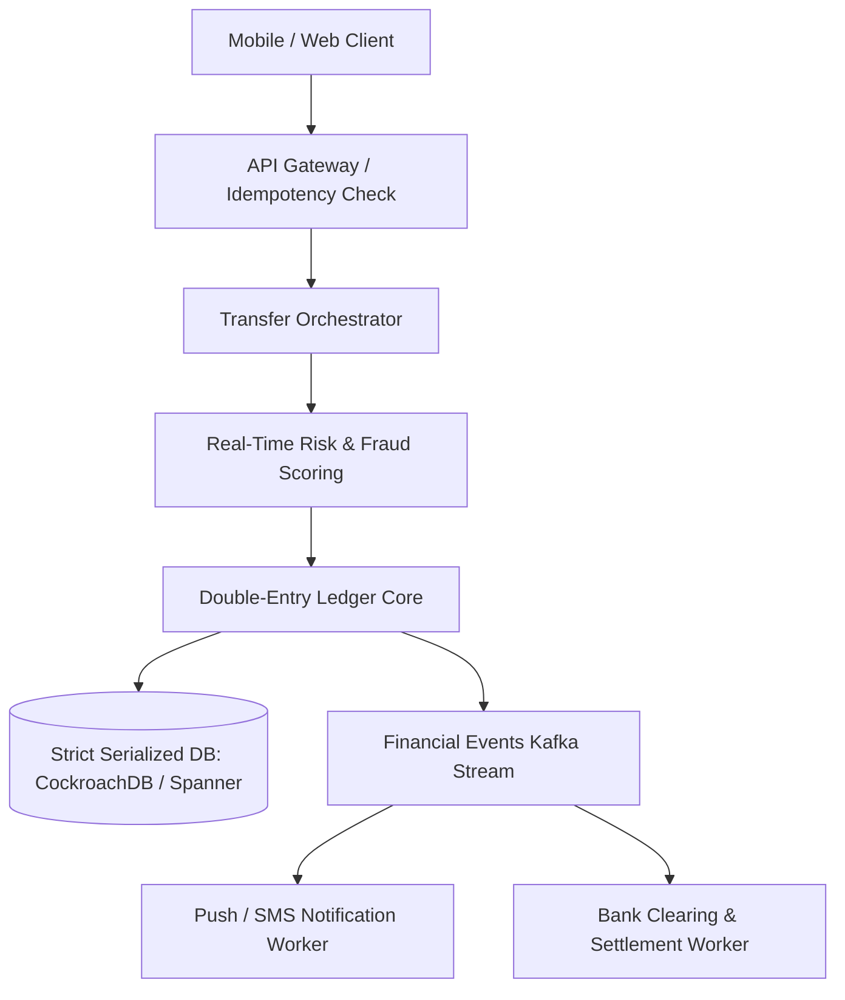

# Reference Architecture: Digital Wallet & Payment Ledger (PayPal / Venmo)

## 1. System Overview
A high-integrity digital wallet and financial balance management system executing real-time peer-to-peer (P2P) transfers, merchant checkouts, and bank top-ups with double-entry ledger bookkeeping, zero negative balance overdrafts, and strict ACID guarantees.

## 2. Business Context
Manages stored customer balances. A single lost transaction or calculation error destroys regulatory banking licenses and consumer trust.

## 3. Functional Requirements
* **P2P Transfer**: Atomically transfer funds from User A to User B.
* **Balance Query**: Retrieve real-time available and pending balance.
* **Double-Entry Ledger**: Every transaction must balance: $\sum \text{Debits} == \sum \text{Credits}$.
* **Audit Trail**: Immutable, tamper-proof financial transaction log.

## 4. Non-Functional Requirements
* **Consistency**: Strict Serializability (ACID). No dirty reads or race condition overdrafts.
* **Availability**: $99.999\%$ (Five Nines) uptime.
* **Latency**: Transfer execution $p99 < 100\text{ ms}$.
* **Durability**: Zero financial data loss ($\text{RPO} = 0$).

## 5. Constraints & Assumptions
* Stored balances must never fall below zero (unless explicit credit overdraft is enabled).

## 6. Scale Estimation
* 20 Million Daily Active Users.
* Daily Transactions: 50 Million P2P transfers/day.
* Average TPS: $\frac{50 \times 10^6}{86,400} \approx 578\text{ TPS}$. Peak ($5\times$ on weekends): $\approx \mathbf{3,000\text{ TPS}}$.

## 7. Capacity Planning
* Ledger Storage: 50M transfers/day $\times$ 4 ledger postings $\times$ 300 bytes $\approx \mathbf{60\text{ GB/day}}$.
* 10-Year Financial Retention: $60\text{ GB} \times 365 \times 10 \approx \mathbf{219\text{ TB}}$ immutable storage.

## 8. High-Level Architecture


## 9. Component Architecture
* **Transfer Orchestrator**: Manages state transitions and idempotent retries.
* **Double-Entry Core**: Generates paired debit and credit postings.
* **Ledger Database**: Distributed relational engine configured for strict serializability.

## 10. Data Flow
1. Alice sends \$50 to Bob (`Idempotency-Key: tx_77a`).
2. Transfer Service checks Redis for duplicate key.
3. Executes atomic SQL transaction:
   * Verify Alice's balance $\ge \$50$.
   * Insert Ledger Entry: Debit Alice \$50.
   * Insert Ledger Entry: Credit Bob \$50.
   * Update cached balances.
4. Returns success $\rightarrow$ Emits event to Kafka for notifications.

## 11. API Design
* `POST /v1/transfers`
  * Headers: `Idempotency-Key: 9b1deb4d`
  * Body: `{"source_account": "acc_alice", "dest_account": "acc_bob", "amount": 5000, "currency": "USD"}`
  * Response: `HTTP 200 OK` `{"transfer_id": "tx_991", "status": "SETTLED"}`

## 12. Data Model
```sql
CREATE TABLE accounts (
    account_id   UUID PRIMARY KEY,
    user_id      UUID NOT NULL,
    currency     VARCHAR(3) NOT NULL,
    balance      BIGINT NOT NULL DEFAULT 0, -- Cents
    version      BIGINT NOT NULL,
    CONSTRAINT chk_positive_bal CHECK (balance >= 0)
);

CREATE TABLE ledger_entries (
    entry_id     UUID PRIMARY KEY,
    transfer_id  UUID NOT NULL,
    account_id   UUID NOT NULL,
    amount       BIGINT NOT NULL,
    direction    VARCHAR(6) NOT NULL, -- DEBIT or CREDIT
    created_at   TIMESTAMP WITH TIME ZONE DEFAULT NOW()
);
```

## 13. Storage Architecture
CockroachDB / Google Cloud Spanner utilizing Paxos/Raft consensus across 3 regions for zero-loss financial serializability.

## 14. Caching Architecture
Redis caches read-only account profile metadata. Account balances are cached with version numbers to support optimistic concurrency.

## 15. Messaging & Async Processing
Kafka topic `transfers.settled` feeds regulatory compliance reporting and automated clearing house (ACH) batch files.

## 16. Scalability Strategy
Account Sharding: Sharding by `account_id` distributes account locks. Transfers between accounts on different shards use Two-Phase Commit managed natively by CockroachDB.

## 17. Performance Optimization
* Amounts stored strictly as integers in the lowest currency unit (cents), eliminating floating-point rounding errors.
* Optimistic Locking on Account Updates:
  ```sql
  UPDATE accounts SET balance = balance - 5000, version = version + 1 
  WHERE account_id = 'acc_alice' AND balance >= 5000 AND version = 12;
  ```

## 18. Reliability & Fault Tolerance
* Zero RPO: Multi-region synchronous replication ensures a sudden region power failure causes zero financial transaction loss.

## 19. Consistency & Transactions
Strict ACID Serializability. Never use eventual consistency for account balances.

## 20. Security Architecture
* Mandatory 2FA for transactions $> \$500$.
* Hardware Security Module (HSM) signing of internal ledger journal blocks.

## 21. Observability Strategy
Metrics: `transfer_rate_tps`, `ledger_imbalance_count` (Must ALWAYS be 0!), `p99_commit_latency_ms`.

## 22. Disaster Recovery
Multi-region active-active cluster with automated consensus failover in $<5\text{ seconds}$.

## 23. Cost Optimization
Archival of completed ledger entries $>3\text{ years}$ old to WORM immutable cloud storage.

## 24. Trade-off Analysis
* **Materialized Balances vs. Pure Event Sourcing**: Pure event sourcing recalculates balance by summing all historical rows (computationally expensive); storing a materialized balance with a constraint check balances speed and safety.

## 25. Failure Scenarios
* **Deadlock between Concurrent Cross-Transfers**: User A sends money to User B while User B sends money to User A. Enforce global deterministic lock ordering (always lock account with lower UUID first).

## 26. Production Considerations
* Daily automated ledger reconciliation script verifying that the sum of all customer balances matches the physical funds held in the custodian clearing bank account.
