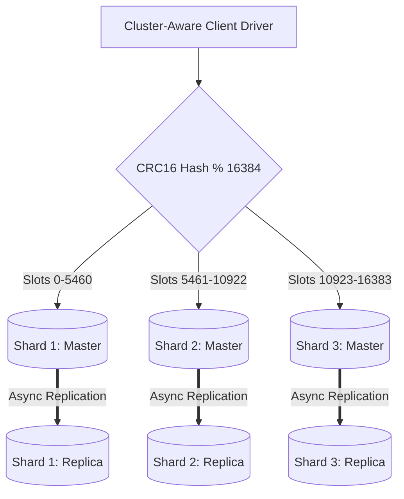

# Reference Architecture: Distributed In-Memory Cache (Redis Cluster)

## 1. System Overview
A linear-scaling, in-memory distributed key-value cache partitioning terabytes of RAM across hundreds of cluster nodes, delivering sub-millisecond data access with master-replica replication and automated failover.

## 2. Business Context
Shields relational databases, search engines, and microservices from read traffic overload, dramatically reducing cloud compute costs and accelerating web/mobile response times.

## 3. Functional Requirements
* **Key-Value API**: Support `GET`, `SET`, `DEL`, `INCR`, `EXPIRE`.
* **Data Structures**: Strings, Hashes, Lists, Sets, Sorted Sets.
* **TTL Expiration**: Automatic eviction based on millisecond-level time-to-live.
* **Clustering**: Transparent client sharding across hash slots.

## 4. Non-Functional Requirements
* **Throughput**: Support $>1,000,000\text{ operations/sec}$.
* **Latency**: Read/Write latency $p99 < 1.0\text{ ms}$, $p50 < 0.2\text{ ms}$.
* **Availability**: $99.99\%$ via automated master-replica failover.

## 5. Constraints & Assumptions
* Total cluster memory bounded by provisioned physical RAM.
* Single-threaded command execution per shard.

## 6. Scale Estimation
* Ingress Load: 1 Million operations/sec peak.
* Read-to-Write Ratio: $10:1$ (900k reads/s, 100k writes/s).
* Average Object Size: 500 bytes.

## 7. Capacity Planning
* Total Stored Objects: 200 Million active keys.
* Raw Memory: $200\text{M} \times 500\text{ bytes} = 100\text{ GB}$.
* Cluster RAM ($\text{RF}=2$, engine overhead $1.4\times$, headroom $1.3\times$): $100 \times 2 \times 1.4 \times 1.3 \approx \mathbf{364\text{ GB RAM}}$.
* Bandwidth Egress: $1,000,000 \times 500\text{ bytes} \times 8 \approx \mathbf{4\text{ Gbps}}$.

## 8. High-Level Architecture


## 9. Component Architecture
* **Cluster-Aware Client**: Caches hash slot mappings locally, routing directly to the authoritative master node.
* **Gossip Engine**: Nodes exchange cluster state and node vitality pings every 100ms.
* **Failover Sentinel**: Promotes replica when majority masters agree a node is unreachable (`PFAIL` $\rightarrow$ `FAIL`).

## 10. Data Flow
1. Client computes slot: $\text{Slot} = \text{CRC16}(\text{key}) \pmod{16384}$.
2. Sends command directly to Shard 2.
3. Shard 2 executes in RAM in $<50\ \mu\text{s}$ $\rightarrow$ Returns result.
4. If key migrated: Shard 2 returns `MOVED 5480 10.0.0.15:6379`; client updates cache and retries.

## 11. API Design
RESP3 Protocol (REdis Serialization Protocol):
```text
*3\r\n$3\r\nSET\r\n$4\r\nuser\r\n$4\r\njohn\r\n
```

## 12. Data Model
Keyspace dictionary (`dict` struct in C): Hash table with incremental rehashing.

## 13. Storage Architecture
RAM-primary. Optional persistence via AOF (Append-Only File with `fsync everysec`) and RDB snapshots.

## 14. Caching Architecture
Eviction policy: `volatile-lru` or `allkeys-lru` when `maxmemory` threshold is breached.

## 15. Messaging & Async Processing
Redis Streams and Pub/Sub for lightweight real-time event broadcasting.

## 16. Scalability Strategy
Horizontal scaling via slot rebalancing: Transferring slots from existing nodes to newly joined nodes without downtime.

## 17. Performance Optimization
* Kernel bypass and epoll I/O multiplexing.
* Threaded I/O offloads socket reads/writes to worker threads while execution remains single-threaded.

## 18. Reliability & Fault Tolerance
* Raft-like epoch consensus for automated replica promotion.
* Replication lag monitoring: Alert when replica lag $>100\text{ ms}$.

## 19. Consistency & Transactions
Asynchronous master-replica replication means write acknowledgement is given before replica persistence (trade-off: possible data loss during ungraceful master crash).

## 20. Security Architecture
TLS in-transit encryption; Redis ACLs restricting dangerous commands (`FLUSHALL`, `KEYS`).

## 21. Observability Strategy
Metrics: `connected_clients`, `used_memory`, `instantaneous_ops_per_sec`, `evicted_keys`.

## 22. Disaster Recovery
Automated RDB snapshot uploads to S3 hourly.

## 23. Cost Optimization
Memory fragmentation tuning: Utilize `jemalloc` with active defragmentation enabled.

## 24. Trade-off Analysis
* **AOF fsync=always vs. everysec**: `always` guarantees zero data loss but reduces throughput to disk speeds ($<5,000\text{ ops/s}$). `everysec` delivers $100\text{k+ ops/s}$ with max 1s data loss risk.

## 25. Failure Scenarios
* **Master Crash**: Replicas detect lost heartbeat in 3s; elect replica; cluster marks slot available in $<5\text{ seconds}$.

## 26. Production Considerations
* Disable transparent huge pages (THP) in Linux kernel to prevent latency spikes during fork/snapshot operations.
