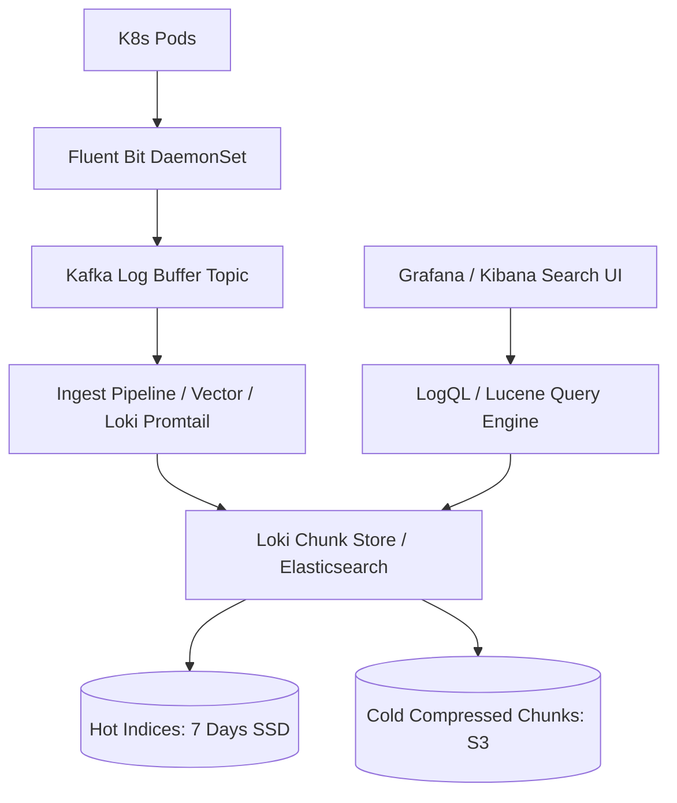

# Reference Architecture: Distributed Logging System (ELK / Grafana Loki)

## 1. System Overview
An enterprise-wide, high-volume distributed log aggregation, indexing, and analytics platform ingesting hundreds of terabytes of structured JSON logs daily, enabling fast keyword search, correlation by trace ID, and compliance retention.

## 2. Business Context
Forms the operational backbone for incident post-mortems, security SIEM threat detection, compliance audits, and real-time debugging across thousands of microservices.

## 3. Functional Requirements
* **Log Ingestion**: Ingest structured JSON logs from Kubernetes pods, VMs, and serverless functions.
* **Full-Text Search & Filtering**: Query logs by `service_name`, `level`, `trace_id`, and regex message text.
* **Tail & Live Streaming**: Stream live log tails directly into developer terminals or web consoles.
* **Retention Lifecycle**: Automated purging and tiering based on corporate compliance policies.

## 4. Non-Functional Requirements
* **Ingestion Throughput**: Support $>100,000\text{ log events/sec}$.
* **Query Latency**: Search query $p99 < 2.0\text{ seconds}$ across a 24-hour log window.
* **Durability**: Zero log loss for Tier-0 financial audit logs.

## 5. Constraints & Assumptions
* Storage costs must be optimized: Indexing every word of every debug log is financially unviable.

## 6. Scale Estimation
* 50,000 CPU cores across 5,000 microservice pods.
* Ingestion: $100,000\text{ log lines/sec}$ average; $300,000\text{ lines/sec}$ peak.
* Average Log Line Size: 500 bytes.
* Peak Ingress Bandwidth: $300,000 \times 500\text{ bytes} \times 8 \approx \mathbf{1.2\text{ Gbps}}$.

## 7. Capacity Planning
* Daily Log Volume: $100,000 \times 500\text{ bytes} \times 86,400 \approx \mathbf{4.32\text{ TB/day}}$ raw logs.
* Compressed Storage (Zstandard $5\times$ compression): $\approx \mathbf{864\text{ GB/day}}$.
* 90-Day Retention: $864\text{ GB} \times 90 \approx \mathbf{77.7\text{ TB}}$.

## 8. High-Level Architecture


## 9. Component Architecture
* **Log Collector (Fluent Bit)**: Lightweight C-based DaemonSet streaming container stdout/stderr from `/var/log/pods`.
* **Buffer Queue (Kafka)**: Shock absorber protecting storage clusters from sudden error log storms.
* **Chunk Engine (Grafana Loki)**: Indexes only metadata labels (`service`, `env`), storing compressed log streams as chunks in S3 (slashing indexing costs by $80\%$).

## 10. Data Flow
1. Microservice emits structured JSON log to stdout.
2. Fluent Bit tails log, enriches with K8s metadata (namespace, pod_name), and pushes to Kafka.
3. Ingest worker batches records into compressed chunks and writes to S3 object storage.
4. Developer searches by `trace_id` in Grafana $\rightarrow$ Query engine retrieves matching chunk $\rightarrow$ Greps text in parallel.

## 11. API Design
Loki Push Protocol (Snappy Protobuf over HTTP):
```protobuf
message PushRequest {
  repeated Stream streams = 1;
}
message Stream {
  string labels = 1; // e.g. {app="orders", env="prod"}
  repeated Entry entries = 2; // [timestamp, log_line]
}
```

## 12. Data Model
Log Chunk Schema:
* Labels (Inverted Index): `app="orders"`, `env="prod"`, `level="error"`.
* Payload: Gzipped chronological stream of `[timestamp_ns, json_payload]`.

## 13. Storage Architecture
Hybrid Tier: Hot 7-day index on local SSD; older logs compressed into 2MB chunks stored in AWS S3 Standard / Infrequent Access.

## 14. Caching Architecture
Redis caches recent query execution results and index label values with 1-hour TTL.

## 15. Messaging & Async Processing
Kafka topic `logs.ingest` partitioned across 64 partitions to parallelize ingestion.

## 16. Scalability Strategy
Separation of Ingesters and Queriers: Ingesters scale based on incoming log volume; Queriers scale independently based on developer search concurrency.

## 17. Performance Optimization
* Standardize on Structured JSON logging (`timestamp`, `level`, `trace_id`, `message`).
* Zero full-text inverted indexing on non-critical debug messages (Loki model).

## 18. Reliability & Fault Tolerance
Local file buffer on Fluent Bit agents ensures logs are not lost if Kafka is temporarily unreachable.

## 19. Consistency & Transactions
Eventual consistency. A 2-second ingestion lag is fully acceptable for operational logging.

## 20. Security Architecture
* **PII Masking**: Fluent Bit filters use regex to redact credit card numbers, JWT tokens, and passwords before network transmission.

## 21. Observability Strategy
Metrics: `logs_ingested_bytes_total`, `chunk_encode_time_seconds`, `query_duration_seconds`.

## 22. Disaster Recovery
Multi-region S3 replication for compliance audit trails.

## 23. Cost Optimization
Dynamic sampling: Drop $90\%$ of HTTP 200 access logs in staging environments; retain $100\%$ of HTTP 5xx errors.

## 24. Trade-off Analysis
* **Elasticsearch vs. Grafana Loki**: Elasticsearch indexes every word, enabling lightning-fast full-text search but requiring $10\times$ more RAM and disk. Loki indexes only labels, storing raw logs in cheap S3 ($80\%$ cheaper).

## 25. Failure Scenarios
* **Log Inundation Attack**: A bug causes an app to emit 1M errors/second. Kafka buffers the spike; dynamic rate limiters throttle the offending pod's logging quota.

## 26. Production Considerations
* Strict Linux log rotation policies (`logrotate`) preventing host disks from filling up if log daemons stall.
