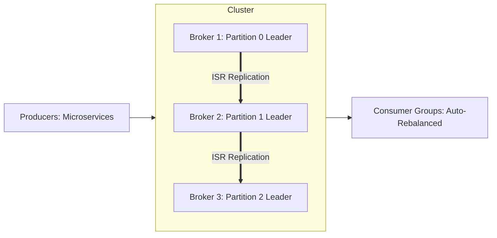

# Reference Architecture: Distributed Message Queue (Apache Kafka / Pulsar)

## 1. System Overview
A distributed, partitioned, replicated append-only commit log service delivering high-throughput, fault-tolerant publish-subscribe event streaming with multi-day retention and historical playback.

## 2. Business Context
Serves as the central real-time event nervous system connecting hundreds of microservices, data pipelines, and streaming analytics engines.

## 3. Functional Requirements
* **Publish Event**: Produce messages to named topics with optional partitioning keys.
* **Subscribe Event**: Consume messages sequentially by offset as part of a consumer group.
* **Replayability**: Rewind consumer offset to any historical timestamp.
* **Retention**: Retain events by time (e.g., 7 days) or compact by key.

## 4. Non-Functional Requirements
* **Throughput**: Support $>500\text{ MB/s}$ ingestion write throughput per cluster.
* **Durability**: Zero message loss under broker crashes ($\text{acks}=\text{all}$).
* **Availability**: $99.99\%$ uptime.
* **Ordering**: Strict per-partition FIFO ordering.

## 5. Constraints & Assumptions
* Consumer groups scale up to the number of partitions in the topic.

## 6. Scale Estimation
* Ingress Volume: 1 Billion events per day.
* Ingress Event Rate: $\approx 11,574\text{ events/sec}$ average; $50,000\text{ events/sec}$ peak.
* Average Event Size: 1 KB.
* Peak Ingress Bandwidth: $50,000 \times 1\text{ KB} = 50\text{ MB/s} = \mathbf{400\text{ Mbps}}$.

## 7. Capacity Planning
* Daily Raw Ingest: $1\text{ Billion} \times 1\text{ KB} \approx 1\text{ TB/day}$.
* 7-Day Retention ($\text{RF}=3$): $1\text{ TB} \times 7 \times 3 \times 1.25\text{ (overhead)} \approx \mathbf{26.25\text{ TB}}$.

## 8. High-Level Architecture

## 9. Component Architecture
* **KRaft Quorum**: Raft-based distributed metadata controller replacing legacy ZooKeeper.
* **Broker Engine**: Manages log segment files on local NVMe disk.
* **Partition Assignor**: Rebalances partition ownership among active consumer pods.

## 10. Data Flow
1. Producer sends batched records to partition leader.
2. Broker writes to OS page cache and appends to disk segment file.
3. Followers fetch records into their local logs.
4. Leader returns ACK once In-Sync Replicas (`min.insync.replicas=2`) acknowledge.
5. Consumers poll records using zero-copy `sendfile`.

## 11. API Design
Kafka Binary Protocol over TCP:
* `ProduceRequest (Topic, Partition, Records)`
* `FetchRequest (Topic, Partition, Offset, MaxBytes)`

## 12. Data Model
Disk Segment File (`00000000000000000000.log`):
* Offset (8 bytes), Timestamp (8 bytes), Key Size (4 bytes), Key, Value Size (4 bytes), Value, CRC32.

## 13. Storage Architecture
Sequential disk appends. Log files split into 1 GB segments; index files (`.index`) map logical offsets to physical byte positions.

## 14. Caching Architecture
Relies completely on Linux **OS Page Cache**; avoids JVM heap memory overhead and GC pauses.

## 15. Messaging & Async Processing
Native streaming platform supporting Dead Letter Queues (DLQ) and Exactly-Once Semantics (EOS).

## 16. Scalability Strategy
Partition Scaling: Increasing partition count parallelizes write throughput and consumer concurrency.

## 17. Performance Optimization
* **Batching & Compression (Zstandard / Snappy)**: Combines 1,000 small records into a single compressed network packet.
* **Zero-Copy Network Transfer**: DMA transfer directly from page cache to NIC.

## 18. Reliability & Fault Tolerance
* `unclean.leader.election.enable = false`: Never elect out-of-sync replica, guaranteeing zero data loss.

## 19. Consistency & Transactions
Transactional messaging with atomic multi-partition commits.

## 20. Security Architecture
SASL/SCRAM authentication, TLS in-transit encryption, Kafka ACLs by topic.

## 21. Observability Strategy
Metrics: `UnderReplicatedPartitions`, `ConsumerLag`, `BytesInPerSec`, `BytesOutPerSec`.

## 22. Disaster Recovery
MirrorMaker 2 / Confluent Cluster Linking for cross-region asynchronous log replication.

## 23. Cost Optimization
Tiered Storage: Local NVMe for hot data (24h); automatic offloading of older segments to AWS S3.

## 24. Trade-off Analysis
* **Kafka vs. RabbitMQ**: Kafka excels at massive throughput, replayability, and streaming; RabbitMQ excels at complex routing, per-message ACKs, and granular queue prioritization.

## 25. Failure Scenarios
* **Broker Crash**: Leader election occurs within 500ms; producers seamlessly redirect traffic to new leader.

## 26. Production Considerations
* Provision dedicated NVMe disks for Kafka log storage separate from OS root volumes.
