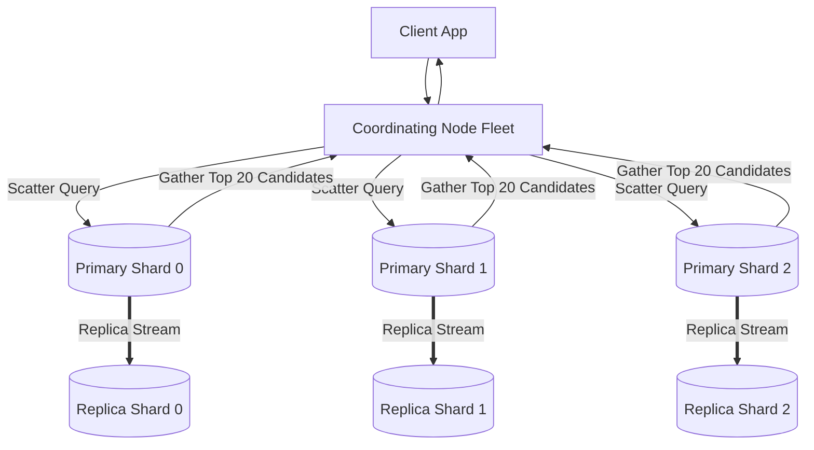

# Reference Architecture: Distributed Full-Text Search Engine (Elasticsearch)

## 1. System Overview
A distributed, JSON-based full-text analytical and search engine providing real-time document indexing, multi-field filtering, complex aggregations, and relevance scoring across billions of unstructured documents.

## 2. Business Context
Powers e-commerce catalog search, enterprise document discovery, cybersecurity log analytics, and application performance monitoring (APM).

## 3. Functional Requirements
* **Document Ingestion**: Index JSON documents in near-real-time ($<1\text{s}$ latency).
* **Full-Text Search**: Keyword search with BM25 relevance scoring, stemming, and fuzzy matching.
* **Faceted Search & Aggregations**: Drill-down filters by brand, category, price range, and date histograms.

## 4. Non-Functional Requirements
* **Query Latency**: Search query $p99 < 50\text{ ms}$, $p50 < 10\text{ ms}$.
* **Availability**: $99.99\%$ for queries.
* **Scalability**: Support horizontal scaling across 100+ nodes and petabytes of data.

## 5. Constraints & Assumptions
* Write path favors near-real-time (NRT) over immediate synchronous durability.

## 6. Scale Estimation
* Ingestion Volume: 5,000 documents/sec peak.
* Query Volume: 25,000 search queries/sec peak.
* Document Collection: 1 Billion documents. Average size: 2 KB.

## 7. Capacity Planning
* Raw Document Data: $1\text{ Billion} \times 2\text{ KB} \approx 2\text{ TB}$.
* Effective Index Storage (Indexes + Doc Values + $\text{RF}=2$): $2\text{ TB} \times 1.5 \times 2 \approx \mathbf{6\text{ TB}}$.

## 8. High-Level Architecture


## 9. Component Architecture
* **Master Nodes**: 3 dedicated nodes managing cluster state, shard routing, and index mappings via Raft consensus.
* **Data Nodes**: Store Lucene shards, execute disk I/O, scoring, and aggregations.
* **Coordinating Nodes**: Stateless proxies handling request parsing, scatter-gather reduction, and HTTP connections.

## 10. Data Flow
1. **Query**: Client queries `POST /products/_search`.
2. Coordinating node broadcasts to 1 copy of each primary/replica shard.
3. Each shard runs BM25 on its local Inverted Index, returning top 20 candidate doc IDs and scores.
4. Coordinating node merges results (priority queue), fetches full `_source` JSON for the winning 20 documents, and returns to client.

## 11. API Design
Elasticsearch Query DSL:
```json
POST /products/_search
{
  "query": {
    "bool": {
      "must": { "match": { "description": "wireless noise cancelling" } },
      "filter": [ { "term": { "brand": "Sony" } }, { "range": { "price": { "lte": 350 } } } ]
    }
  },
  "size": 20
}
```

## 12. Data Model
Inverted Index (terms $\rightarrow$ postings) + Doc Values (columnar storage for sorting and aggregations).

## 13. Storage Architecture
Apache Lucene immutable segments written to high-IOPS NVMe SSDs. Background merge scheduler compacts smaller segments into larger segments.

## 14. Caching Architecture
* **Node Query Cache**: Caches boolean filter results as bitsets.
* **Shard Request Cache**: Caches aggregation results for indices that have not received mutations.

## 15. Messaging & Async Processing
Logstash / Kafka buffers heavy write surges before indexing into Elasticsearch data nodes.

## 16. Scalability Strategy
Index Sharding: Divide index into $N$ primary shards (e.g., 10 shards $\times 200\text{ GB}$). Scale read capacity by increasing replica factor.

## 17. Performance Optimization
* Set `refresh_interval = 30s` on bulk ingest to amortize Lucene segment creation overhead.
* Use keyword type for exact filtering to avoid unnecessary text analysis.

## 18. Reliability & Fault Tolerance
If a data node dies, the master promotes replicas to primary within seconds and allocates new replicas across surviving nodes.

## 19. Consistency & Transactions
Near-Real-Time (NRT): Documents are searchable within 1 second (`refresh_interval`), not immediately upon HTTP 200 write.

## 20. Security Architecture
Role-Based Access Control (RBAC) with document-level and field-level security. TLS encryption on internode transport port 9300.

## 21. Observability Strategy
Metrics: `search_latency_ms`, `indexing_rate`, `jvm_heap_used_percent`, `merging_disk_bytes`.

## 22. Disaster Recovery
Elasticsearch Snapshot lifecycle management backing up indices to AWS S3 hourly.

## 23. Cost Optimization
Hot/Warm/Cold data tiering: Move indices older than 30 days to low-cost Warm nodes with spinning disks or S3 Searchable Snapshots.

## 24. Trade-off Analysis
* **Deep Pagination (`from=10000`)**: Scatter-gather must collect 10,000 results from every shard, destroying memory. Mandate **`search_after` (cursor pagination)** for deep traversal.

## 25. Failure Scenarios
* **JVM Heap OOM**: Field data circuit breaker trips when aggregations consume $>60\%$ heap, throwing exception rather than crashing data node.

## 26. Production Considerations
* Cap JVM heap at 31 GB (`-Xmx31g`) to maintain Compressed Object Pointers (Compressed OOPs).
