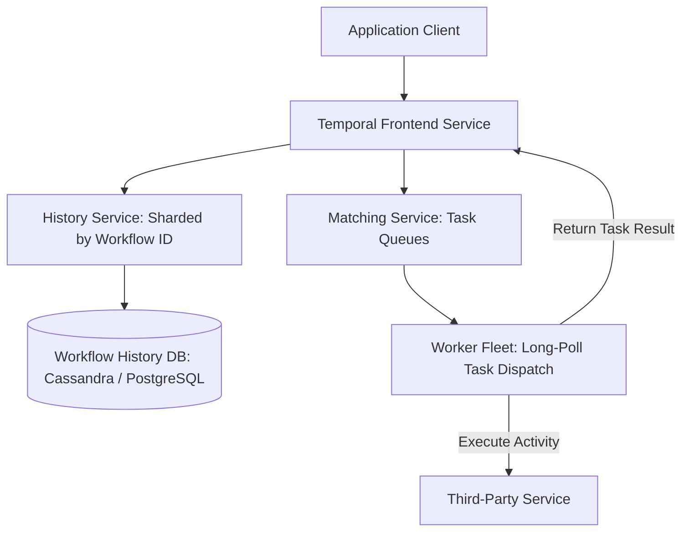

# Reference Architecture: Distributed Task Scheduler & Workflow Engine (Temporal / Airflow)

## 1. System Overview
A resilient, distributed orchestration and task scheduling system managing millions of complex multi-step business workflows, executing deterministic state machines, handling long-running transactions (lasting seconds to months), and ensuring automated retries and compensations.

## 2. Business Context
Orchestrates mission-critical enterprise sagas: customer onboarding, payment subscription billing, warehouse robotics coordination, and cloud resource provisioning.

## 3. Functional Requirements
* **Workflow Definition**: Define multi-step directed acyclic graph (DAG) workflows as code.
* **Task Scheduling**: Distribute tasks to heterogeneous worker fleets (Python, Go, Java).
* **Deterministic Replay**: Reconstruct workflow state by replaying recorded history events.
* **Timers & Delays**: Support durable timers sleeping for minutes, days, or months without consuming server threads.

## 4. Non-Functional Requirements
* **Fault Tolerance**: A worker crash mid-workflow must never lose execution progress.
* **Scale**: Support millions of concurrently active executing workflows.
* **Durability**: Zero state loss across complete data center outages.

## 5. Constraints & Assumptions
* Workflow code must be deterministic (zero random numbers or non-deterministic system clock calls in workflow logic).

## 6. Scale Estimation
* 10 Million workflows executed per day.
* Concurrency: 1 Million simultaneously active long-running workflows.
* Task throughput: $5,000\text{ task completions/sec}$.

## 7. Capacity Planning
* Average workflow history size: 100 KB (50 events per workflow).
* Daily History Storage: $10\text{M} \times 100\text{ KB} \approx \mathbf{1\text{ TB/day}}$.
* 1-Year History Archive: $\approx \mathbf{365\text{ TB}}$ in S3 Parquet.

## 8. High-Level Architecture


## 9. Component Architecture
* **Frontend Service**: Stateless gRPC gateway handling client requests and authorization.
* **History Service**: Core brain managing workflow state machines, shard ownership, and event history append.
* **Matching Service**: High-speed queue routing tasks to idle long-polling workers.
* **Worker Fleet**: Customer-hosted application workers executing business logic.

## 10. Data Flow
1. Client initiates workflow `RunOrderFulfillment(order_id)`.
2. Frontend routes to History Service shard based on `Hash(workflow_id)`.
3. History service writes `WorkflowExecutionStarted` event to DB $\rightarrow$ enqueues first activity task to Matching Service.
4. Worker long-polls Matching Service $\rightarrow$ claims task $\rightarrow$ executes activity $\rightarrow$ reports result.
5. History records `ActivityTaskCompleted` and schedules next step.

## 11. API Design
gRPC Protocol:
```protobuf
service WorkflowService {
  rpc StartWorkflowExecution (StartWorkflowRequest) returns (StartWorkflowResponse);
  rpc RespondActivityTaskCompleted (RespondActivityCompletedRequest) returns (RespondResponse);
}
```

## 12. Data Model
```sql
CREATE TABLE workflow_execution_events (
    workflow_id    VARCHAR(255) NOT NULL,
    run_id         UUID NOT NULL,
    event_id       BIGINT NOT NULL,
    event_type     VARCHAR(64) NOT NULL,
    event_payload  BLOB NOT NULL,
    created_at     TIMESTAMP WITH TIME ZONE DEFAULT NOW(),
    PRIMARY KEY (workflow_id, run_id, event_id)
);
```

## 13. Storage Architecture
Apache Cassandra / PostgreSQL partitioned by `(workflow_id, run_id)`. Event history is strictly append-only, maximizing disk sequential write performance.

## 14. Caching Architecture
In-Memory Shard Cache inside History Service: Caches running workflow state machines, eliminating database lookups during active task transitions.

## 15. Messaging & Async Processing
Matching Service utilizes in-memory synchronous handoff queues; if no worker is idle, tasks persist in database task lists.

## 16. Scalability Strategy
History Sharding: The keyspace is divided into $16,384$ shards distributed uniformly across History Service hosts via consistent hashing.

## 17. Performance Optimization
* **History Compression**: Compress historical execution event streams with Zstandard before flushing to disk.
* **Event Batching**: Batches multiple task transition events into a single database write transaction.

## 18. Reliability & Fault Tolerance
* Worker Crash Resilience: If a worker dies mid-task, the Matching Service times out after `ScheduleToCloseTimeout` and re-dispatches the task to an adjacent worker.

## 19. Consistency & Transactions
Strict ACID consistency per workflow execution. Optimistic concurrency locking on workflow state prevents dual-execution conflicts.

## 20. Security Architecture
mTLS encryption on all gRPC communication; payload data converter encrypts workflow input/output data client-side before reaching the orchestrator.

## 21. Observability Strategy
Metrics: `workflow_execution_latency_seconds`, `activity_schedule_to_start_latency`, `history_shard_load`.

## 22. Disaster Recovery
Multi-region active-standby cluster replication with automated failover.

## 23. Cost Optimization
Completed workflow histories are automatically offloaded from high-cost database SSDs to AWS S3 after 30 days.

## 24. Trade-off Analysis
* **Event Sourcing Replay vs. Snapshot State**: Event sourcing allows zero data loss and exact execution replay at the cost of rebuilding state from events upon worker assignment.

## 25. Failure Scenarios
* **Database IOPS Freeze**: History Service buffers in-flight transitions in memory and gracefully slows down task acceptance using backpressure.

## 26. Production Considerations
* Enforce strict workflow history size limits (max 50,000 events per run); trigger `ContinueAsNew` when workflows exceed thresholds.
