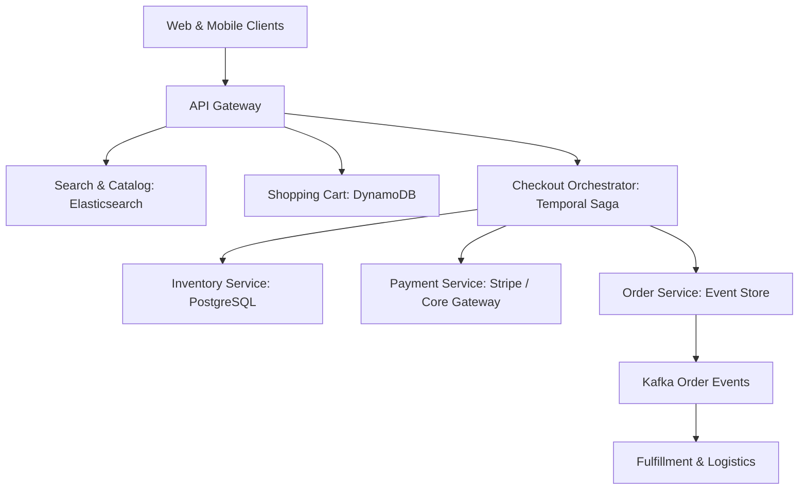

# Reference Architecture: High-Scale E-Commerce Platform (Amazon)

## 1. System Overview
An enterprise-grade, distributed e-commerce marketplace platform orchestrating product catalog browsing, personalized search, shopping carts, real-time inventory reservation, order checkout, and payment settlement.

## 2. Business Context
Serves millions of buyers and sellers globally. Platform reliability during major retail events (Black Friday, Prime Day) is essential; 1 second of checkout delay costs millions in lost revenue.

## 3. Functional Requirements
* **Catalog Management**: Millions of product SKUs with rich attributes and category hierarchies.
* **Shopping Cart**: Low-latency, durable shopping cart state across devices.
* **Inventory Reservation**: Atomic, race-condition-free inventory decrementing during checkout.
* **Order Processing**: Distributed Saga workflow coordinating payment, fulfillment, and shipping.

## 4. Non-Functional Requirements
* **Availability**: $99.99\%$ for browsing; $99.999\%$ for checkout.
* **Consistency**: Strict serializability / ACID for inventory and payments; eventual consistency for catalog views.
* **Scale**: Support $50,000\text{ write TPS}$ during flash sales.

## 5. Constraints & Assumptions
* Inventory overselling is unacceptable.

## 6. Scale Estimation
* 50 Million Daily Active Shoppers.
* Peak Shopping Day: 100 Million visits, 10 Million orders placed.
* Browsing QPS: 150,000 QPS peak.
* Checkout TPS: 15,000 orders/sec peak.

## 7. Capacity Planning
* Catalog Storage (100M SKUs $\times$ 5 KB) $\approx 500\text{ GB}$.
* Product Media Assets: 50 TB on S3 + CloudFront.
* Order Database Storage: 10M orders/day $\times$ 2 KB $\times$ 365 $\approx 7.3\text{ TB/year}$.

## 8. High-Level Architecture


## 9. Component Architecture
* **Catalog Service**: Reads from denormalized Elasticsearch clusters; writes to master PostgreSQL.
* **Cart Service**: Highly available DynamoDB session store.
* **Inventory Service**: High-concurrency relational store enforcing row locks.
* **Checkout Saga Coordinator**: Executes distributed transaction workflows with compensating actions.

## 10. Data Flow
1. Shopper browses catalog via Elasticsearch.
2. Shopper adds item to cart $\rightarrow$ Cart state saved in DynamoDB in $<5\text{ ms}$.
3. Shopper clicks "Buy Now" $\rightarrow$ Checkout Service initiates Saga:
   * Step 1: Reserve Inventory in Inventory DB.
   * Step 2: Authorize Payment via Payment Gateway.
   * Step 3: Create Order in Order DB.
   * Step 4: Emit `OrderPlaced` event to Kafka $\rightarrow$ Trigger fulfillment.

## 11. API Design
* `POST /v1/checkout`
  * Body: `{"cart_id": "c_99", "payment_method_id": "pm_123", "idempotency_key": "9b1deb4d"}`
  * Response: `HTTP 201 Created` `{"order_id": "ord_881", "status": "CONFIRMED"}`

## 12. Data Model
```sql
CREATE TABLE inventory (
    sku_id        VARCHAR(64) PRIMARY KEY,
    total_stock   INTEGER NOT NULL,
    reserved_stock INTEGER NOT NULL DEFAULT 0,
    version       BIGINT NOT NULL,
    CONSTRAINT chk_stock CHECK (total_stock >= reserved_stock)
);
```

## 13. Storage Architecture
Polyglot Persistence: Elasticsearch for catalog search; DynamoDB for shopping carts; PostgreSQL partitioned by `sku_id` for inventory; Kafka for order processing.

## 14. Caching Architecture
Redis Cluster caches product details, pricing, and category trees with 15-minute TTL.

## 15. Messaging & Async Processing
Kafka decouples order creation from warehouse fulfillment, invoice email dispatch, and analytics.

## 16. Scalability Strategy
* **Optimistic Concurrency Control (OCC)**:
  ```sql
  UPDATE inventory 
  SET reserved_stock = reserved_stock + 1, version = version + 1 
  WHERE sku_id = 'SKU_123' AND (total_stock - reserved_stock) >= 1 AND version = 5;
  ```
  Eliminates heavy pessimistic database locks; retries on version collision.

## 17. Performance Optimization
* In-memory inventory caches with Redis atomic `DECR` for flash-sale SKUs, syncing deltas to relational DB in background batches.

## 18. Reliability & Fault Tolerance
* Compensating Saga Transactions: If payment fails after inventory reservation, Saga coordinator automatically invokes `ReleaseInventory` to restore stock.

## 19. Consistency & Transactions
Strong ACID consistency for inventory and payments; eventual consistency for catalog updates and search indexing via CDC (Debezium).

## 20. Security Architecture
* PCI-DSS Level 1 compliance: Full credit card numbers never touch internal servers; tokenized via third-party iframe elements.

## 21. Observability Strategy
Metrics: `checkout_success_rate`, `cart_abandonment_ratio`, `inventory_contention_retries`.

## 22. Disaster Recovery
Multi-Region Active-Passive deployment with cross-region continuous streaming replication.

## 23. Cost Optimization
Spot instances run background analytics and non-urgent email dispatch fleets.

## 24. Trade-off Analysis
* **Pessimistic Locking vs. OCC**: Pessimistic locks prevent race conditions but kill throughput during flash sales. OCC delivers massive throughput at the expense of retry logic.

## 25. Failure Scenarios
* **Payment Gateway Outage**: Checkout queues order in `PENDING_PAYMENT` state, retrying payment asynchronously with exponential backoff before canceling.

## 26. Production Considerations
* Implement Virtual Waiting Rooms (Queue-It) at the CDN edge during massive product launches to throttle traffic to sustainable database rates.
