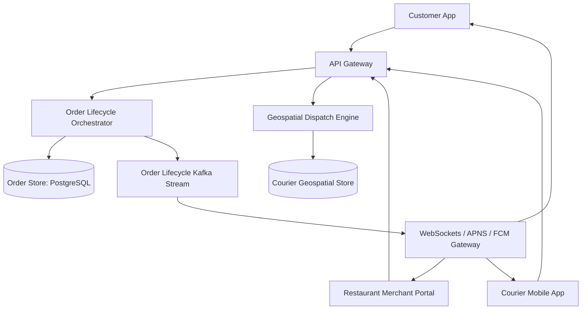

# Reference Architecture: Food Delivery Platform (DoorDash / Deliveroo)

## 1. System Overview
A 3-sided marketplace platform connecting customers, restaurants, and couriers, orchestrating real-time order placement, kitchen prep tracking, courier route optimization, and live GPS delivery tracking.

## 2. Business Context
Coordinates complex physical and digital logistics: kitchen cooking preparation times must align precisely with courier arrival to ensure hot food delivery.

## 3. Functional Requirements
* **Restaurant Catalog**: Dynamic menus, pricing, operating hours, and kitchen prep times.
* **Order Placement**: Multi-item cart checkout with customizations.
* **Three-Sided State Machine**: Placed $\rightarrow$ Accepted by Kitchen $\rightarrow$ Prepared $\rightarrow$ Courier Picked Up $\rightarrow$ Delivered.
* **Courier Dispatch**: Matches available couriers based on vehicle type (bike, car) and proximity.

## 4. Non-Functional Requirements
* **Availability**: $99.99\%$ for ordering.
* **Latency**: Order placement $p99 < 300\text{ ms}$; courier live tracking $p99 < 500\text{ ms}$.
* **Consistency**: Strict ACID for payments and restaurant payouts.

## 5. Constraints & Assumptions
* Restaurant prep time is variable and non-deterministic.

## 6. Scale Estimation
* 10 Million Daily Orders.
* Peak Dinner Rush (6 PM - 8 PM): Absorbs $60\%$ of daily volume ($6\text{ Million orders in 2 hours}$).
* Peak Order Rate: $\frac{6 \times 10^6}{7,200} \approx \mathbf{833\text{ orders/sec}}$.
* Concurrent Active Couriers: 500,000 couriers transmitting GPS pings every 5s = $100,000\text{ GPS writes/sec}$.

## 7. Capacity Planning
* Order Records: 10M orders/day $\times$ 4 KB $\approx 40\text{ GB/day}$.
* 3-Year Order History: $40\text{ GB} \times 365 \times 3 \approx 43.8\text{ TB}$.

## 8. High-Level Architecture


## 9. Component Architecture
* **Menu Service**: Highly cached read-heavy service for restaurant menus.
* **Order State Machine**: Orchestrates transitions across customer, restaurant, and courier.
* **Dispatch Optimizer**: Calculates optimal courier batching (delivering 2 orders on the same route).

## 10. Data Flow
1. Customer places order $\rightarrow$ Payment authorized $\rightarrow$ Order emitted to Kafka.
2. Restaurant tablet receives order via WebSocket $\rightarrow$ Kitchen accepts and sets prep time (25 mins).
3. Dispatch engine calculates ETA $\rightarrow$ Dispatches courier offer to arrive at restaurant exactly at minute 23.
4. Courier picks up food $\rightarrow$ Customer receives live map stream until delivery.

## 11. API Design
* `POST /v1/orders`
  * Body: `{"restaurant_id": "rest_12", "items": [{"id": "item_1", "qty": 2}], "payment_id": "pm_88"}`
* `PUT /v1/orders/{id}/status`
  * Body: `{"status": "PREPARED", "ready_timestamp": "..."}`

## 12. Data Model
```sql
CREATE TABLE orders (
    order_id         UUID PRIMARY KEY,
    customer_id      UUID NOT NULL,
    restaurant_id    UUID NOT NULL,
    courier_id       UUID,
    status           VARCHAR(32) NOT NULL,
    total_amount     DECIMAL(10,2) NOT NULL,
    delivery_address JSONB NOT NULL,
    created_at       TIMESTAMP WITH TIME ZONE DEFAULT NOW()
);
```

## 13. Storage Architecture
PostgreSQL partitioned by `created_at` and sharded by `restaurant_id`. Redis handles courier location tracking and menu caching.

## 14. Caching Architecture
Redis caches restaurant menus and operating hours; invalidates via pub/sub when a restaurant runs out of an ingredient ("86'd items").

## 15. Messaging & Async Processing
Kafka topics: `order.placed`, `order.accepted`, `courier.assigned`, `courier.delivered`.

## 16. Scalability Strategy
Geographic Partitioning: Logistics engines partition compute by metropolitan delivery zones (submarkets).

## 17. Performance Optimization
Order Batching Algorithm: Groups deliveries from the same restaurant going to the same apartment building into a single courier assignment.

## 18. Reliability & Fault Tolerance
* Compensating transactions: If no courier accepts within 20 minutes, automatically refund customer and notify restaurant.

## 19. Consistency & Transactions
Strong ACID for financial transactions and menu inventory. Eventual consistency for live courier tracking.

## 20. Security Architecture
Customer phone and address masking; couriers only see delivery destination coordinates after picking up food.

## 21. Observability Strategy
Metrics: `order_to_delivery_duration_minutes`, `kitchen_wait_time_minutes`, `courier_idle_time`.

## 22. Disaster Recovery
Multi-region cloud failover with automated traffic shifting.

## 23. Cost Optimization
Batching nearby orders reduces courier delivery fees by $25\%$.

## 24. Trade-off Analysis
* **Early Dispatch vs. Late Dispatch**: Dispatching courier immediately causes expensive idle waiting at the restaurant. Delayed dispatch risks food sitting cold. Dynamic ETA ML models optimize the intersection.

## 25. Failure Scenarios
* **Kitchen Rejection**: If restaurant cancels order, trigger immediate credit card authorization release and dispatch apology push notification.

## 26. Production Considerations
* Battery-saving background location modes on courier mobile devices.
