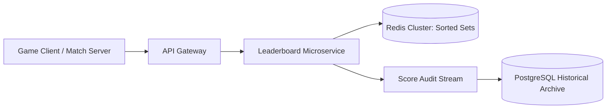

# Reference Architecture: Real-Time Gaming Leaderboard

## 1. System Overview
A low-latency, high-concurrency gaming leaderboard service tracking scores for tens of millions of competitive players, computing global ranks and friend-circle rankings in real time with sub-10ms response times.

## 2. Business Context
Drives player retention and live-ops monetization in multiplayer games (Battle Royale, mobile games). Leaderboards must be instant and cheat-proof.

## 3. Functional Requirements
* **Submit Score**: Update player score upon game completion.
* **Global Top 100**: Retrieve top 100 players globally.
* **Relative Rank (Surrounding Players)**: Retrieve player's exact rank and 5 players above/below them.
* **Seasonal Resets**: Automated monthly and weekly leaderboard resets.

## 4. Non-Functional Requirements
* **Latency**: Score update $p99 < 5\text{ ms}$; rank retrieval $p99 < 10\text{ ms}$.
* **Throughput**: Support $50,000\text{ score updates/sec}$ during tournaments.
* **Scale**: Support 50 Million registered players.

## 5. Constraints & Assumptions
* Millions of players share identical scores; tie-breaking must be deterministic (earliest timestamp wins).

## 6. Scale Estimation
* 20 Million Daily Active Players.
* Daily Matches: 100 Million match completions/day.
* Update Rate: $\approx 1,157\text{ updates/sec}$ average; $\mathbf{25,000\text{ updates/sec}}$ peak.

## 7. Capacity Planning
* Active Leaderboard Players: 10 Million players in seasonal board.
* Redis Sorted Set memory per player: $\approx 64\text{ bytes}$.
* Memory Required: $10\text{M} \times 64\text{ bytes} \approx \mathbf{640\text{ MB RAM}}$!

## 8. High-Level Architecture

## 9. Component Architecture
* **Leaderboard Engine**: Redis Sorted Set (ZSET) running in-memory SkipList operations.
* **Tie-Breaker Encoder**: Encodes score and timestamp into a 64-bit floating point number.
* **Historical Archive**: Relational database storing end-of-season snapshots for trophy distribution.

## 10. Data Flow
1. Player completes match with score $8,500$ at timestamp $T$.
2. Service submits to Redis: `ZADD season_12_board 8500.999999999 player_42`.
3. Player requests rank: `ZREVRANK season_12_board player_42` $\rightarrow$ Returns exact rank $1,420$ in $<0.2\text{ ms}$.
4. Queries surrounding players: `ZREVRANGE season_12_board 1415 1425 WITHSCORES`.

## 11. API Design
* `POST /v1/leaderboards/{id}/scores`
  * Body: `{"player_id": "p_42", "score": 8500}`
* `GET /v1/leaderboards/{id}/me`
  * Response: `{"player_id": "p_42", "rank": 1420, "score": 8500, "surrounding": [ ... ]}`

## 12. Data Model
Redis ZSET Encoding:
* Member: `player_id` (String)
* Score: $\text{Score} + (1.0 - \frac{\text{Timestamp}}{10^{13}})$ (Ensures earlier scores rank higher on tie).

## 13. Storage Architecture
In-memory Redis Cluster with AOF persistence. Historical season standings archived to PostgreSQL and S3.

## 14. Caching Architecture
Edge CDN caches Global Top 100 rankings with 10-second TTL, offloading $90\%$ of read queries.

## 15. Messaging & Async Processing
Kafka buffers score updates during massive game launch surges, ensuring zero dropped scores.

## 16. Scalability Strategy
Sharded Leaderboards: For games with 100M+ players where a single Redis node saturates, partition players into 100 competitive leagues (e.g., Bronze, Silver, Gold leagues of 10,000 players each).

## 17. Performance Optimization
* **SkipList Complexity**: Redis ZSET operations (`ZADD`, `ZRANK`) run in $O(\log N)$ time.
* Pipelining: Batch 50 score updates into a single Redis network round-trip.

## 18. Reliability & Fault Tolerance
Master-Replica Redis replication with automated Sentinel failover in $<3\text{ seconds}$.

## 19. Consistency & Transactions
Strong consistency in memory; eventual consistency for long-term historical archives.

## 20. Security Architecture
Anti-Cheat Validation: Scores submitted only by trusted, cryptographically authenticated dedicated game servers, never by client mobile binaries.

## 21. Observability Strategy
Metrics: `score_update_latency_ms`, `zset_cardinality`, `top_100_query_qps`.

## 22. Disaster Recovery
Daily RDB snapshots copied to AWS S3.

## 23. Cost Optimization
Ephemeral seasonal boards: Delete inactive historical seasonal sets from Redis after awarding rewards.

## 24. Trade-off Analysis
* **Single Global Board vs. League Partitioning**: Single global board allows exact universal ranking but hits single-node Redis write limits at 100k updates/s. League partitioning provides infinite horizontal scaling.

## 25. Failure Scenarios
* **Score Corruption Exploit**: A hacker compromises a game server and injects false billion-point scores. SRE runs automated script pruning scores $>3$ standard deviations from the mean.

## 26. Production Considerations
* Pre-allocate Redis memory buffers to prevent copy-on-write OOM panics during hourly snapshot generation.
