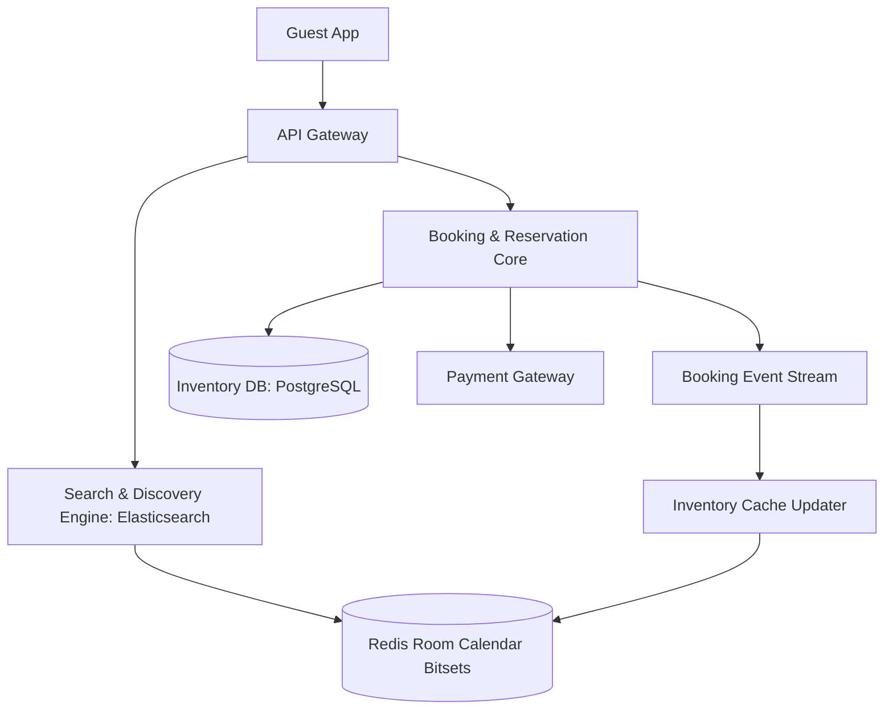

# Reference Architecture: Hotel Reservation System (Airbnb / Booking.com)

## 1. System Overview
A global lodging reservation and property inventory management system supporting real-time room availability search, dynamic pricing, seasonal promotions, and race-condition-free booking reservations across millions of hotel rooms and private apartments.

## 2. Business Context
Powers global travel portals. Overbooking a room creates severe customer friction, legal penalties, and partner churn.

## 3. Functional Requirements
* **Property Search**: Find available rooms by city, date range, guest count, and price.
* **Room Availability**: Real-time calendar showing room inventory per night.
* **Temporary Hold / Reservation**: Lock a room for 15 minutes during the checkout payment window.
* **Booking Confirmation**: Confirm reservation upon successful payment.

## 4. Non-Functional Requirements
* **Search Latency**: Availability search $p99 < 150\text{ ms}$.
* **Consistency**: Strict serializability for room booking (Zero Double Bookings).
* **Availability**: $99.99\%$ for browsing; $99.999\%$ for booking checkout.

## 5. Constraints & Assumptions
* High read-to-write ratio ($1000:1$ browsing to booking ratio).
* Room availability fluctuates continuously based on seasonal calendars.

## 6. Scale Estimation
* 10 Million hotel rooms / apartments listed globally.
* 200 Million Daily Search Queries.
* Peak Search Rate: $\approx \mathbf{10,000\text{ search QPS}}$.
* Booking Rate: 1 Million bookings/day $\approx \mathbf{12\text{ bookings/sec}}$ average; $100\text{ bookings/sec}$ peak.

## 7. Capacity Planning
* Inventory Matrix: $10\text{M rooms} \times 365\text{ days} = \mathbf{3.65\text{ Billion room-nights}}$.
* Bitset Inventory Representation: 1 bit per room-night $\approx \mathbf{456\text{ MB RAM}}$!

## 8. High-Level Architecture


## 9. Component Architecture
* **Search Engine**: Denormalized Elasticsearch cluster filtering by location, amenities, and price.
* **Availability Engine**: Redis bitmap tracking room-night availability for ultra-fast range queries.
* **Reservation Engine**: Relational transactional database executing atomic reservation holds.

## 10. Data Flow
1. Guest searches "Paris, Oct 10-15".
2. Search service filters Paris properties via Elasticsearch.
3. Intersects property IDs with Redis availability bitmaps.
4. Guest clicks "Reserve" $\rightarrow$ Booking Service acquires a 15-minute temporary lock in PostgreSQL.
5. Guest completes payment $\rightarrow$ Status changes to `CONFIRMED` $\rightarrow$ Cache updated.

## 11. API Design
* `POST /v1/reservations/hold`
  * Body: `{"room_id": "rm_401", "check_in": "2026-10-10", "check_out": "2026-10-15"}`
  * Response: `HTTP 201 Created` `{"hold_id": "hld_992", "expires_at": "2026-09-05T10:15:00Z"}`

## 12. Data Model
```sql
CREATE TABLE room_reservations (
    room_id         UUID NOT NULL,
    stay_date       DATE NOT NULL,
    reservation_id  UUID,
    status          VARCHAR(16) NOT NULL, -- AVAILABLE, HELD, CONFIRMED
    hold_expires_at TIMESTAMP WITH TIME ZONE,
    PRIMARY KEY (room_id, stay_date)
);
```

## 13. Storage Architecture
PostgreSQL partitioned by `stay_date` (monthly partitions) with B-Tree indexes on `(room_id, stay_date)`.

## 14. Caching Architecture
Redis Bitmaps: Each room has a bitmap for the year (365 bits). Bitwise `AND` across date ranges evaluates availability in microseconds.

## 15. Messaging & Async Processing
Delayed Kafka queues or Redis TTLs release expired temporary holds automatically after 15 minutes if payment is not completed.

## 16. Scalability Strategy
Partitioning by `hotel_id` or geographical market. All reservation transactions for a single hotel execute on the same database shard, eliminating cross-shard locks.

## 17. Performance Optimization
* **Atomic Reservation Hold SQL**:
  ```sql
  UPDATE room_reservations 
  SET status = 'HELD', hold_expires_at = NOW() + INTERVAL '15 minutes'
  WHERE room_id = 'rm_401' 
    AND stay_date BETWEEN '2026-10-10' AND '2026-10-14'
    AND (status = 'AVAILABLE' OR (status = 'HELD' AND hold_expires_at < NOW()));
  ```
  If rows updated equals nights requested (5), hold is successful!

## 18. Reliability & Fault Tolerance
* Active-Active multi-AZ PostgreSQL deployment with automated failover.

## 19. Consistency & Transactions
Strict ACID consistency for reservation state transitions to guarantee zero double bookings.

## 20. Security Architecture
PCI-DSS tokenization for payment details; guest PII encrypted at rest.

## 21. Observability Strategy
Metrics: `search_to_book_conversion_ratio`, `hold_abandonment_rate`, `double_booking_conflict_count` (Must be 0).

## 22. Disaster Recovery
Continuous cross-region streaming replication with RPO = 0.

## 23. Cost Optimization
Elasticsearch index lifecycle management transitioning historical past reservations to cold storage.

## 24. Trade-off Analysis
* **Pessimistic Row Locks vs. Status Columns**: Pessimistic `FOR UPDATE` locks block all concurrent readers; status columns with conditional `UPDATE` allow high read concurrency.

## 25. Failure Scenarios
* **Payment Webhook Delay**: Guest pays via PayPal, but webhook arrives after the 15-minute hold expires. Check if room is still available; if re-booked, trigger automated full refund.

## 26. Production Considerations
* Background reconciliation worker running every 60s to unlock abandoned expired holds.
