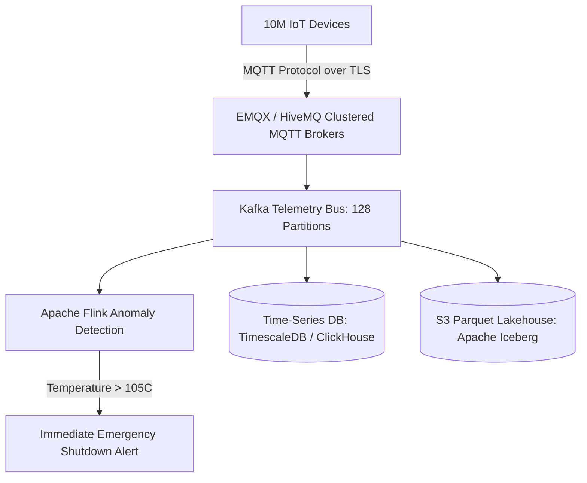

# Reference Architecture: Industrial IoT Data Ingestion Platform

## 1. System Overview
A massive-scale Industrial Internet of Things (IIoT) telemetry platform ingesting, processing, and analyzing sensor telemetry (vibration, temperature, pressure) from millions of industrial machines and connected vehicles with sub-second anomaly detection.

## 2. Business Context
Powers predictive maintenance, smart grid monitoring, and connected vehicle fleet telemetry. Detecting machine overheating seconds before failure prevents multi-million dollar factory outages.

## 3. Functional Requirements
* **Telemetry Ingestion**: Ingest high-frequency sensor readings over MQTT and HTTP.
* **Real-Time Anomaly Detection**: Evaluate alerting rules over 10-second sliding windows.
* **Time-Series Storage**: Store high-resolution raw telemetry for 30 days; downsample for 5 years.
* **Device Twin & Management**: Maintain latest desired and reported device state.

## 4. Non-Functional Requirements
* **Ingestion Scale**: Support $>1,000,000\text{ sensor readings/sec}$.
* **Availability**: $99.999\%$ uptime.
* **Durability**: Zero data loss for regulatory industrial audit streams.

## 5. Constraints & Assumptions
* Edge devices operate over unstable cellular links; must buffer data offline.

## 6. Scale Estimation
* 10 Million connected IoT devices.
* Reporting Interval: 1 ping every 10 seconds.
* Ingress Rate: $\frac{10,000,000}{10} = \mathbf{1,000,000\text{ events/sec}}$.
* Average Payload: 100 bytes.
* Ingress Bandwidth: $1,000,000 \times 100\text{ bytes} \times 8 = \mathbf{800\text{ Mbps}}$.

## 7. Capacity Planning
* Daily Raw Volume: $1\text{M/s} \times 100\text{ bytes} \times 86,400 \approx \mathbf{8.64\text{ TB/day}}$.
* 30-Day Hot Storage: $8.64\text{ TB} \times 30 \approx \mathbf{259.2\text{ TB}}$.
* 5-Year Downsampled Archive: $\approx \mathbf{150\text{ TB}}$ in S3 Parquet.

## 8. High-Level Architecture


## 9. Component Architecture
* **MQTT Broker Cluster**: EMQX / HiveMQ handling 10M concurrent persistent TCP connections and QoS levels.
* **Stream Analytics (Flink)**: Evaluates complex event processing (CEP) rules in real-time.
* **Time-Series Store**: ClickHouse / TimescaleDB optimized for time-series range aggregations.

## 10. Data Flow
1. Sensor publishes binary Protobuf telemetry over MQTT to topic `sensors/{device_id}/telemetry`.
2. MQTT broker bridges message to Kafka topic `iot.raw`.
3. Flink processes stream: calculates 1-minute rolling average temperature.
4. If temperature $> 105^\circ\text{C}$ for 3 consecutive readings: trigger emergency alert.
5. Telemetry batched and written to ClickHouse and S3 Iceberg lakehouse.

## 11. API Design
MQTT Topic Hierarchy:
```text
industry/v1/factory_12/line_4/device_9921/telemetry
```
Payload (Protobuf):
```protobuf
message SensorReading {
  string device_id = 1;
  int64 timestamp_ms = 2;
  float temperature = 3;
  float pressure = 4;
  float vibration = 5;
}
```

## 12. Data Model
```sql
CREATE TABLE sensor_telemetry (
    device_id    UUID,
    timestamp    DateTime64(3),
    temperature  Float32,
    pressure     Float32,
    vibration    Float32
) ENGINE = MergeTree()
PARTITION BY toYYYYMM(timestamp)
ORDER BY (device_id, timestamp);
```

## 13. Storage Architecture
ClickHouse columnar storage with LZ4 compression; Parquet files organized in Apache Iceberg tables for long-term Spark analytical queries.

## 14. Caching Architecture
Redis stores the **Device Shadow (Device Twin)**: the latest known status, firmware version, and configuration for every device.

## 15. Messaging & Async Processing
Kafka cluster partitioned by `device_id` ensures sequential delivery of sensor readings per device.

## 16. Scalability Strategy
MQTT Broker Auto-Scaling: Clustered EMQX nodes scale out horizontally behind Anycast Layer-4 load balancers.

## 17. Performance Optimization
* Binary Protocol Buffers reduce bandwidth by $75\%$ compared to JSON over cellular networks.
* Micro-batching: Flink batches 10,000 records per database insert statement.

## 18. Reliability & Fault Tolerance
* MQTT QoS 1 (At-Least-Once): Devices buffer telemetry in local flash memory during cellular network outages and sync upon reconnect.

## 19. Consistency & Transactions
Eventual consistency for historical analytics; read-after-write consistency for device configuration shadow updates.

## 20. Security Architecture
* Device Mutual TLS (mTLS): Every physical IoT device carries a unique X.509 cryptographic certificate burned into hardware secure elements (TPM).

## 21. Observability Strategy
Metrics: `mqtt_active_connections`, `telemetry_ingest_rate_events_sec`, `anomaly_detection_latency_ms`.

## 22. Disaster Recovery
Multi-region Kafka mirroring; S3 cross-region bucket replication.

## 23. Cost Optimization
Automated downsampling: Retain millisecond-resolution data for 7 days; aggregate into 1-minute averages for 90 days; aggregate into 1-hour averages for 5 years.

## 24. Trade-off Analysis
* **MQTT vs. HTTP**: HTTP introduces $1\text{ KB}$ header overhead on every ping; MQTT persistent connection consumes only $2\text{ bytes}$ per packet header, slashing cellular data transmission costs by $95\%$.

## 25. Failure Scenarios
* **Cellular Network Reconnection Storm**: A telecom outage ends; 500,000 devices reconnect simultaneously. MQTT brokers rate-limit connection establishment via token bucket to prevent TCP SYN starvation.

## 26. Production Considerations
* Strict schema validation rejecting corrupted sensor voltage readings before writing to Kafka.
