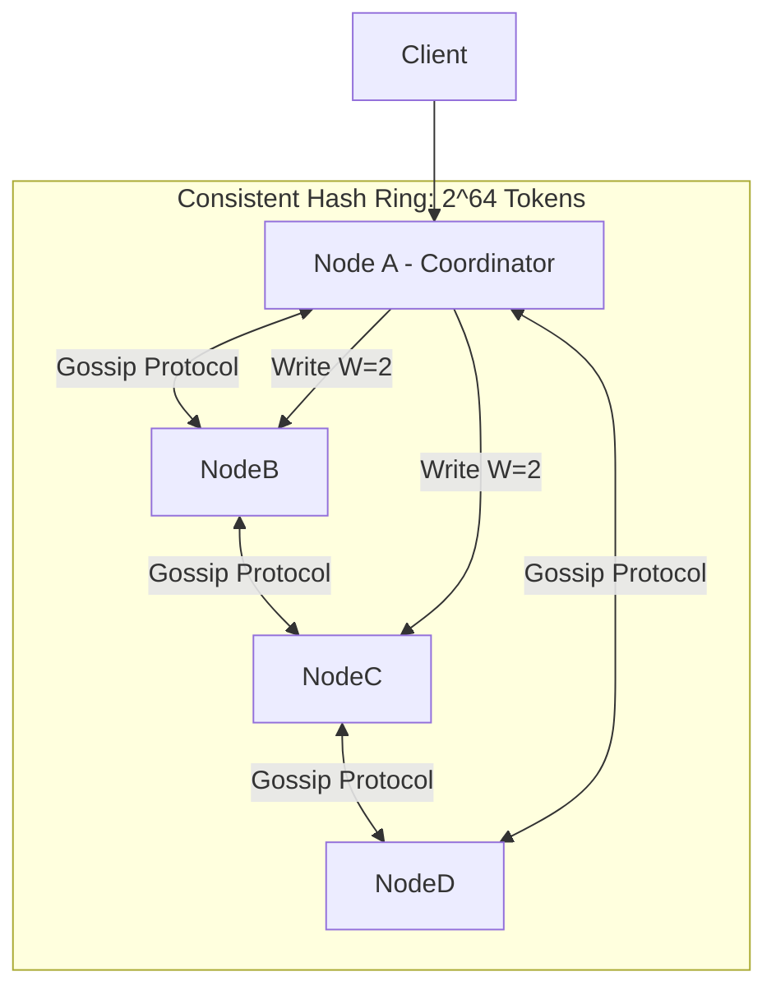

# Reference Architecture: Distributed Key-Value Store (Dynamo / Cassandra)

## 1. System Overview
A decentralized, masterless distributed key-value storage engine providing tunable consistency, high write availability, horizontal scalability, and automatic partition rebalancing across commodity hardware.

## 2. Business Context
Powers shopping carts, user session states, personalization preferences, and distributed configuration stores where downtime is impermissible.

## 3. Functional Requirements
* `put(key, value)`: Store an arbitrary binary payload associated with a key.
* `get(key)`: Retrieve the latest value associated with a key.
* `delete(key)`: Tombstone and delete a key-value record.

## 4. Non-Functional Requirements
* **Availability**: $99.999\%$ uptime. Always writable.
* **Latency**: Single-digit millisecond reads ($<5	ext{ ms}$) and sub-millisecond writes ($<1	ext{ ms}$).
* **Scalability**: Linear throughput growth when adding nodes.
* **Partition Tolerance**: Continues operating during network splits.

## 5. Constraints & Assumptions
* Masterless peer-to-peer ring topology.
* Replication Factor $	ext{RF} = 3$.

## 6. Scale Estimation
* Ingress Read: $50,000	ext{ QPS}$.
* Ingress Write: $20,000	ext{ QPS}$.
* Average Key Size: 64 bytes; Value Size: 1 KB.

## 7. Capacity Planning
* Daily Write Volume: $20,000 	imes 1	ext{ KB} 	imes 86,400 pprox 1.72	ext{ TB/day}$.
* 1-Year Storage ($	ext{RF}=3$): $1.72 	imes 365 	imes 3 pprox \mathbf{1.88	ext{ PB}}$.

## 8. High-Level Architecture


## 9. Component Architecture
* **Coordinator Node**: Any node receiving a client request acts as the coordinator.
* **Storage Engine**: LSM-Tree (Memtable in RAM + SSTables on NVMe SSD).
* **Gossip Service**: Disseminates cluster membership and node health every 1 second.
* **Anti-Entropy Engine**: Background Merkle Tree exchange resolving replica divergence.

## 10. Data Flow
1. **Write Flow**: Coordinator hashes key $
ightarrow$ Finds 3 successor nodes on hash ring $
ightarrow$ Dispatches writes in parallel $
ightarrow$ Nodes append to WAL and Memtable $
ightarrow$ When $W$ replicas ACK, coordinator returns success.
2. **Read Flow**: Coordinator queries $R$ replicas $
ightarrow$ Compares timestamps/vector clocks $
ightarrow$ Returns latest $
ightarrow$ Fires asynchronous Read Repair to stale replicas.

## 11. API Design
gRPC Protocol:
```protobuf
service KeyValueStore {
  rpc Get (GetRequest) returns (GetResponse);
  rpc Put (PutRequest) returns (PutResponse);
}
```

## 12. Data Model
SSTable binary format: Key-Value tuples with 64-bit microsecond timestamps and 1-byte deletion flag (tombstone).

## 13. Storage Architecture
LSM-Tree with Bloom Filters. Bloom filter checks disk presence in $<1\ \mu	ext{s}$, avoiding unnecessary random disk reads for non-existent keys.

## 14. Caching Architecture
Operating system Page Cache accelerates SSTable reads; internal Row Cache holds hot uncompressed key-value records.

## 15. Messaging & Async Processing
Hinted Handoff: If a replica is temporarily unreachable during a write, the coordinator buffers the mutation locally and replays it once the replica recovers.

## 16. Scalability Strategy
Consistent Hashing with Virtual Nodes (256 vnodes per physical server) ensures uniform key and disk distribution.

## 17. Performance Optimization
Sequential append-only writes eliminate random disk head movement and SSD block-erase amplification.

## 18. Reliability & Fault Tolerance
Quorum consensus: $R + W > N$. With $N=3, W=2, R=2$, the system tolerates 1 dead node with zero loss of strong consistency.

## 19. Consistency & Transactions
Tunable consistency per query: `ONE`, `QUORUM`, or `ALL`. Conflict resolution via Vector Clocks or Last-Write-Wins (LWW).

## 20. Security Architecture
TLS 1.3 inter-node mesh encryption; mTLS client authentication.

## 21. Observability Strategy
Metrics: `read_repair_count`, `gossip_pending_tasks`, `sstable_compaction_pending`.

## 22. Disaster Recovery
Rack-aware and Region-aware replica placement ensures replicas reside in distinct power grids.

## 23. Cost Optimization
Tiered tiered storage: Older SSTables moved from NVMe SSDs to high-density QLC SSDs.

## 24. Trade-off Analysis
* **LSM-Tree vs. B-Tree**: LSM provides blazing write performance at the expense of read amplification and background compaction CPU cycles.

## 25. Failure Scenarios
* **Split-Brain Network Partition**: Majority partition continues processing quorum writes; minority partition rejects writes with `InsufficientNodesException`.

## 26. Production Considerations
* Tune Linux I/O scheduler to `none`/`mq-deadline` for NVMe storage.
* Schedule major compactions during off-peak hours.
