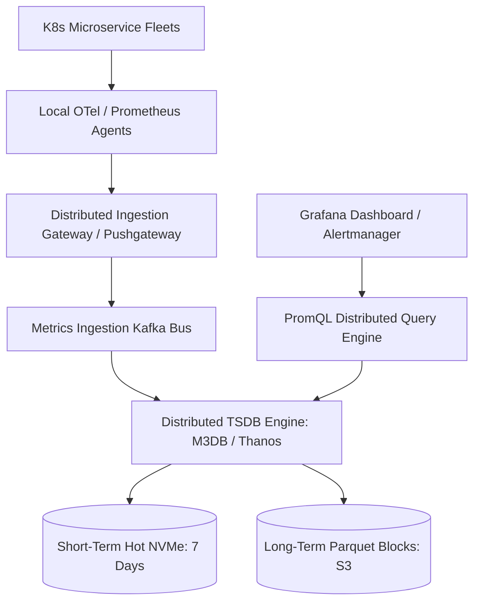

# Reference Architecture: Metrics Monitoring & Time-Series DB (Prometheus / M3)

## 1. System Overview
A globally scalable time-series metrics monitoring and alerting system ingesting millions of metrics per second, executing PromQL queries, evaluating SLO alerts, and generating Grafana dashboards.

## 2. Business Context
Provides real-time visibility into infrastructure, microservices, and business health. The monitoring system is Tier-0: it must function reliably even when all other production systems fail.

## 3. Functional Requirements
* **Metric Ingestion**: Scrape or push numerical time-series metrics: `(metric_name, labels, timestamp, value)`.
* **Query Engine**: Real-time evaluation of PromQL aggregations (e.g., `rate(http_requests_total[5m])`).
* **Alerting**: Continuous threshold evaluation triggering PagerDuty/Slack alerts.

## 4. Non-Functional Requirements
* **Ingestion Scale**: Ingest 5 Million metrics/second.
* **Query Latency**: Dashboard graph queries $p99 < 500\text{ ms}$.
* **Availability**: $99.99\%$ uptime.
* **Storage Compression**: Sub-2 bytes per data point on disk.

## 5. Constraints & Assumptions
* High cardinality metric labels can crash traditional TSDBs.

## 6. Scale Estimation
* 5 Million metric samples ingested per second.
* Samples/day: $5,000,000 \times 86,400 \approx \mathbf{432\text{ Billion samples/day}}$.

## 7. Capacity Planning
* Raw sample: Timestamp (8 bytes) + Value (8 bytes) = 16 bytes.
* Gorilla Compression (Facebook XOR delta-of-delta): Compresses 16 bytes to **1.5 bytes per sample**.
* Daily Storage: $432 \times 10^9 \times 1.5\text{ bytes} \approx \mathbf{648\text{ GB/day}}$.
* 1-Year Storage (with downsampling): $\approx \mathbf{70\text{ TB}}$.

## 8. High-Level Architecture


## 9. Component Architecture
* **Ingestion Gateway**: Validates label cardinality and distributes samples across Kafka partitions.
* **TSDB Storage Nodes**: Implements Gorilla XOR floating-point compression and inverted index for label matching.
* **Alertmanager**: Deduplicates, silences, and routes PagerDuty alerts.

## 10. Data Flow
1. Microservice exposes `/metrics` endpoint.
2. Ingest agent scrapes every 15s and forwards to Ingest Gateway.
3. Gateway writes to Kafka $\rightarrow$ TSDB nodes consume, compress in memory, and flush 2-hour immutable blocks to disk.
4. Grafana executes PromQL query $\rightarrow$ Query engine matches inverted index $\rightarrow$ Decompresses time-series $\rightarrow$ Renders chart.

## 11. API Design
Prometheus Remote Write Protocol (Snappy-compressed Protobuf over HTTP):
```protobuf
message WriteRequest {
  repeated TimeSeries timeseries = 1;
}
```

## 12. Data Model
Time-Series Sample:
```text
http_requests_total{service="orders", status="500", env="prod"} 1725508800000 42.0
```

## 13. Storage Architecture
Tiered TSDB: Hot data (0–7 days) stored in memory and local NVMe SSDs; compacted downsampled blocks (1-minute resolution for 30 days, 1-hour resolution for 1 year) uploaded to AWS S3.

## 14. Caching Architecture
In-Memory Index Cache holds active label inverted index (Roaring Bitmaps).

## 15. Messaging & Async Processing
Kafka buffers metrics during TSDB compaction or node replacement, preventing metric loss.

## 16. Scalability Strategy
Consistent Hashing on Metric Identity:
$$\text{TSDB Shard} = \text{MurmurHash3}(\text{MetricName} + \text{Labels}) \pmod N$$

## 17. Performance Optimization
* **Gorilla Floating Point Compression**: Encodes value deltas using variable-length XOR masks, shrinking 8-byte doubles into an average of 1.37 bytes.
* **Delta-of-Delta Timestamps**: Encodes fixed 15-second scrape intervals in 1 or 2 bits.

## 18. Reliability & Fault Tolerance
* Quorum Replication ($\text{RF}=3$): Reads/writes tolerate 1 TSDB node failure with zero metric loss.

## 19. Consistency & Transactions
Eventual consistency. Missing 1 metric sample during a network blip is acceptable; correctness of trend matters more than strict transactions.

## 20. Security Architecture
mTLS between scrape agents and ingestion gateways; tenant isolation for multi-tenant SaaS metrics.

## 21. Observability Strategy
Meta-Monitoring: A separate, isolated secondary monitoring cluster monitors the health of the primary monitoring system.

## 22. Disaster Recovery
Long-term historical blocks reside in multi-region S3 storage.

## 23. Cost Optimization
Automated downsampling policies: Raw data retained for 14 days; downsampled to 5-minute resolution after 14 days ($90\%$ storage savings).

## 24. Trade-off Analysis
* **Pull vs. Push**: Pull (Prometheus scraping) detects down targets automatically and prevents server DDoS; Push (OTel Collector) works better for short-lived serverless functions.

## 25. Failure Scenarios
* **High-Cardinality Explosion**: A rogue microservice injects `user_id` as a metric label. Ingestion gateway detects label cardinality $>100,000$ and drops the offending metric to protect TSDB memory.

## 26. Production Considerations
* Strict linting enforcing rules against unbounded metric labels.
