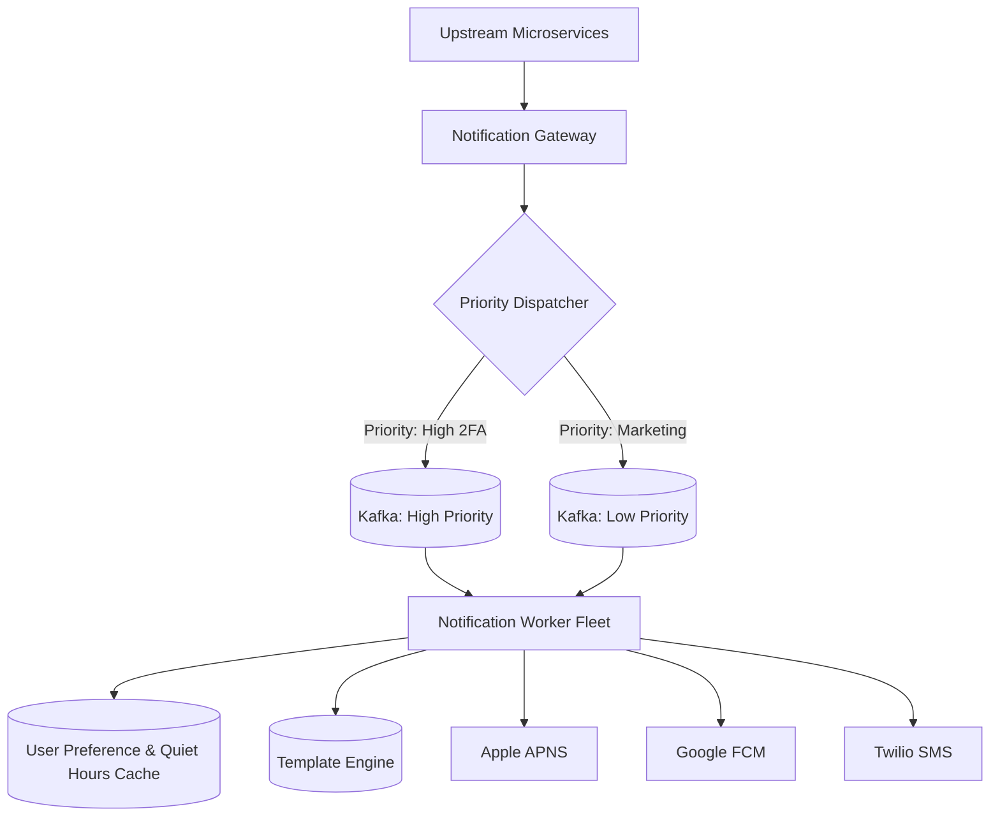

# Reference Architecture: Enterprise Notification Service

## 1. System Overview
A centralized, multi-channel notification platform delivering billions of real-time push notifications, SMS alerts, transactional emails, and in-app messages with user preference enforcement and global rate limits.

## 2. Business Context
Drives user engagement, order tracking, two-factor authentication (2FA), and critical security alerts across global consumer and B2B products.

## 3. Functional Requirements
* Multi-channel delivery: iOS (APNS), Android (FCM), SMS (Twilio), Email (SendGrid).
* Template management with dynamic variable substitution and localization.
* User preference engine: Opt-ins, channel preferences, quiet hours.
* Notification tracking: Sent, delivered, opened, bounced, and clicked.

## 4. Non-Functional Requirements
* **Throughput**: Support 50,000 notifications per second peak.
* **Latency**: Critical 2FA OTP delivery $p99 < 3	ext{ seconds}$.
* **Reliability**: At-Least-Once delivery guarantee.

## 5. Constraints & Assumptions
* Third-party delivery providers (Apple, Google, Twilio) enforce rate limits and experience transient outages.

## 6. Scale Estimation
* 100 Million daily active users.
* 5 notifications per user/day = 500 Million notifications/day.
* Average RPS: $rac{500 	imes 10^6}{86,400} pprox 5,787	ext{ notifications/sec}$. Peak: $pprox 25,000	ext{ notifications/sec}$.

## 7. Capacity Planning
* Daily payload storage (500M events $	imes$ 1 KB) $pprox 500	ext{ GB/day}$.
* Bandwidth Egress: $25,000 	imes 1	ext{ KB} 	imes 8 pprox 200	ext{ Mbps}$.

## 8. High-Level Architecture


## 9. Component Architecture
* **Ingestion Gateway**: Authenticates incoming notification requests.
* **Preference Service**: Evaluates user unsubscribe states and timezone quiet hours.
* **Delivery Workers**: Channel-specific worker pools handling provider throttling and retries.

## 10. Data Flow
1. Order Service calls `POST /v1/notifications` with user ID, template ID, and variables.
2. Ingest service publishes to Kafka.
3. Worker consumes event $
ightarrow$ Queries Redis for user preferences $
ightarrow$ Renders template $
ightarrow$ Dispatches to third-party provider.

## 11. API Design
* `POST /v1/notifications`
  * Body: `{"recipient_id": "usr_102", "priority": "CRITICAL", "template": "order_confirmed", "vars": {"order_id": "1001"}}`
  * Response: `HTTP 202 Accepted` `{"notification_id": "notif_8812a"}`

## 12. Data Model
```sql
CREATE TABLE notification_log (
    notification_id UUID PRIMARY KEY,
    recipient_id    UUID NOT NULL,
    channel         VARCHAR(32) NOT NULL,
    status          VARCHAR(32) NOT NULL,
    sent_at         TIMESTAMP WITH TIME ZONE,
    delivered_at    TIMESTAMP WITH TIME ZONE
);
```

## 13. Storage Architecture
PostgreSQL holds template definitions and delivery logs. Historical audit events streamed to AWS S3 Parquet data lake.

## 14. Caching Architecture
Redis caches user opt-in flags, timezone quiet hours, and channel preferences with 24-hour TTL.

## 15. Messaging & Async Processing
Dedicated Kafka topics per priority tier: `notifications.critical`, `notifications.transactional`, `notifications.marketing`.

## 16. Scalability Strategy
Channel workers scale independently: SMS workers scale during OTP surges; push workers scale during sports events.

## 17. Performance Optimization
* Multi-channel provider connection pooling.
* Batch dispatch: Dispatching 500 APNS notifications per HTTP/2 connection.

## 18. Reliability & Fault Tolerance
* Dual-Provider Fallback: If Twilio SMS fails, automatically failover to MessageBird.
* Dead Letter Queue captures undeliverable notifications for manual redrive.

## 19. Consistency & Transactions
Eventual consistency for delivery tracking. Idempotency keys prevent double-sending messages.

## 20. Security Architecture
Zero storage of plain-text passwords or full credit card numbers in notification payloads.

## 21. Observability Strategy
Metrics: `delivery_latency_seconds_bucket`, `provider_status_code_total`, `queue_lag`.

## 22. Disaster Recovery
Multi-region active-active setup with automated provider failover.

## 23. Cost Optimization
Routing optimization engine chooses the lowest-cost SMS carrier dynamically per country destination.

## 24. Trade-off Analysis
* **Synchronous vs. Asynchronous Dispatch**: Asynchronous queuing returns HTTP 202 in $<5	ext{ ms}$, decoupling callers from third-party vendor latency.

## 25. Failure Scenarios
* **APNS Major Outage**: APNS worker buffers events in Kafka; backs off until Apple recovers without dropping customer notifications.

## 26. Production Considerations
* Strict deduplication preventing sending duplicate marketing blasts.
