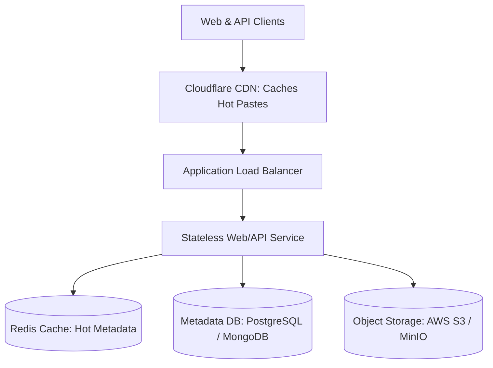

# Reference Architecture: Distributed Pastebin Service (Pastebin / GitHub Gist)

## 1. System Overview
A cloud-scale text sharing and snippet storage platform allowing users to store arbitrary blocks of plain text or source code (up to 10 MB per paste), generating unique shareable URLs with optional access passwords and expiration lifespans.

## 2. Business Context
Pastebin services serve developer debugging, log sharing, code reviews, and ephemeral data transfer. Revenue derives from premium subscriptions (custom vanity URLs, encrypted private pastes, unlisted access) and display advertising.

## 3. Functional Requirements
* **Create Paste**: Upload text content (max 10 MB); return unique short URL.
* **View Paste**: Retrieve raw text or syntax-highlighted HTML by URL token.
* **Expiration**: Automated TTL expiration (10 minutes, 1 day, 1 week, Never).
* **Access Control**: Public, Unlisted (unsearchable), and Password-Protected.

## 4. Non-Functional Requirements
* **Availability**: $99.95\%$ uptime.
* **Latency**: Content retrieval $p99 < 30	ext{ ms}$; generation $p99 < 150	ext{ ms}$.
* **Durability**: 11 Nines ($99.999999999\%$) durability for persistent pastes.

## 5. Constraints & Assumptions
* Maximum paste size: 10 MB (Average size: 10 KB).
* Read-to-write ratio: $20:1$.

## 6. Scale Estimation
* **Write Traffic**: 10 Million new pastes per day.
  * Ingress writes/sec (avg): $rac{10 	imes 10^6}{86,400} pprox 116	ext{ pastes/sec}$.
  * Peak writes/sec ($3	imes$): $pprox 350	ext{ writes/sec}$.
* **Read Traffic ($20:1$)**:
  * Ingress reads/sec (avg): $116 	imes 20 = 2,320	ext{ reads/sec}$.
  * Peak reads/sec ($3	imes$): $pprox 7,000	ext{ reads/sec}$.

## 7. Capacity Planning
* **Daily Ingress Data**: $10	ext{M} 	imes 10	ext{ KB} = 100	ext{ GB/day}$.
* **3-Year Storage Volume**: $100	ext{ GB/day} 	imes 365 	imes 3 pprox 109.5	ext{ TB}$.
* **Bandwidth Ingress**: $350	ext{ writes/s} 	imes 10	ext{ KB} 	imes 8 pprox 28	ext{ Mbps}$.
* **Bandwidth Egress**: $7,000	ext{ reads/s} 	imes 10	ext{ KB} 	imes 8 pprox 560	ext{ Mbps}$.

## 8. High-Level Architecture


## 9. Component Architecture
* **Metadata Database**: Stores paste ID, user ID, expiration timestamp, size, and S3 object URI.
* **Object Store**: Stores actual text payload as immutable S3 objects.
* **Expiration Daemon**: Scans expired metadata records and issues asynchronous S3 delete batch commands.

## 10. Data Flow
1. **Create Paste**: Client `POST /v1/pastes` $
ightarrow$ API saves text body to S3 $
ightarrow$ Inserts metadata row with S3 pointer to PostgreSQL $
ightarrow$ Returns unique paste ID.
2. **View Paste**: Client `GET /v1/pastes/{id}` $
ightarrow$ API checks Redis for S3 presigned URL or text $
ightarrow$ Fetches text from S3 $
ightarrow$ Returns text.

## 11. API Design
* `POST /v1/pastes`
  * Body: `{"content": "console.log('hello');", "syntax": "javascript", "ttl_seconds": 86400}`
  * Response: `HTTP 201 Created` `{"paste_url": "https://paste.bin/p/9xK2b"}`
* `GET /v1/pastes/{id}`
  * Response: `HTTP 200 OK` `{"content": "...", "created_at": "...", "views": 42}`

## 12. Data Model
```sql
CREATE TABLE pastes (
    paste_id    VARCHAR(8) PRIMARY KEY,
    user_id     UUID,
    s3_key      VARCHAR(255) NOT NULL,
    size_bytes  INTEGER NOT NULL,
    is_private  BOOLEAN DEFAULT FALSE,
    password_hash VARCHAR(255),
    expires_at  TIMESTAMP WITH TIME ZONE,
    created_at  TIMESTAMP WITH TIME ZONE DEFAULT NOW()
);
CREATE INDEX idx_pastes_exp ON pastes(expires_at) WHERE expires_at IS NOT NULL;
```

## 13. Storage Architecture
Hybrid storage: PostgreSQL holds structured metadata (100 bytes/row), while AWS S3 holds raw text payloads. This prevents database bloat and provides sub-cent per-gigabyte economics.

## 14. Caching Architecture
Redis caches hot pastes ($<100	ext{ KB}$) directly in memory, bypassing both metadata DB and S3 for viral snippets.

## 15. Messaging & Async Processing
Paste creation emits event to Kafka for asynchronous malware/phishing scanning (ClamAV) and syntax highlighting HTML pre-rendering.

## 16. Scalability Strategy
S3 provides infinite horizontal scaling for text storage. PostgreSQL metadata is horizontally partitioned by `created_at` or sharded by `paste_id` hash.

## 17. Performance Optimization
* **Gzip/Brotli Compression**: Text compresses exceptionally well ($60\%	ext{--}80\%$ reduction). Compress before storing in S3 and transfer compressed to clients.
* **Edge CDN**: Cache public pastes with explicit `Cache-Control` headers at CDN edge PoPs.

## 18. Reliability & Fault Tolerance
* S3 guarantees $99.999999999\%$ durability across multiple physical facilities.
* Graceful degradation: If Redis fails, read directly from S3.

## 19. Consistency & Transactions
Eventual consistency is acceptable for paste viewing across regions. Strong read-your-own-writes consistency ensured by immediately returning the generated link to the creator.

## 20. Security Architecture
* **XSS Defense**: Raw paste output must declare `Content-Type: text/plain; charset=utf-8` and `X-Content-Type-Options: nosniff` to prevent browser script injection.
* **Malware Scanning**: Automated scanning blocks executable binaries or ransomware payloads.

## 21. Observability Strategy
* Golden Signals: S3 upload latency, metadata query duration, and paste creation rates.
* Storage volume growth alerts tracking daily S3 GB ingestion.

## 22. Disaster Recovery
Cross-region S3 bucket replication (CRR) mirrors all paste payloads from US-East to US-West.

## 23. Cost Optimization
S3 Lifecycle rules transition pastes older than 90 days to S3 Infrequent Access, and delete expired pastes automatically.

## 24. Trade-off Analysis
* **Blob in DB vs. S3**: Storing text directly in database BLOB columns simplifies transactions but inflates database backup sizes by $50	imes$. Hybrid DB + S3 decouples storage cost from database performance.

## 25. Failure Scenarios
* **S3 Outage in Single Region**: Application fails over read traffic to replicated secondary bucket in adjacent cloud region.

## 26. Production Considerations
* Strict rate limiting on unauthenticated IP uploads to prevent storage abuse.
* Database VACUUM scheduling to handle continuous high-frequency deletion of expired pastes.
