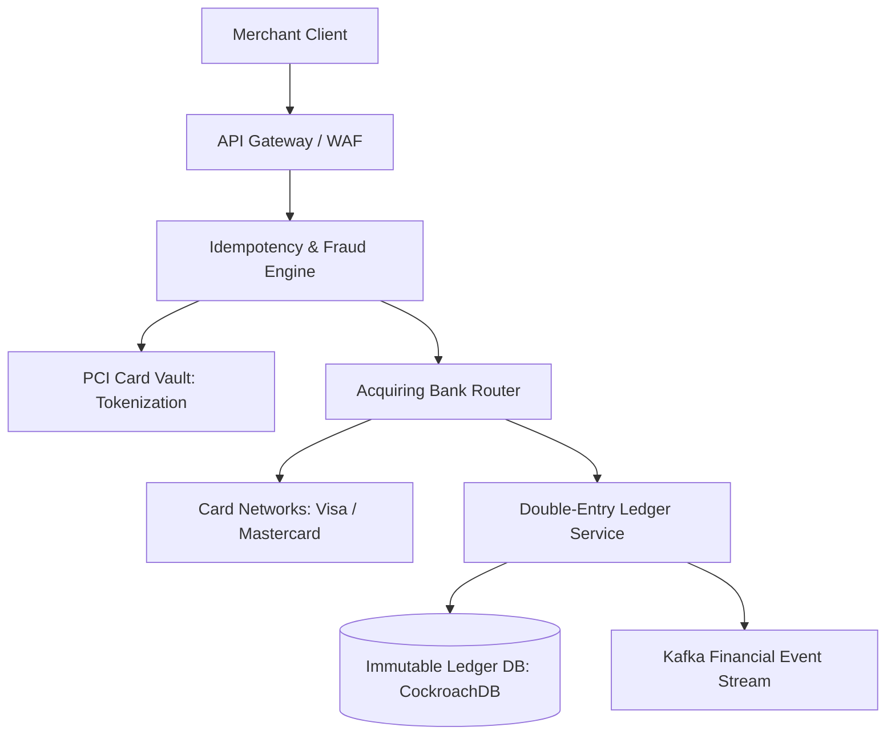

# Reference Architecture: Global Payment Gateway (Stripe)

## 1. System Overview
A mission-critical financial processing infrastructure executing payment authorizations, card tokenization, multi-currency settlements, fraud evaluation, and merchant payouts with zero data loss and strict compliance.

## 2. Business Context
Processes hundreds of billions of dollars in global commerce. Single transactions must execute with absolute cryptographic and accounting integrity.

## 3. Functional Requirements
* **Payment Processing**: Charge credit cards, digital wallets (Apple Pay), and bank transfers (ACH / SEPA).
* **Tokenization Vault**: PCI-DSS Level 1 compliant secure vault tokenizing raw card details.
* **Idempotency**: Prevent double charges during client retries.
* **Ledger Accounting**: Immutable double-entry bookkeeping ledger.

## 4. Non-Functional Requirements
* **Availability**: $99.999\%$ (Five Nines) uptime.
* **Latency**: Payment authorization $p99 < 1500\text{ ms}$ (constrained by banking rails).
* **Security & Compliance**: Strict PCI-DSS Level 1, SOC2, ISO 27001.
* **Durability**: Zero data loss ($\text{RPO} = 0$).

## 5. Constraints & Assumptions
* Upstream banking networks (Visa, Mastercard, acquiring banks) experience unpredictable latencies and transient timeouts.

## 6. Scale Estimation
* Ingress Volume: 100 Million payment transactions per day.
* Average TPS: $\frac{100 \times 10^6}{86,400} \approx 1,157\text{ TPS}$.
* Peak TPS ($5\times$ on Cyber Monday): $\approx \mathbf{5,800\text{ TPS}}$.

## 7. Capacity Planning
* Ledger Storage: 100M tx/day $\times$ 4 ledger entries $\times$ 500 bytes $\approx 200\text{ GB/day}$.
* 7-Year Regulatory Retention: $200\text{ GB} \times 365 \times 7 \approx \mathbf{511\text{ TB}}$ of immutable ledger storage.

## 8. High-Level Architecture


## 9. Component Architecture
* **Card Tokenization Vault**: Isolated, air-gapped HSM/enclave converting PAN (credit card numbers) to UUID tokens.
* **Bank Routing Engine**: Dynamically routes authorizations to optimal acquiring banks for maximum approval rates.
* **Double-Entry Ledger**: Immutable financial accounting ledger enforcing $\sum \text{Debits} == \sum \text{Credits}$.

## 10. Data Flow
1. Merchant frontend tokenizes card directly against PCI Vault via iframe.
2. Merchant backend calls `POST /v1/charges` with Card Token and `Idempotency-Key`.
3. Gateway validates idempotency in Redis.
4. Fraud engine scores transaction (Radar ML).
5. Router submits ISO 8583 message to Visa/Mastercard.
6. Bank returns approval $\rightarrow$ Double-entry ledger records transaction $\rightarrow$ Response returned to merchant.

## 11. API Design
* `POST /v1/charges`
  * Headers: `Idempotency-Key: 7bX9-4412-99a`
  * Body: `{"amount": 5000, "currency": "usd", "source": "tok_visa4242"}`
  * Response: `HTTP 200 OK` `{"id": "ch_102", "status": "succeeded", "captured": true}`

## 12. Data Model
```sql
CREATE TABLE ledger_entries (
    entry_id        UUID PRIMARY KEY,
    transaction_id  UUID NOT NULL,
    account_id      UUID NOT NULL,
    amount          BIGINT NOT NULL, -- Stored in cents (integer)
    direction       VARCHAR(6) NOT NULL, -- DEBIT or CREDIT
    created_at      TIMESTAMP WITH TIME ZONE DEFAULT NOW()
);
```

## 13. Storage Architecture
Distributed SQL (CockroachDB / Google Cloud Spanner) providing synchronous multi-region Raft replication and external consistency (strict serializability).

## 14. Caching Architecture
Redis Cluster stores idempotency keys and cached token metadata. Zero caching of cardholder financial balances.

## 15. Messaging & Async Processing
Kafka streams payment success/failure events to asynchronous webhook delivery workers and settlement reconciliation pipelines.

## 16. Scalability Strategy
Partitioning by `merchant_id` and `account_id` distributes transactional load across independent CockroachDB ranges.

## 17. Performance Optimization
* Multi-homed connections to major card networks over dedicated AWS DirectConnect / private leased fiber lines.
* Integer arithmetic for all monetary values (storing amounts in lowest currency unit: cents/pence) to eliminate floating-point rounding errors.

## 18. Reliability & Fault Tolerance
* Dual-Acquirer Routing: If primary acquiring bank times out, automatically retry transaction on secondary acquirer.
* Idempotency guarantee ensures network retries never charge customer twice.

## 19. Consistency & Transactions
Strict ACID Serializability. Financial accounts must never use eventual consistency; balances are mathematically proven via ledger sums.

## 20. Security Architecture
* Dedicated PCI Enclave: Application microservices never see raw Primary Account Numbers (PAN).
* Envelope Encryption: Data encrypted with AES-256-GCM using keys stored in Hardware Security Modules (HSM).

## 21. Observability Strategy
Metrics: `authorization_approval_rate`, `bank_timeout_count`, `idempotency_collision_rate`.

## 22. Disaster Recovery
Synchronous multi-region replication across 3 cloud regions guarantees $\text{RPO} = 0$ and $\text{RTO} < 10\text{ seconds}$.

## 23. Cost Optimization
Smart routing optimizes interchange fees, routing debit cards through lower-cost regional PIN-debit networks.

## 24. Trade-off Analysis
* **Synchronous Replication vs. Latency**: Paying a $20\text{ ms}$ cross-region consensus latency penalty is mandatory to guarantee zero lost financial transactions.

## 25. Failure Scenarios
* **Acquirer Network Partition**: Authorizations fail over instantly to secondary banking partners without dropping merchant checkout flows.

## 26. Production Considerations
* Nightly automated reconciliation matching internal ledger entries against acquiring bank raw clearing settlement files.
