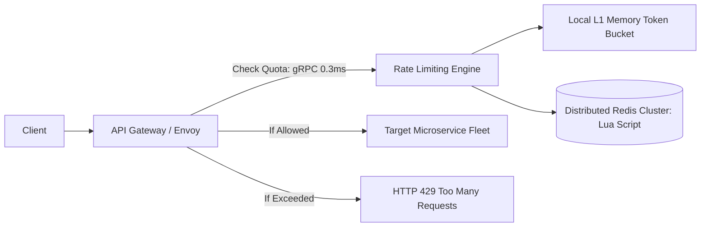

# Reference Architecture: Distributed Rate Limiter

## 1. System Overview
A low-latency, highly available distributed rate limiting service that protects enterprise APIs, microservices, and databases from denial-of-service (DDoS) attacks, brute-force credential stuffing, API quota abuse, and thundering herds.

## 2. Business Context
Enforces API monetization tiers (Free vs. Enterprise SLA quotas), protects multi-tenant platforms from noisy neighbors, and guarantees system stability during flash crowd events.

## 3. Functional Requirements
* **Quota Enforcement**: Limit requests by IP address, user ID, API token, or tenant organization.
* **Configurable Rules**: Support distinct quotas per endpoint (e.g., `/auth/login`: 5 req/min; `/catalog`: 1,000 req/min).
* **Deterministic Rejection**: Return `HTTP 429 Too Many Requests` with standard `RateLimit-*` headers.

## 4. Non-Functional Requirements
* **Ultra-Low Latency**: Decision overhead $p99 < 1.0	ext{ ms}$, $p50 < 0.2	ext{ ms}$.
* **High Availability**: $99.999\%$ (Five Nines). The rate limiter must never become the point of failure.
* **Fail-Open Policy**: If the rate limiter crashes, traffic must be permitted rather than blocking the enterprise.

## 5. Constraints & Assumptions
* Centralized Redis cluster latency over LAN: $pprox 0.5	ext{ ms}$.
* Ingress traffic: $100,000	ext{ RPS}$ global scale.

## 6. Scale Estimation
* Ingress Rate: $100,000	ext{ RPS}$ peak.
* Concurrency: $100,000$ operations per second evaluated against in-memory stores.

## 7. Capacity Planning
* Active tracking keys (Users / IPs): $5,000,000$ active tracking tokens in any 10-minute window.
* Memory per key (Sliding Window Counter): $pprox 64	ext{ bytes}$.
* Memory Required: $5,000,000 	imes 64	ext{ bytes} pprox 320	ext{ MB RAM}$ (Tiny memory footprint!).

## 8. High-Level Architecture


## 9. Component Architecture
* **Gateway Filter**: Intercepts requests, extracts client identity, executes rate check.
* **Two-Tier Limiter**: Local memory in Envoy for high-frequency coarse-grained shedding; centralized Redis for fine-grained multi-node consistency.
* **Rule Repository**: Dynamic policy store updated via GitOps/Consul.

## 10. Data Flow
1. Gateway receives request with `Authorization: Bearer token`.
2. Hash token to lookup policy $
ightarrow$ Limit: 100 req/min.
3. Execute atomic Redis Lua script evaluating sliding window counter.
4. If count $\le$ limit: return allow with remaining count. Else: return reject with `Retry-After`.

## 11. API Design
Internal gRPC Rate Limit Service (Envoy RLS Protocol):
```protobuf
service RateLimitService {
  rpc ShouldRateLimit (RateLimitRequest) returns (RateLimitResponse);
}
```

## 12. Data Model
Redis Keyspace:
* Key: `rl:{tenant_id}:{user_id}:{endpoint}:{minute_timestamp}`
* Type: Hash / Integer Counter with 120-second TTL.

## 13. Storage Architecture
In-Memory Redis Cluster partitioned across 16 shards using consistent hashing. No persistent disk storage required (ephemeral rate windows).

## 14. Caching Architecture
L1 Local Memory cache inside Envoy gateway evaluates burst quotas locally, reducing Redis network hops by $70\%$.

## 15. Messaging & Async Processing
Violations and blocked IP events emitted asynchronously to Kafka for real-time security alerting and automated IP banning.

## 16. Scalability Strategy
Sharded Redis Cluster handles $100,000+	ext{ RPS}$ through pipeline execution and atomic Lua scripts.

## 17. Performance Optimization
* **Atomic Lua Script**: Executes sliding window calculations inside Redis single-thread engine in 1 network round-trip.
* **Local Token Bucketing**: Clients refill local token buckets in batches of 20, reducing Redis calls from 1:1 to 1:20.

## 18. Reliability & Fault Tolerance
* **Fail-Open**: If Redis fails or times out $>2.0	ext{ ms}$, allow the request and log an emergency warning.
* Master-Replica Redis Sentinel pairs in every Availability Zone.

## 19. Consistency & Transactions
Eventual / loose consistency is fully acceptable. Over-permitting 2 extra requests during a transient partition is vastly superior to blocking live business transactions.

## 20. Security Architecture
* Defense against Rate Limiter Bypass: IP address extraction must inspect authenticated reverse proxy headers (`X-Forwarded-For` trusted leftmost IP).

## 21. Observability Strategy
* Metrics: `ratelimit_allowed_total`, `ratelimit_rejected_total`, `redis_eval_duration_ms`.

## 22. Disaster Recovery
Zero persistent state DR required; if entire Redis cluster is destroyed, spin up new cluster; quotas reset to zero.

## 23. Cost Optimization
Ephemeral TTLs (60s) keep RAM usage under $1	ext{ GB}$, running on minimal cloud compute.

## 24. Trade-off Analysis
* **Sliding Window Log vs. Sliding Window Counter**: Log maintains exact timestamps of every request ($O(N)$ memory); Counter interpolates linearly across adjacent windows ($O(1)$ memory, $99.5\%$ accuracy). Counter chosen for production efficiency.

## 25. Failure Scenarios
* **Redis Latency Spike**: If Redis slows to $>5	ext{ ms}$, circuit breaker trips to Fail-Open, shielding API latency.

## 26. Production Considerations
* Set dynamic whitelists for internal health check probes and payment webhooks.
