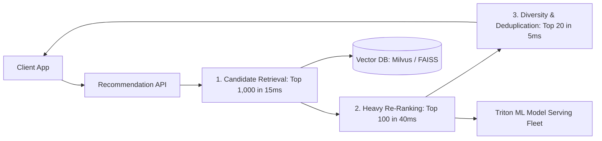

# Reference Architecture: Personalized Recommendation Engine (Netflix / TikTok)

## 1. System Overview
A real-time, low-latency personalized recommendation and discovery engine delivering individualized content and video recommendations to hundreds of millions of users based on deep collaborative filtering, graph embeddings, and real-time contextual signals.

## 2. Business Context
Directly governs platform consumption: over $80\%$ of watched content on Netflix and $90\%$ on TikTok is driven by recommendation algorithms.

## 3. Functional Requirements
* **Real-Time Recommendation Generation**: Generate top 20 personalized items for a user's home screen.
* **Candidate Retrieval**: Retrieve thousands of potential candidates from millions of catalog items in $<20\text{ ms}$.
* **Heavy Re-Ranking**: Score and rank candidates using deep learning models in $<50\text{ ms}$.
* **Feedback Ingestion**: Capture user interactions (clicks, skips, watch percentage) in real-time.

## 4. Non-Functional Requirements
* **End-to-End Latency**: Recommendations returned in $p99 < 100\text{ ms}$.
* **Availability**: $99.99\%$ (with static fallback).
* **Freshness**: User interactions reflected in recommendations within 10 seconds.

## 5. Constraints & Assumptions
* Evaluating a 500-layer neural network across 10 million items in real-time is impossible; multi-stage pipeline is mandatory.

## 6. Scale Estimation
* 100 Million Daily Active Users.
* Recommendation requests: $500\text{ Million requests/day} \approx \mathbf{5,787\text{ QPS}}$ average; $25,000\text{ QPS}$ peak.
* Interaction events (swipes, clicks, watch time): 5 Billion events/day $\approx \mathbf{60,000\text{ events/sec}}$.

## 7. Capacity Planning
* Interaction Stream: $60,000 \times 200\text{ bytes} \approx 12\text{ MB/s} \approx \mathbf{1\text{ TB/day}}$ raw telemetry.
* Vector Embeddings Storage: 10 Million items $\times$ 512-dimension float vectors $\approx \mathbf{20\text{ GB RAM}}$ in Vector DB (Milvus / Pinecone).

## 8. High-Level Architecture


## 9. Component Architecture
* **Candidate Retrieval Stage (Approximate Nearest Neighbors - ANN)**: Uses FAISS / HNSW vector indexing to narrow 10M catalog items down to top 1,000 candidates based on cosine similarity.
* **Scoring & Ranking Stage**: Two-Tower Neural Network / GBDT evaluated on NVIDIA Triton GPU serving clusters.
* **Diversity & Filter Layer**: Removes already-watched items and injects category diversity.

## 10. Data Flow
1. User opens app $\rightarrow$ API sends user vector embedding to Vector DB.
2. Vector DB executes HNSW search $\rightarrow$ Returns top 1,000 candidate IDs.
3. Model server evaluates deep scoring model against 1,000 candidates.
4. Business logic filters out items watched in last 7 days $\rightarrow$ Returns top 20.
5. User watches 10s of video $\rightarrow$ Telemetry emitted to Kafka $\rightarrow$ Real-time Flink pipeline updates user vector in $<5\text{ seconds}$.

## 11. API Design
* `GET /v1/recommendations/feed?user_id=usr_102&limit=20`
  * Response: `HTTP 200 OK` `{"items": [{"id": "vid_88", "score": 0.984}, ...], "model_version": "v3.2"}`

## 12. Data Model
User Feature Store (Redis / Feast):
```json
{
  "user_id": "usr_102",
  "preferred_categories": ["sci-fi", "action"],
  "recent_watch_ids": ["vid_12", "vid_99"],
  "user_embedding": [0.042, -0.198, 0.512, "... 512 floats ..."]
}
```

## 13. Storage Architecture
Feast / Redis for low-latency online feature serving. Milvus / Pinecone for vector embeddings. Snowflake / S3 for offline model training data.

## 14. Caching Architecture
Pre-computed fallback recommendations: Cache top 20 recommendations for active users in Redis, refreshing hourly in the background.

## 15. Messaging & Async Processing
Kafka topic `user.interactions` streams clickstream events to Apache Flink for real-time online feature updates.

## 16. Scalability Strategy
GPU Cluster Autoscaling: Scale Triton model serving pods based on GPU duty cycle and queue latency.

## 17. Performance Optimization
* Multi-Stage Funnel: Reduces computational complexity from $O(N)$ across 10M items to $O(K)$ across 1,000 candidates.
* 8-bit Integer Quantization (INT8) of neural network weights reduces GPU inference latency by $3\times$.

## 18. Reliability & Fault Tolerance
* **Graceful Fallback**: If GPU model serving cluster times out $>60\text{ ms}$, immediately return static pre-cached list of trending popular items.

## 19. Consistency & Transactions
Eventual consistency. User watch history taking 2 seconds to influence the recommendation feed is unnoticeable.

## 20. Security Architecture
Anonymization of user training data; zero storage of sensitive PII in model training pipelines.

## 21. Observability Strategy
Metrics: `recommendation_p99_latency_ms`, `ctr_click_through_rate`, `model_drift_divergence`.

## 22. Disaster Recovery
Model checkpoints stored in S3; inference clusters can be recreated in alternate cloud regions in minutes.

## 23. Cost Optimization
Evaluate expensive deep ranking models only on top 200 items instead of top 1,000 items during peak traffic periods.

## 24. Trade-off Analysis
* **Exploration vs. Exploitation**: Recommending only high-confidence historical favorites traps users in filter bubbles. $10\%$ random exploratory items are injected to discover new interests.

## 25. Failure Scenarios
* **Cold Start Problem**: New user with zero watch history. Fallback immediately to demographic and geographic popular items until first 3 clicks occur.

## 26. Production Considerations
* Continuous A/B testing infrastructure allocating $5\%$ of traffic to experimental model candidates.
