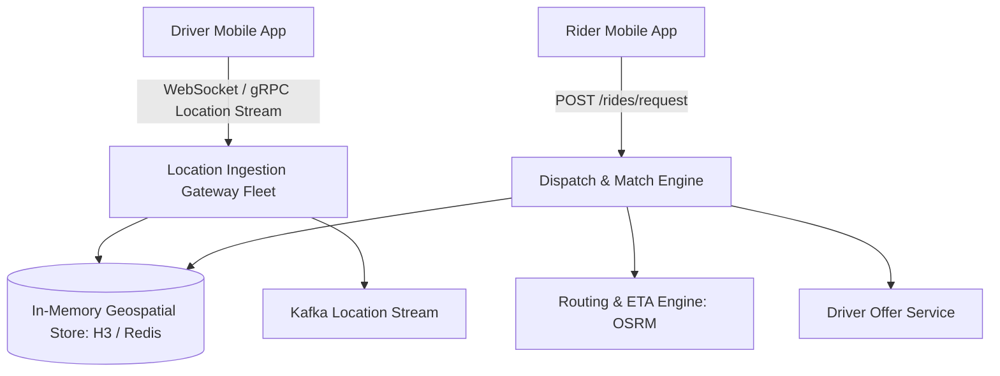

# Reference Architecture: Ride-Sharing Dispatch Service (Uber / Lyft)

## 1. System Overview
A real-time geospatial matching, tracking, and dynamic pricing engine connecting millions of passenger ride requests with nearby active drivers, computing optimal routes and updating live vehicle locations every 4 seconds.

## 2. Business Context
Dispatches rides globally in dense urban markets. Minimizing Passenger Wait Time (ETA) and maximizing driver utilization directly governs marketplace profitability.

## 3. Functional Requirements
* **Location Tracking**: Ingest driver GPS coordinates every 4 seconds.
* **Driver Match**: Find and dispatch the optimal driver within a 3-mile radius in $<2\text{ seconds}$.
* **Trip Lifecycle**: Request, dispatch, pickup, in-transit, complete, and fare payment.
* **Dynamic Pricing (Surge)**: Adjust pricing based on real-time neighborhood supply and demand.

## 4. Non-Functional Requirements
* **Availability**: $99.99\%$ uptime.
* **Latency**: Location ingest $p99 < 50\text{ ms}$; matching response $p99 < 2\text{ seconds}$.
* **Geospatial Precision**: Neighborhood indexing down to sub-100 meter accuracy.

## 5. Constraints & Assumptions
* Mobile GPS coordinates contain noise and jitter.
* High write traffic: Millions of moving vehicles sending updates simultaneously.

## 6. Scale Estimation
* 5 Million active drivers; 20 Million active riders daily.
* Driver GPS updates: 5 Million drivers $\times$ 1 update every 4 seconds = $\mathbf{1,250,000\text{ GPS writes/sec}}$!
* Ride requests: 50,000 requests/minute peak.

## 7. Capacity Planning
* GPS Payload: `(driver_id, lat, lon, bearing, timestamp)` $\approx 40\text{ bytes}$.
* Ingress Throughput: $1,250,000 \times 40\text{ bytes} = 50\text{ MB/s} = \mathbf{400\text{ Mbps}}$ continuous ingress.
* Ephemeral Location Cache: In-memory store holding latest location of 5M drivers $\approx 500\text{ MB RAM}$.

## 8. High-Level Architecture


## 9. Component Architecture
* **Location Ingestion Gateway**: High-throughput Netty/Go gateway terminating millions of driver sockets.
* **Geospatial Index (Uber H3)**: Hexagonal hierarchical spatial index dividing Earth into discrete hexagonal cells.
* **Dispatch Engine**: Evaluates candidate drivers within expanding H3 concentric rings.
* **Surge Pricing Engine**: Aggregates ride demand vs. idle driver supply per H3 cell every 10 seconds.

## 10. Data Flow
1. Driver app transmits GPS coordinates over WebSocket every 4s.
2. Ingestion service maps `(lat, lon)` to H3 Cell ID (e.g., resolution 8 $\approx 460\text{m}$ edge).
3. Updates driver's current cell in in-memory Redis cluster.
4. Rider requests trip $\rightarrow$ Dispatch engine identifies rider's H3 cell $\rightarrow$ Queries adjacent cells for idle drivers $\rightarrow$ Calculates ETA via OSRM $\rightarrow$ Sends offer to best driver.

## 11. API Design
* `POST /v1/rides/request`
  * Body: `{"pickup": {"lat": 37.7749, "lon": -122.4194}, "dropoff": {"lat": 37.7833, "lon": -122.4167}}`
  * Response: `HTTP 200 OK` `{"trip_id": "trip_991", "estimated_fare": 18.50, "eta_minutes": 4}`

## 12. Data Model
```sql
CREATE TABLE trips (
    trip_id       UUID PRIMARY KEY,
    rider_id      UUID NOT NULL,
    driver_id     UUID,
    status        VARCHAR(32) NOT NULL, -- REQUESTED, MATCHED, IN_PROGRESS, COMPLETED
    pickup_lat    DOUBLE PRECISION NOT NULL,
    pickup_lon    DOUBLE PRECISION NOT NULL,
    fare_amount   DECIMAL(8,2),
    created_at    TIMESTAMP WITH TIME ZONE DEFAULT NOW()
);
```

## 13. Storage Architecture
PostgreSQL / Cassandra for persistent trip records and billing history. Redis Cluster for transient real-time vehicle coordinates.

## 14. Caching Architecture
In-memory H3 spatial indexing: Maps `H3_Cell_ID` $\rightarrow$ Set of `driver_id`s.

## 15. Messaging & Async Processing
Kafka topics: `driver.locations`, `trip.lifecycle`, `surge.telemetry`. Flink processes real-time stream aggregation for surge multipliers.

## 16. Scalability Strategy
Geographic Cell Sharding: Shard matching engines by metropolitan area (e.g., NYC cluster, London cluster, Tokyo cluster). NYC ride requests never query London driver state.

## 17. Performance Optimization
* **H3 Hexagonal Indexing**: Hexagons have equal distance to all 6 neighbors, simplifying radial expansion queries compared to square grids.
* **Kalman Filtering**: Client-side smoothing of noisy GPS readings before network transmission.

## 18. Reliability & Fault Tolerance
* If a matched driver does not accept within 15 seconds, dispatch automatically cascades to the second-best candidate.

## 19. Consistency & Transactions
Distributed Lock on Driver: When dispatching a trip, acquire a Redis lock on `driver_id` to prevent offering the same driver two concurrent trips.

## 20. Security Architecture
* Rider phone number masking / anonymized Twilio relay proxies.
* Real-time GPS spoofing detection algorithms.

## 21. Observability Strategy
Metrics: `dispatch_match_latency_seconds`, `driver_offer_acceptance_rate`, `surge_multiplier_by_cell`.

## 22. Disaster Recovery
Independent regional datacenter isolation.

## 23. Cost Optimization
Adaptive Heartbeat: Reduce driver GPS updates from every 4s to every 30s when vehicle is parked or stationary.

## 24. Trade-off Analysis
* **Google S2 vs. Uber H3**: H3 chosen for uniform adjacency math; S2 chosen for square projection simplicity.

## 25. Failure Scenarios
* **Massive Connectivity Drop in Subway Tunnel**: Driver app buffers locations and syncs deltas upon cellular reconnect.

## 26. Production Considerations
* Strict connection drain protocols on gateway updates to avoid dropping 5M driver sockets simultaneously.
