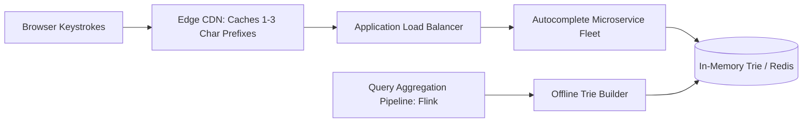

# Reference Architecture: Search Autocomplete & Typeahead System

## 1. System Overview
A real-time search suggestion engine that predicts and completes search queries as users type, returning the top 5 most relevant suggestions in under 15 milliseconds.

## 2. Business Context
Drives search discovery on e-commerce, streaming, and web portals. Immediate, relevant suggestions boost conversion and discovery.

## 3. Functional Requirements
* **Real-Time Prefix Search**: Return top 5 suggestions matching query prefix.
* **Query Ranking**: Rank suggestions by historical query frequency, popularity, and freshness.
* **Typo Tolerance**: Tolerate 1-character typos on prefixes $>3$ characters.

## 4. Non-Functional Requirements
* **Latency**: Ultra-low latency: $p99 < 15\text{ ms}$, $p50 < 3\text{ ms}$.
* **Availability**: $99.99\%$.
* **Scale**: Support $50,000\text{ QPS}$ during search surges.

## 5. Constraints & Assumptions
* Suggestions must be pre-filtered for profanity and offensive terms.

## 6. Scale Estimation
* 50 Million searches per day.
* Average 6 keystrokes per search $\rightarrow$ 300 Million prefix lookups/day.
* Ingress QPS: $\approx 3,472\text{ QPS}$ average; peak $\approx \mathbf{15,000\text{ QPS}}$.

## 7. Capacity Planning
* Unique search queries: 10 Million queries in suggestion dictionary.
* Average query length: 25 bytes.
* Trie Memory Footprint: $\approx \mathbf{2.5\text{ GB RAM}}$ (fits comfortably in memory!).

## 8. High-Level Architecture


## 9. Component Architecture
* **Trie Engine**: In-memory prefix tree where each node stores the top 5 pre-computed queries to achieve $O(1)$ lookup time.
* **Data Aggregator**: Apache Flink pipeline aggregating raw search clickstream logs into query frequency scores.
* **Trie Rebuilder**: Daily batch job refreshing the production Trie with updated weights.

## 10. Data Flow
1. User types "iph".
2. Client queries `GET /v1/search/autocomplete?q=iph`.
3. Service navigates Trie to node `h` (child of `p`, child of `i`).
4. Directly returns pre-computed top 5 array stored on node `h` (e.g., "iphone 16", "iphone case") in $<1\text{ ms}$.

## 11. API Design
* `GET /v1/search/autocomplete?q=iph&limit=5`
  * Response: `HTTP 200 OK` `{"suggestions": ["iphone 16", "iphone case", "iphone 15", "iphone charger", "ipad"]}`

## 12. Data Model
Trie Node Structure:
```typescript
interface TrieNode {
  children: Map<string, TrieNode>;
  top_suggestions: Array<{ query: string; weight: number }>; // Max 5 items
}
```

## 13. Storage Architecture
Production Trie resides in RAM. Master historical query dictionary persisted in PostgreSQL / Elasticsearch.

## 14. Caching Architecture
* **Edge CDN**: Cache 1, 2, and 3-character prefixes (`a`, `ap`, `app`) with 1-hour TTL. These represent $80\%$ of keystroke volume.
* **Browser Local Storage**: Caches recent user queries locally.

## 15. Messaging & Async Processing
Clickstream events emitted to Kafka topic `search.clicks` for frequency re-weighting.

## 16. Scalability Strategy
Stateless Trie Replicas: Load Trie into memory of 10 microservice pods behind round-robin load balancer. Each pod handles 5,000 QPS independently.

## 17. Performance Optimization
Pre-computed top suggestions on each node eliminate runtime tree traversal and priority queue sorting.

## 18. Reliability & Fault Tolerance
If Trie service fails, fallback to Elasticsearch prefix queries (`match_phrase_prefix`).

## 19. Consistency & Transactions
Eventual consistency: Suggestion weights updated daily via batch pipeline.

## 20. Security Architecture
Profanity and PII filter blocks credit card numbers, passwords, and toxic terms from entering the suggestion index.

## 21. Observability Strategy
Metrics: `typeahead_latency_ms`, `cache_hit_ratio_edge`, `trie_node_count`.

## 22. Disaster Recovery
Trie snapshots stored in S3; newly launched pods boot and hydrate Trie in $<10\text{ seconds}$.

## 23. Cost Optimization
Edge CDN caching absorbs $80\%$ of requests, reducing backend compute fleet size by $5\times$.

## 24. Trade-off Analysis
* **Pre-computed Top 5 on Nodes vs. Runtime Traversal**: Pre-computing increases Trie memory by $3\times$ but drops lookup latency from $O(V)$ to $O(1)$.

## 25. Failure Scenarios
* **Spam Query Bombing**: Spammers submit millions of random queries; min-frequency thresholds require $>500$ unique IP occurrences before entering suggestions.

## 26. Production Considerations
* Client-side debouncing (delaying request by 200ms after user pauses typing) reduces backend QPS by $60\%$.
