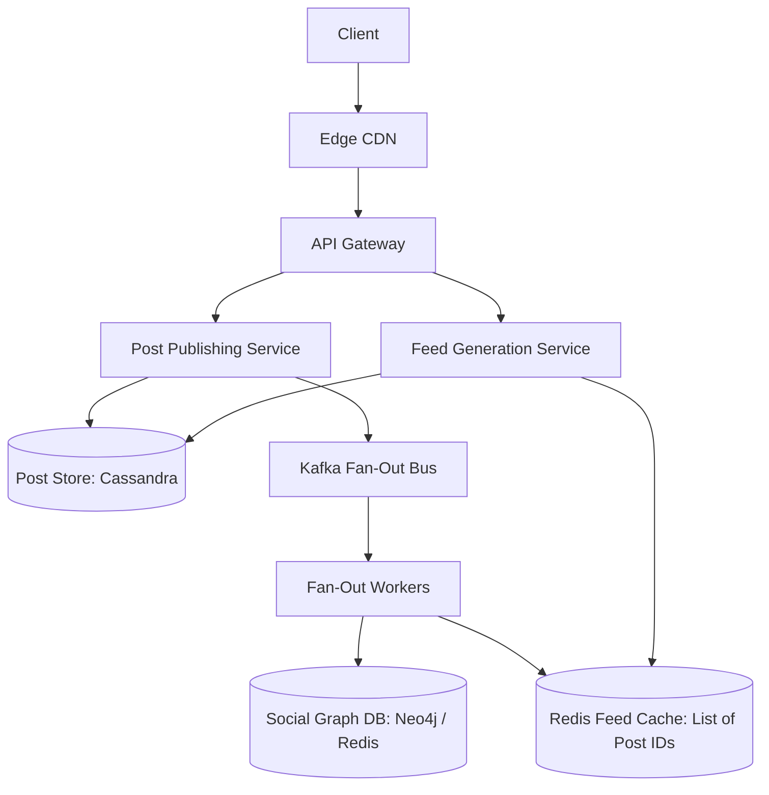

# Reference Architecture: Social Media Feed System (Twitter / Instagram)

## 1. System Overview
A distributed timeline generation and distribution engine serving personalized, real-time home feeds to hundreds of millions of daily active users, balancing instant post publishing with sub-100ms feed retrieval.

## 2. Business Context
The home timeline is the primary engagement and advertising vehicle for social networks. Latency or stale feeds directly degrade ad impressions and user retention.

## 3. Functional Requirements
* **Post Content**: Publish text, images, and video posts.
* **Follow Graph**: Follow and unfollow user accounts.
* **Home Feed**: Generate an aggregated, chronologically or algorithmically ranked feed of posts from followed accounts.
* **User Timeline**: View a specific user's historical post history.

## 4. Non-Functional Requirements
* **Availability**: $99.99\%$ for timeline reads.
* **Latency**: Home feed generation $p99 < 100\text{ ms}$. Post publishing latency $p99 < 500\text{ ms}$.
* **Scale**: Support $300\text{ Million DAU}$.
* **Read-Heavy**: Read-to-write ratio of $\approx 100:1$.

## 5. Constraints & Assumptions
* Celebrity accounts (accounts with $>10\text{M}$ followers) require hybrid fan-out architecture to prevent write storms.

## 6. Scale Estimation
* 300 Million DAU.
* Daily Posts: $300\text{M} \times 2\text{ posts/day} = 600\text{ Million posts/day}$.
  * Write QPS (avg): $\frac{600 \times 10^6}{86,400} \approx 6,944\text{ posts/sec}$. Peak: $\approx 20,000\text{ posts/sec}$.
* Feed Reads: $300\text{M} \times 20\text{ views/day} = 6\text{ Billion feed queries/day}$.
  * Read QPS (avg): $\approx 69,444\text{ reads/sec}$. Peak: $\approx 200,000\text{ reads/sec}$.

## 7. Capacity Planning
* Average post metadata size: 300 bytes.
* Daily Metadata: $600\text{M} \times 300\text{ bytes} \approx 180\text{ GB/day}$.
* 3-Year Storage ($\text{RF}=3$): $180\text{ GB} \times 365 \times 3 \times 3 \approx 591\text{ TB}$.
* Cache RAM (Top 20% Active Feeds - 60M users $\times$ 800 post IDs $\times$ 8 bytes): $\approx 384\text{ GB RAM}$.

## 8. High-Level Architecture


## 9. Component Architecture
* **Post Ingestion Service**: Validates and stores raw post content.
* **Social Graph Service**: Manages follower/following relationships.
* **Fan-Out Worker Fleet**: Asynchronously injects post IDs into followers' timeline caches.
* **Feed Aggregator**: Hydrates post IDs from Redis with full post metadata and user profiles.

## 10. Data Flow
1. **Post Creation**: User posts tweet $\rightarrow$ Saved to PostDB $\rightarrow$ Event emitted to Kafka.
2. **Fan-Out (Normal Users)**: Worker fetches followers $\rightarrow$ Injects `post_id` into each follower's Redis Sorted Set timeline.
3. **Feed Retrieval**: User opens app $\rightarrow$ Feed Service queries user's Redis list (returns top 20 post IDs) $\rightarrow$ Hydrates post content from cache/DB $\rightarrow$ Returns feed.

## 11. API Design
* `POST /v1/posts`
  * Body: `{"text": "Hello world!", "media_ids": ["med_12"]}`
* `GET /v1/feed/home?limit=20&cursor=post_9921`
  * Response: `HTTP 200 OK` `{"posts": [ ... ], "next_cursor": "post_9901"}`

## 12. Data Model
```sql
CREATE TABLE user_posts (
    user_id     UUID,
    post_id     TIMEUUID,
    content     TEXT,
    media_urls  LIST<TEXT>,
    created_at  TIMESTAMP,
    PRIMARY KEY (user_id, post_id)
) WITH CLUSTERING ORDER BY (post_id DESC);
```

## 13. Storage Architecture
Apache Cassandra / ScyllaDB for posts. Social graph relationships stored in graph database (Neo4j / Amazon Neptune) or relational sharded tables.

## 14. Caching Architecture
Redis Cluster holds pre-computed timelines:
* Key: `feed:{user_id}`
* Value: Sorted Set (ZSET) holding up to 800 post IDs scored by publication timestamp.

## 15. Messaging & Async Processing
Kafka partitions fan-out jobs across worker pools based on `follower_id` to distribute write loads evenly.

## 16. Scalability Strategy
**Hybrid Fan-Out Architecture**:
* **Fan-Out on Write (Push)**: For 99% of normal users (<5,000 followers), push post IDs into follower feeds on write.
* **Fan-Out on Read (Pull)**: For celebrities (>5,000 followers, e.g., Elon Musk), do NOT push to 100M feeds. When a user requests their feed, merge the celebrity's recent posts dynamically at read time.

## 17. Performance Optimization
* Hydrate post metadata using multi-key Redis `MGET`, retrieving 20 posts in a single network round-trip.
* Edge CDN caches media attachments and profile avatars.

## 18. Reliability & Fault Tolerance
* If Redis feed cache drops a user's timeline, fall back to dynamic on-demand query across followed users in Cassandra.
* Kafka backpressure prevents fan-out workers from overwhelming Redis.

## 19. Consistency & Transactions
Eventual consistency is fully acceptable. A follower seeing a friend's post 2 seconds after publication does not violate business SLOs.

## 20. Security Architecture
Content safety scanner runs asynchronously on all posts; spam detection models quarantine abusive accounts.

## 21. Observability Strategy
Metrics: `feed_generation_latency_ms`, `fanout_lag_seconds`, `celebrity_merge_duration_ms`.

## 22. Disaster Recovery
Multi-region active-active Cassandra and Redis clusters.

## 23. Cost Optimization
Trim feed caches: Retain only the most recent 800 posts per user in Redis; older posts are read from cold Cassandra disk on-demand.

## 24. Trade-off Analysis
* **Push vs. Pull**: Pure push requires massive write amplification (1 post $\rightarrow$ 10M writes). Pure pull causes massive read spikes. Hybrid fan-out balances both.

## 25. Failure Scenarios
* **Celebrity Post Surge**: System applies rate limits to prevent viral comments from locking downstream database partitions.

## 26. Production Considerations
* Active user cache warming: Periodically refresh feed caches only for users who have opened the app within the last 7 days.
