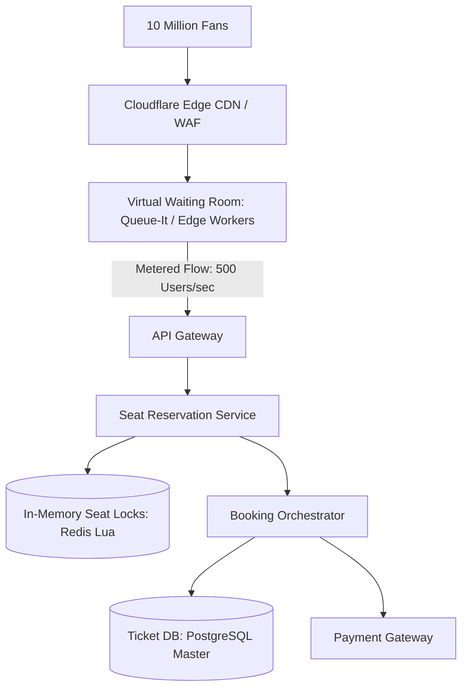

# Reference Architecture: High-Concurrency Ticket Booking (Ticketmaster)

## 1. System Overview
A flash-scale ticketing platform engineered to handle extreme thundering herds (e.g., Taylor Swift / World Cup stadium tickets), where 10 million concurrent fans attempt to purchase 50,000 available seats within 60 seconds of a ticket drop.

## 2. Business Context
Flash ticket sales represent the most violent traffic surges in computer science. System collapse damages brand equity and invites government regulatory scrutiny.

## 3. Functional Requirements
* **Interactive Venue Map**: Real-time visualization of stadium seating availability.
* **Seat Hold**: Lock selected seats for 10 minutes during checkout.
* **Fair Queue / Virtual Waiting Room**: Orderly admission of fans matching backend capacity.
* **Checkout & Ticketing**: Cryptographic barcode/QR generation with anti-scalping defenses.

## 4. Non-Functional Requirements
* **Scale**: Handle $50\times$ traffic surge instantaneously ($10\text{ Million users arriving at 10:00:00 AM}$).
* **Consistency**: Zero double booking of physical seats.
* **Availability**: $99.999\%$ for virtual waiting room; backend protected from collapse.

## 5. Constraints & Assumptions
* High demand guarantees $100\%$ inventory sell-out in $<5\text{ minutes}$.

## 6. Scale Estimation
* 10 Million fans waiting at drop time.
* Stadium capacity: 50,000 seats.
* Surge Traffic: $\mathbf{500,000\text{ RPS}}$ hitting ingress gateways at drop time.

## 7. Capacity Planning
* Virtual Waiting Room Queue: 10 Million entries in Redis/Cloudflare edge.
* Seat Inventory: 50,000 seats $\times$ 100 bytes $\approx \mathbf{5\text{ MB RAM}}$ (Entire stadium inventory fits in memory!).

## 8. High-Level Architecture


## 9. Component Architecture
* **Virtual Waiting Room (Edge Queue)**: Intercepts millions of fans at CDN edge, assigning randomized queue positions to prevent DDoS on origin servers.
* **Seat Inventory Engine**: Ultra-fast in-memory Redis cluster executing atomic Lua seat reservations.
* **Ticketing Core**: Relational database generating cryptographic tickets.

## 10. Data Flow
1. Fans arrive at 9:55 AM $\rightarrow$ Pooled in Virtual Waiting Room.
2. At 10:00 AM, Waiting Room randomizes order and meters admission at a steady **500 users/second**.
3. Admitted user selects Seat A12 $\rightarrow$ API Gateway invokes Redis Lua script.
4. Redis atomically claims seat with 10-minute TTL.
5. User completes payment $\rightarrow$ Seat confirmed in PostgreSQL $\rightarrow$ Encrypted QR ticket issued.

## 11. API Design
* `POST /v1/events/{id}/seats/hold`
  * Headers: `Queue-Token: jwt_token_from_waiting_room`
  * Body: `{"seat_ids": ["SEC101-A12", "SEC101-A13"]}`
  * Response: `HTTP 200 OK` `{"hold_id": "hld_882", "expires_in_seconds": 600}`

## 12. Data Model
```sql
CREATE TABLE seat_inventory (
    event_id    UUID NOT NULL,
    seat_id     VARCHAR(32) NOT NULL,
    section     VARCHAR(16) NOT NULL,
    price       DECIMAL(8,2) NOT NULL,
    status      VARCHAR(16) NOT NULL, -- AVAILABLE, HELD, BOOKED
    held_by     UUID,
    hold_expiry TIMESTAMP WITH TIME ZONE,
    PRIMARY KEY (event_id, seat_id)
);
```

## 13. Storage Architecture
PostgreSQL for permanent ticket records. Redis Cluster for transient in-memory seat locks.

## 14. Caching Architecture
Edge CDN serves static stadium seating SVGs, venue maps, and pricing charts; zero origin server load for static maps.

## 15. Messaging & Async Processing
Kafka handles post-booking barcode generation and receipt email dispatch.

## 16. Scalability Strategy
**Traffic Leveling via Virtual Waiting Room**: Transforming a $500,000\text{ RPS}$ spike into a steady, controlled $500\text{ RPS}$ trickle shields the database from CPU thrashing.

## 17. Performance Optimization
* **Atomic Redis Lua Script for Seat Holds**:
  ```lua
  local event = KEYS[1]
  local seat = ARGV[1]
  local user = ARGV[2]
  local status = redis.call("HGET", event, seat)
  if status == "AVAILABLE" or status == false then
      redis.call("HSET", event, seat, "HELD:" .. user)
      return 1 -- Held Successfully
  else
      return 0 -- Already Taken
  end
  ```

## 18. Reliability & Fault Tolerance
* If payment fails, Redis seat key is immediately released, allowing the next fan to grab it.

## 19. Consistency & Transactions
Strict ACID consistency: Only one person can ever buy physical Seat A12.

## 20. Security Architecture
* **Anti-Bot Defenses**: Turnstile / reCAPTCHA v3 verification before entering the waiting room.
* Dynamic Rotating Barcodes: QR codes refresh every 15 seconds in the mobile app to eliminate screenshot ticket scalping.

## 21. Observability Strategy
Metrics: `waiting_room_queue_depth`, `seat_hold_success_rate`, `checkout_time_distribution`.

## 22. Disaster Recovery
Multi-region standby deployment with automated DNS shift.

## 23. Cost Optimization
Waiting room hosted entirely on serverless edge workers (Cloudflare Workers), eliminating thousands of idle backend servers.

## 24. Trade-off Analysis
* **First-Come-First-Served vs. Randomized Queue**: FCFS rewards bot scripts with fast fiber connections. Randomized lottery waiting rooms level the playing field for human fans.

## 25. Failure Scenarios
* **Payment Gateway Timeout**: If payment processor hangs for 30s, the seat hold timer must pause to prevent releasing the seat while the user's card is in-flight.

## 26. Production Considerations
* Strict limit of max 4 to 6 tickets per transaction to prevent scalpers from vacuuming inventory.
