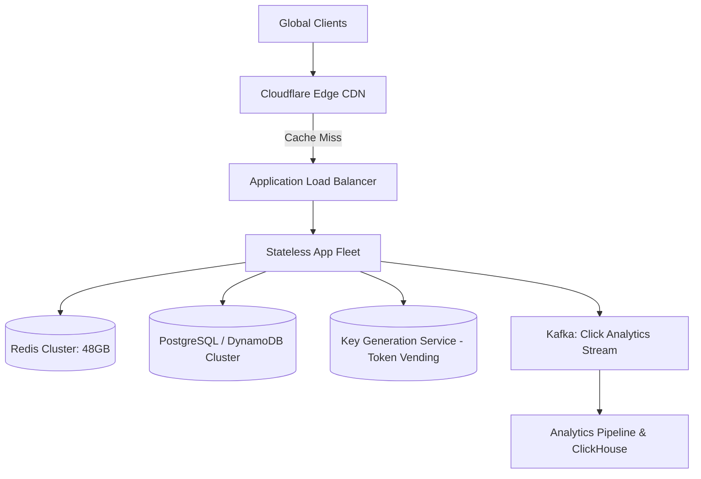

# Reference Architecture: Global URL Shortener Service (TinyURL / Bit.ly)

## 1. System Overview
A globally distributed, high-throughput URL shortening service that maps arbitrary long URLs to compact, human-readable 7-character alphanumeric tokens (e.g., `https://tiny.url/7bXk9q1`), redirecting incoming HTTP requests with sub-10ms latency.

## 2. Business Context
URL shorteners optimize communication character limits (SMS, Twitter/X), obfuscate referral parameters, provide unified brand links, and collect comprehensive click analytics (geographic origin, referrer, user-agent).

## 3. Functional Requirements
* **Shorten URL**: Generate a unique, compact 7-character alias for any valid input URL.
* **Redirection**: Redirect incoming short link queries to the original long URL with HTTP 301 or 302.
* **Custom Alias**: Permit enterprise clients to define custom branded aliases.
* **Expiration / TTL**: Configurable link time-to-live (default: 5 years; custom: 1 hour to 10 years).
* **Click Analytics**: Asynchronously capture click counts, geo-IP, browser, and timestamps.

## 4. Non-Functional Requirements
* **Availability**: $99.99\%$ (Four Nines) for link redirection.
* **Latency**: Redirect lookup $p99 < 15	ext{ ms}$, $p50 < 2	ext{ ms}$ (served from cache).
* **Durability**: Zero data loss for generated mappings.
* **Scalability**: Support $100:1$ read-to-write ratio at global scale.

## 5. Constraints & Assumptions
* Short code alphabet: Base62 (`[0-9a-zA-Z]`).
* With 7 characters: $62^7 pprox 3.52	ext{ Trillion}$ unique combinations.
* Read queries heavily dominate ($99\%$ reads, $1\%$ writes).

## 6. Scale Estimation
* **New URLs**: 100 Million URLs created per month.
  * Write QPS (avg): $rac{100 	imes 10^6}{30 	imes 86,400} pprox 38.5	ext{ writes/sec}$.
  * Write QPS (peak, $3	imes$): $pprox 116	ext{ writes/sec}$.
* **Redirect Queries ($100:1$ ratio)**:
  * Read QPS (avg): $38.5 	imes 100 = 3,850	ext{ reads/sec}$.
  * Read QPS (peak, $3	imes$): $11,550	ext{ reads/sec}$.

## 7. Capacity Planning
* **5-Year Storage**: $100	ext{M} 	imes 12 	imes 5 = 6	ext{ Billion URLs}$.
  * Average record size: $500	ext{ bytes}$ (Long URL + Short Code + User ID + Timestamp).
  * Raw Storage: $6 	imes 10^9 	imes 500	ext{ bytes} pprox 3.0	ext{ TB}$.
  * Effective Storage with Indexes & Replication ($	ext{RF}=3$): $pprox 15	ext{ TB}$.
* **In-Memory Cache (Redis)**:
  * Daily reads: $3,850 	imes 86,400 pprox 332.6	ext{ Million reads/day}$.
  * 80/20 Rule Working Set ($20\%$): $66.5	ext{M items} 	imes 500	ext{ bytes} 	imes 1.4	ext{ (overhead)} pprox \mathbf{46.5	ext{ GB RAM}}$.

## 8. High-Level Architecture


## 9. Component Architecture
* **API Gateway / Load Balancer**: Terminates TLS, rate limits per IP, forwards to compute.
* **Redirect Service**: Stateless Go/Rust microservice performing ultra-fast cache-aside lookups.
* **Key Generation Service (KGS)**: Dedicated token vending service pre-generating and allocating Base62 short tokens to eliminate runtime collision hashing.
* **Analytics Worker**: Asynchronously consumes clickstream events from Kafka to update ClickHouse.

## 10. Data Flow
1. **Shorten Flow**: Client submits Long URL $
ightarrow$ API retrieves pre-generated 7-char token from KGS $
ightarrow$ Writes mapping to DB and Cache $
ightarrow$ Returns short URL.
2. **Redirect Flow**: Client requests `GET /7bXk9q1` $
ightarrow$ CDN checks edge $
ightarrow$ App checks Redis $
ightarrow$ On hit, returns `HTTP 301 Permanent Redirect` with `Location: https://original.url`.

## 11. API Design
* `POST /v1/urls`
  * Request: `{"long_url": "https://example.com/very-long-path", "custom_alias": null, "ttl_days": 1825}`
  * Response: `HTTP 201 Created` `{"short_url": "https://tiny.url/7bXk9q1", "expires_at": "2031-09-05T00:00:00Z"}`
* `GET /{short_code}`
  * Response: `HTTP 301 Moved Permanently` `Location: https://example.com/very-long-path`

## 12. Data Model
```sql
CREATE TABLE url_mapping (
    short_code   VARCHAR(7) PRIMARY KEY,
    original_url TEXT NOT NULL,
    user_id      UUID,
    created_at   TIMESTAMP WITH TIME ZONE DEFAULT NOW(),
    expires_at   TIMESTAMP WITH TIME ZONE NOT NULL
);
CREATE INDEX idx_url_expires ON url_mapping(expires_at);
```

## 13. Storage Architecture
NoSQL Key-Value store (Amazon DynamoDB or ScyllaDB) partitioned by `short_code` hash, providing $O(1)$ single-digit millisecond primary key lookups with continuous multi-region active-active replication.

## 14. Caching Architecture
Redis Cluster configured with `allkeys-lru` eviction. Caches the top $20\%$ hot working set, absorbing $95\%$ of global redirection traffic.

## 15. Messaging & Async Processing
Click analytics emitted to Apache Kafka topic `url.clicks`. Stream consumers batch-write events to ClickHouse for OLAP aggregation without blocking the redirect path.

## 16. Scalability Strategy
Stateless web tier auto-scales from 5 to 50 pods based on request concurrency. KGS vends ranges of keys (e.g., node 1 allocates 1M–2M, node 2 allocates 2M–3M) to memory buffers, preventing database sequence lock contention.

## 17. Performance Optimization
* **HTTP 301 vs. 302**: 301 (Permanent Redirect) instructs browsers to cache the destination locally, offloading all subsequent redirect requests from origin infrastructure.
* **Connection Keep-Alive & HTTP/2**: Eliminates TCP handshake overhead for high-concurrency redirect traffic.

## 18. Reliability & Fault Tolerance
* Zero Single Point of Failure (SPOF): Active-active multi-AZ deployments.
* KGS redundancy: Two KGS nodes maintain separate pre-generated token sets in memory; if KGS 1 crashes, KGS 2 serves tokens immediately.

## 19. Consistency & Transactions
Eventual consistency is fully acceptable for analytics. Read-after-write consistency is enforced for URL creation by populating Redis cache immediately upon database insertion.

## 20. Security Architecture
* **Malicious URL Detection**: Integrate Google Safe Browsing API asynchronously upon link creation; quarantine suspicious phishing URLs.
* **Rate Limiting**: Restrict unauthenticated clients to 10 URL creations per minute via Token Bucket filter.

## 21. Observability Strategy
* Prometheus metrics: `url_redirect_latency_seconds`, `cache_hit_ratio`, `kgs_token_buffer_depth`.
* Distributed tracing with OpenTelemetry spanning Gateway, Redis, and Database.

## 22. Disaster Recovery
* RPO = 0 (Data replicated synchronously across 3 Availability Zones).
* RTO < 1 minute (Automated DNS failover across cloud regions).

## 23. Cost Optimization
* S3/Parquet archival: Expired URLs moved to cold storage after 30 days past TTL expiration.
* Edge CDN caching eliminates $80\%$ origin bandwidth costs.

## 24. Trade-off Analysis
* **Pre-generated Tokens (KGS) vs. On-Demand Hashing**: KGS eliminates MD5/Murmur hash collision retry loops at the expense of maintaining a separate token-vending microservice.
* **HTTP 301 vs. 302**: 301 maximizes speed and lowers origin cost, but loses click analytics for repeated visits. 302 captures 100% of click analytics but incurs origin server hits on every visit.

## 25. Failure Scenarios
* **Redis Cluster Failure**: Cache miss spikes land on DynamoDB/ScyllaDB; database connection pools must be sized to handle $100\%$ raw read load without crashing.
* **KGS Exhaustion**: If KGS buffer drains, fallback temporarily to random Base62 generation with `INSERT ... ON CONFLICT DO NOTHING` retry loops.

## 26. Production Considerations
* Set up automated cron job purging expired records using database partition dropping (`DROP TABLE url_mapping_2021_q1`).
* Enforce strict regex validation rejecting internal IP ranges (e.g., `127.0.0.1`, `169.254.169.254`) to prevent Server-Side Request Forgery (SSRF).
