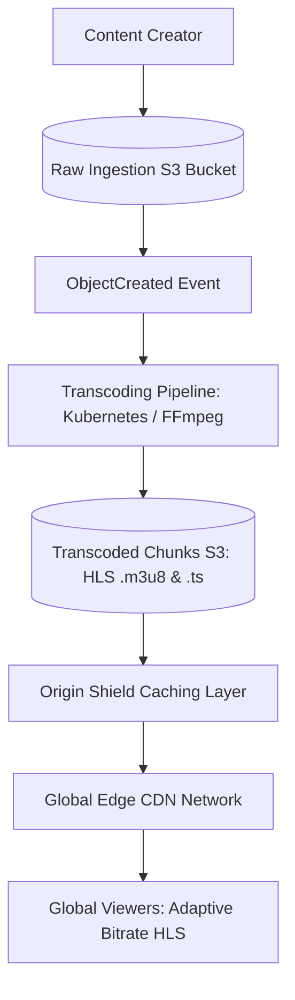

# Reference Architecture: Global Video Streaming Platform (YouTube / Netflix)

## 1. System Overview
A global video ingestion, transcoding, and content delivery system streaming high-definition video (4K, 1080p) to hundreds of millions of concurrent viewers with adaptive bitrate streaming (HLS / DASH) and zero buffering.

## 2. Business Context
Powers global subscription video-on-demand (SVOD) and ad-supported streaming platforms. Video quality and uninterrupted playback directly drive subscriber retention.

## 3. Functional Requirements
* **Upload Video**: Ingest raw multi-gigabyte video files.
* **Transcode Video**: Convert master video into multiple codecs (H.264, AV1, VP9) and resolutions (4K, 1080p, 720p, 360p).
* **Adaptive Bitrate Streaming**: Stream chunked video via HLS/DASH dynamically adjusting to viewer bandwidth.
* **Search & Recommendations**: Catalog browsing and personalized watch lists.

## 4. Non-Functional Requirements
* **Global Availability**: $99.99\%$ playback availability.
* **Startup Latency**: Time to first frame $<1.5\text{ seconds}$.
* **Zero Buffering**: Re-buffer rate $<0.25\%$.
* **Durability**: 11 Nines for master video assets.

## 5. Constraints & Assumptions
* Video files are large (1 GB to 50 GB master uploads).
* Content Delivery Networks (CDNs) must absorb $>95\%$ of global video traffic.

## 6. Scale Estimation
* 100 Million Daily Active Viewers.
* 1 Billion hours of video viewed per day.
* Video upload: 500,000 hours of video uploaded daily.
* Average streaming bitrate: $5\text{ Mbps}$ (1080p).
* Total Global Bandwidth Egress: $100\text{M concurrent streams} \times 5\text{ Mbps} = \mathbf{500\text{ Tbps}}$!

## 7. Capacity Planning
* Master Video Ingest: $500,000\text{ hrs} \times 20\text{ GB/hr} \approx 10\text{ PB/day}$.
* Transcoded Assets ($5\text{ resolutions} \times 2\text{ codecs}$): $\approx 25\text{ PB/day}$.
* Storage Architecture: AWS S3 / Cold Glacier for masters; Edge CDN for popular segments.

## 8. High-Level Architecture


## 9. Component Architecture
* **Ingestion Gateway**: Manages multi-part parallel resumable uploads (TUS protocol).
* **Distributed Transcoder**: Chunk-based parallel transcode workers converting raw video into 6-second `.ts`/`.m4s` media segments.
* **Manifest Generator**: Generates master `.m3u8` playlists linking multi-resolution streams.
* **CDN Edge Delivery Network**: Caches popular video segments within ISP points of presence.

## 10. Data Flow
1. Creator uploads raw video via direct S3 pre-signed multipart upload.
2. Ingestion trigger splits raw video into 6-second chunks and dispatches parallel worker pods.
3. Workers transcode to H.264/AV1 at 1080p, 720p, etc., and write HLS chunks to S3.
4. Viewer client requests `.m3u8` playlist $\rightarrow$ CDN edge downloads chunks dynamically matching client network bandwidth.

## 11. API Design
* `POST /v1/videos/upload-url` $\rightarrow$ Returns S3 multipart upload ID.
* `GET /v1/videos/{video_id}/master.m3u8` $\rightarrow$ Returns HLS master manifest with available bitrates.

## 12. Data Model
```sql
CREATE TABLE video_metadata (
    video_id     UUID PRIMARY KEY,
    uploader_id  UUID NOT NULL,
    title        VARCHAR(255) NOT NULL,
    duration_sec INTEGER NOT NULL,
    status       VARCHAR(32) NOT NULL, -- PENDING, TRANSCODING, READY
    manifest_url TEXT,
    created_at   TIMESTAMP WITH TIME ZONE DEFAULT NOW()
);
```

## 13. Storage Architecture
Tiered Object Storage: Master files transition to S3 Glacier after successful transcoding. Transcoded chunks reside in S3 Standard with Origin Shield acceleration.

## 14. Caching Architecture
Edge CDN caching strategy: Top $10\%$ popular videos represent $80\%$ of views. Edge PoPs cache the first 30 seconds of trending videos to guarantee instantaneous start times.

## 15. Messaging & Async Processing
Kafka coordinates task assignment across thousands of distributed GPU/CPU transcoding nodes.

## 16. Scalability Strategy
Chunk-Level Parallel Transcoding: A 2-hour movie is split into 1,200 chunks processed concurrently across 100 worker nodes in parallel, completing full transcoding in under 5 minutes.

## 17. Performance Optimization
* **Adaptive Bitrate (ABR)**: Client measures real-time throughput; seamlessly shifts between 1080p and 720p chunks without stopping playback.
* **TCP BBR Congestion Control**: Optimizes throughput over lossy mobile networks.

## 18. Reliability & Fault Tolerance
Multi-CDN Strategy (Cloudflare + Akamai + Fastly): Client player dynamically switches CDNs if error rates or buffering spikes on a single provider.

## 19. Consistency & Transactions
Eventual consistency across video catalog; strong metadata consistency on video status updates.

## 20. Security Architecture
* Digital Rights Management (DRM): Widevine, FairPlay, and PlayReady encryption.
* Signed CDN URLs with time-limited HMAC tokens preventing hotlinking.

## 21. Observability Strategy
Real-Time Video Analytics: Track Quality of Experience (QoE) metrics: Buffer Ratio, Video Start Failure (VSF), Average Bitrate.

## 22. Disaster Recovery
Multi-region active storage replication; transcode pipelines can be spun up in alternate regions on-demand.

## 23. Cost Optimization
* Encode with modern codecs (AV1 / HEVC): Reduces bandwidth requirements by $30\%\text{--}50\%$ compared to legacy H.264 at identical visual quality.
* Peer-to-Peer CDN (WebRTC P2P) sharing video segments between co-located browser viewers on the same local ISP.

## 24. Trade-off Analysis
* **HLS vs. WebRTC**: WebRTC achieves sub-second latency for live streaming but costs $10\times$ more in infrastructure; chunked HLS/CMAF achieves 2–3s latency with standard, highly cached HTTP CDN economics.

## 25. Failure Scenarios
* **CDN Edge Outage**: Client player detects chunk 404/504 errors and switches to fallback CDN within 500ms.

## 26. Production Considerations
* Deploy dedicated thumbnail generation pipelines creating preview scrubber sprites (`vtt` storyboard).
