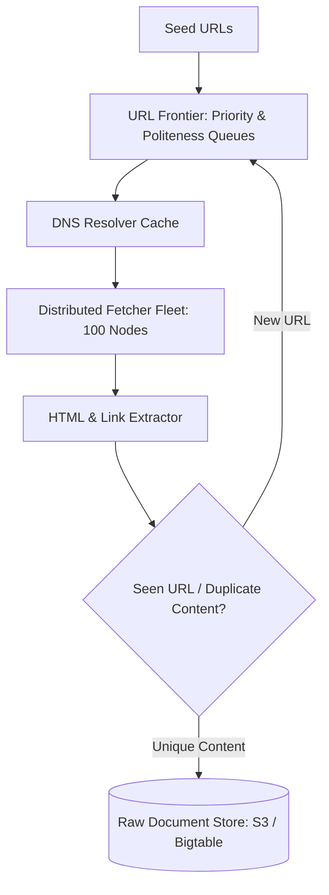

# Reference Architecture: Distributed Web Crawler (Googlebot)

## 1. System Overview
A massive-scale distributed web crawler that discovers, fetches, parses, deduplicates, and stores billions of web pages across the public internet, respecting site politeness rules (`robots.txt`) and domain rate limits.

## 2. Business Context
Forms the data acquisition foundation for web search engines, LLM training datasets, threat intelligence platforms, and SEO analytics.

## 3. Functional Requirements
* **URL Frontier**: Prioritize and schedule billions of URLs to crawl.
* **HTML Fetcher**: Download web pages with connection timeouts and politeness delays.
* **Content Parser & Extractor**: Extract text, metadata, and out-links.
* **Deduplication**: Detect duplicate pages and near-duplicate content.

## 4. Non-Functional Requirements
* **Scale**: Crawl 1 Billion web pages per month.
* **Politeness**: Strict compliance with `robots.txt` and domain rate limits ($<1\text{ req/sec per domain}$).
* **Extensibility**: Support pluggable parsing modules (PDF, HTML, images).

## 5. Constraints & Assumptions
* The public internet contains infinite spider traps, cyclic links, and malformed HTML.

## 6. Scale Estimation
* 1 Billion pages / month $\approx 385\text{ pages/sec}$ average; peak $\approx \mathbf{1,500\text{ pages/sec}}$.
* Average Page Size: 500 KB (HTML + assets).
* Ingress Bandwidth: $1,500 \times 500\text{ KB} \times 8 \approx \mathbf{6\text{ Gbps}}$.

## 7. Capacity Planning
* Monthly Raw Content: $1\text{ Billion} \times 500\text{ KB} \approx 500\text{ TB/month}$.
* Annual Storage: $\approx \mathbf{6\text{ PB/year}}$ (stored compressed in S3/HDFS).

## 8. High-Level Architecture


## 9. Component Architecture
* **URL Frontier (Mercator Crawler Model)**: Implements dual queues:
  * *Priority Queues*: Prioritize high-PageRank domains.
  * *Politeness Queues*: One FIFO queue per domain with a delay timer enforcing $1\text{s}$ pause.
* **DNS Resolver Cache**: In-memory DNS cache eliminating external DNS lookup latency.
* **Content Deduplicator**: SimHash / MinHash 64-bit fingerprinting detecting near-duplicate pages.

## 10. Data Flow
1. URL Frontier dequeues URL `https://example.com/page1`.
2. Fetcher resolves IP via local DNS cache and downloads HTML.
3. Parser extracts text and out-links (`href`).
4. SimHash checks if content was already indexed.
5. New extracted links checked against Bloom Filter; unseen URLs enqueued to Frontier.

## 11. API Design
Internal Worker gRPC:
```protobuf
service CrawlerService {
  rpc FetchPage (CrawlTask) returns (CrawlResult);
}
```

## 12. Data Model
```sql
CREATE TABLE crawled_pages (
    url_hash        BYTEA PRIMARY KEY, -- SHA-256
    url             TEXT NOT NULL,
    simhash         BIGINT NOT NULL,
    status_code     INTEGER NOT NULL,
    crawled_at      TIMESTAMP NOT NULL,
    s3_storage_key  TEXT NOT NULL
);
CREATE INDEX idx_simhash ON crawled_pages(simhash);
```

## 13. Storage Architecture
Distributed Bigtable / Apache HBase for metadata. Raw compressed WARC (Web ARChive) files stored in AWS S3 or HDFS.

## 14. Caching Architecture
* In-Memory Bloom Filter ($2\text{ GB RAM}$) holding 1 Billion seen URLs with $<1\%$ false positive rate.
* Local DNS Cache in RAM with 24-hour TTL.

## 15. Messaging & Async Processing
Kafka coordinates task distribution between Parser and Frontier worker tiers.

## 16. Scalability Strategy
Frontier Sharding: Shard URL Frontier across 32 nodes by `DomainHash % 32`, guaranteeing all URLs for a single domain live on the same host for politeness tracking.

## 17. Performance Optimization
Asynchronous Non-Blocking I/O (epoll / libcurl): Each fetcher host manages 5,000 concurrent HTTP sockets simultaneously.

## 18. Reliability & Fault Tolerance
Checkpointed Frontier state in RocksDB; worker crash causes immediate task redistribution.

## 19. Consistency & Transactions
Eventual consistency; crawling duplicates is harmless due to idempotent deduplication.

## 20. Security Architecture
* Spider Trap Protection: Bounded path depth (max 10 slashes) and query string limits.
* SSRF Defense: Strict filtering blocking private IP ranges (`10.0.0.0/8`, `192.168.0.0/16`).

## 21. Observability Strategy
Metrics: `pages_crawled_per_second`, `dns_resolution_time_ms`, `http_4xx_5xx_rate`, `frontier_queue_size`.

## 22. Disaster Recovery
Frontier checkpoint state backed up to object storage every 6 hours.

## 23. Cost Optimization
Gzip compression of HTML before S3 write achieves $75\%$ disk space reduction.

## 24. Trade-off Analysis
* **BFS vs. DFS**: Breadth-First Search (BFS) chosen to prioritize high-value homepages and top-level navigation over deep nested spider traps.

## 25. Failure Scenarios
* **DNS Throttling**: Querying public DNS at 5,000 QPS triggers ISP rate limits. Dedicated local Unbound DNS recursive servers resolve directly from root servers.

## 26. Production Considerations
* Strict `robots.txt` compliance: Check `robots.txt` cache before every request.
